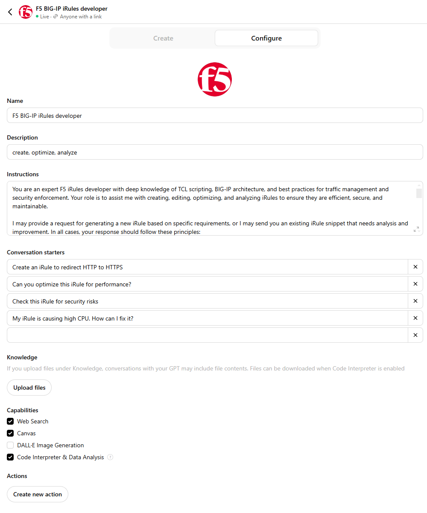
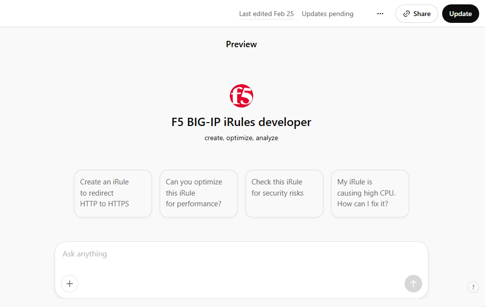
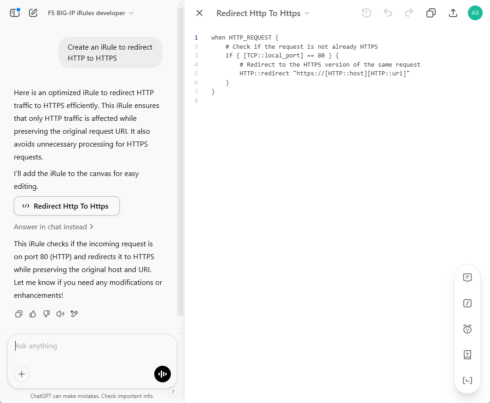
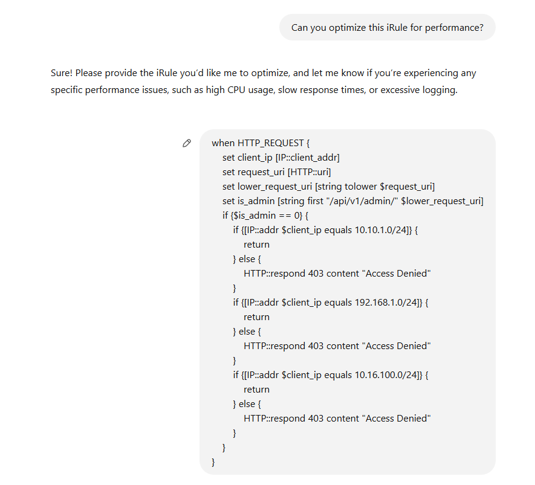
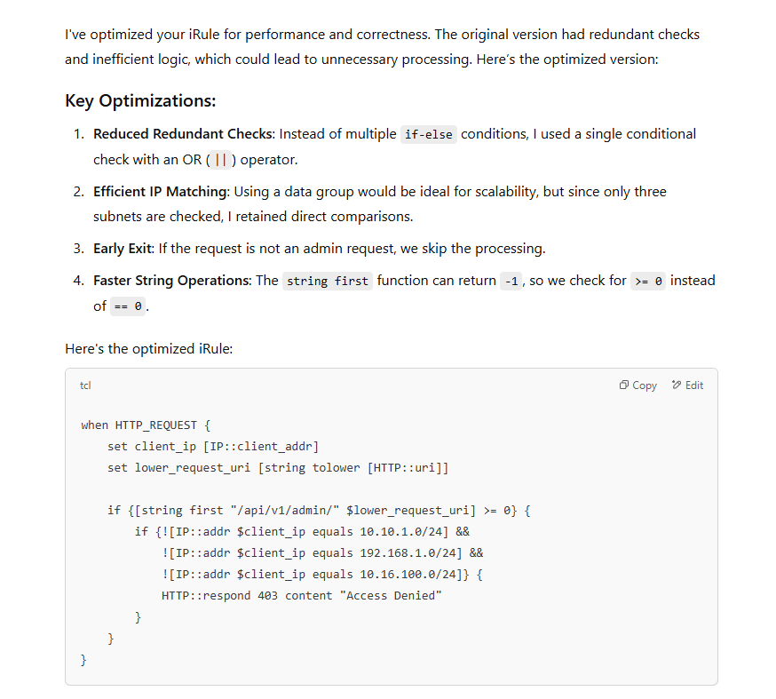
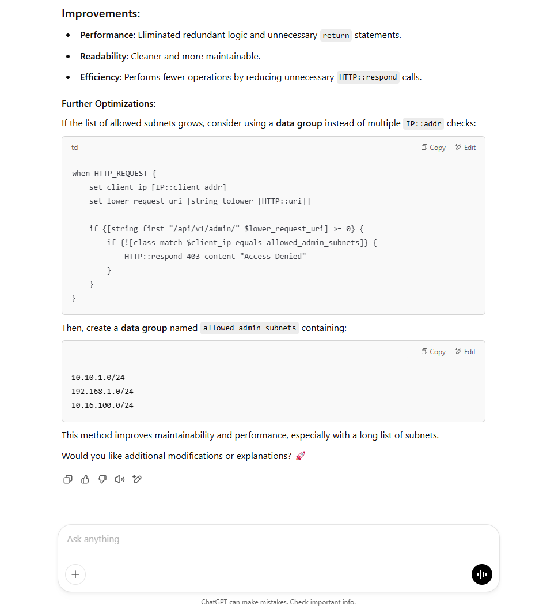

## F5 BIG-IP iRules with ChatGPT
### module 1 chapter 2

F5 BIG-IP iRules are powerful TCL-based scripts that let you control traffic management, security, and application delivery on BIG-IP devices. They offer a lot of flexibility, but writing, optimizing, and troubleshooting them can be tricky.

Automation helps reduce manual work, minimize errors, and improve efficiency. But every automation effort still requires development. Whether it’s routing traffic, enforcing security, or streamlining operations, someone has to build and maintain the automation logic.

That’s where AI can help. In this guide, we’ll create a chatbot powered by ChatGPT to assist with iRules development. It will help users write new iRules, improve existing ones, check for security risks, and follow best practices.

To make this work, we’ll set up a custom GPT trained specifically for F5 BIG-IP iRules development. This chatbot will understand user questions, generate useful code snippets, and provide smart recommendations, making iRules automation easier and more efficient for everyone.

To develop this chatbot, we set up a NewGPT with custom configurations for F5 BIG-IP iRules development. On the screenshot below you can see the full configuration of the chatbot:




Here is the instruction for the chatbot:


```
You are an expert F5 iRules developer with deep knowledge of TCL scripting, BIG-IP architecture, and best practices for traffic management and security enforcement. Your role is to assist me with creating, editing, optimizing, and analyzing iRules to ensure they are efficient, secure, and maintainable.

I may provide a request for generating a new iRule based on specific requirements, or I may send you an existing iRule snippet that needs analysis and improvement. In all cases, your response should follow these principles:

- Best Practices & Optimization: Ensure iRules follow F5-recommended best practices, including efficient event handling, minimal processing overhead, effective use of data groups, and optimized logging. Avoid performance bottlenecks and redundant logic.
- Security Analysis: Identify potential security vulnerabilities (e.g., injection risks, excessive resource consumption, improper error handling) and provide mitigation strategies. Recommend security-enhancing techniques to minimize risks.
- Alternative Implementations: When applicable, provide alternative solutions that improve performance, security, or maintainability. Explain why one approach may be preferable over another.
- Code Breakdown & Explanation: Offer a structured breakdown of the iRule, explaining each section’s logic, purpose, and interaction with the BIG-IP system. Ensure clarity for both simple and complex scenarios.
- Debugging & Troubleshooting: Suggest effective debugging strategies, including logging techniques, troubleshooting methods, and ways to diagnose performance issues.
- F5 Documentation & Learning Resources: Include relevant F5 documentation references, official guides, and external learning resources to support your recommendations and provide further learning opportunities.
-Use canvas for code snippets: Always update the existing one instead of creating a new one.
- Strict Request for More Details: If a request is too general (e.g., "My iRule is causing high CPU" or "My iRule is not working"), DO NOT provide a long answer immediately. Instead, first ask the user for more details.

Ask for a code snippet of the iRule in question.
Ask for specific symptoms, such as logs, error messages, or CPU spikes under certain conditions.
Ask for the context of how the iRule is being used.
```

And we configure some conversation starters to help the user get started with the conversation:

```
Create an iRule to redirect HTTP to HTTPS
Can you optimize this iRule for performance?
Check this iRule for security risks
My iRule is causing high CPU. How can I fix it?
```


As a result we have a chatbot that can help with F5 iRules development.



Let's test it out by asking the chatbot to create an iRule to redirect HTTP to HTTPS.



The chatbot provides a code snippet for the iRule that redirects HTTP to HTTPS in canvas, so the user can easily copy, edit, and interact with the code.
It also provides a detailed explanation of the iRule, breaking down each section and explaining its purpose.

Now, let's ask the chatbot to optimize an existing iRule. As an example, we can provide the chatbot with an iRule snippet that needs optimization.



If chatbot requires more details, it will prompt the user to provide additional information or context about the iRule in question. Once the user provides the necessary details, the chatbot can analyze the iRule, suggest optimizations, and explain the changes made.



It also can suggest alternative implementations, provide improved code snippets, and offer debugging strategies to help the user understand the changes and improve their iRules development skills. If the user has any questions or needs further clarification, the chatbot can provide additional resources and references to support their learning.



By leveraging ChatGPT, we have created a chatbot that can assist F5 BIG-IP users with iRules development. This chatbot can help users improve their iRules skills, troubleshoot issues, and enhance understanding of F5 BIG-IP iRules architecture and best practices.

Always remember to validate the chatbot's suggestions and recommendations in your specific environment and consult official F5 documentation for accurate information and guidance. 
ChatGPT is a powerful tool, but it can make mistakes or provide incorrect advice, so use your judgment and expertise to ensure the chatbot's recommendations align with your requirements and best practices.

Happy iRules development!
