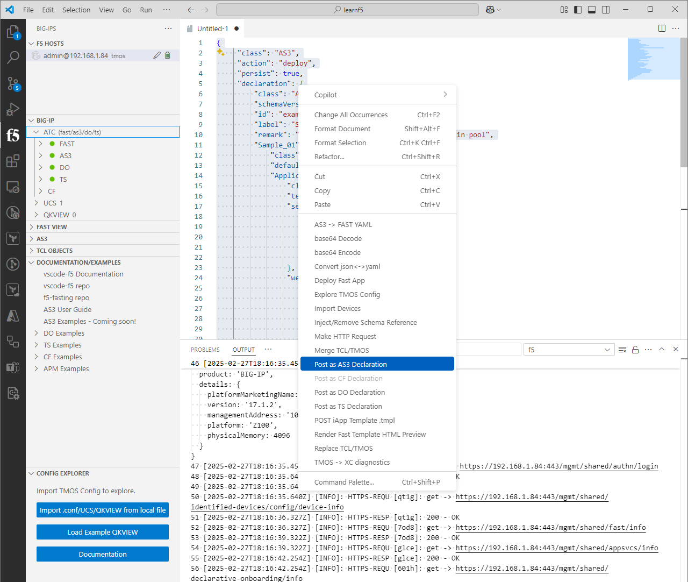
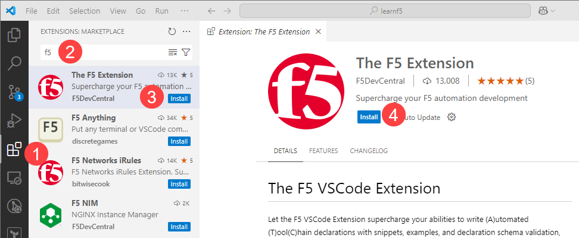
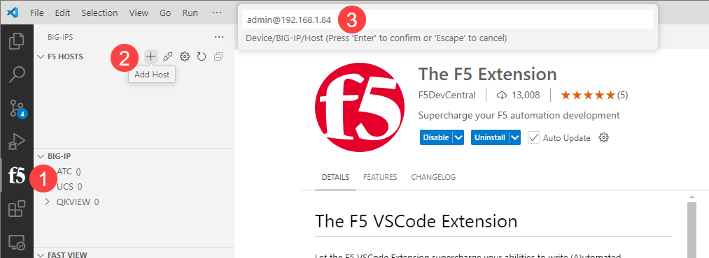

## Automating F5 BIG-IP with Visual Studio Code Extension
### module 1 Chapter 3

Every developer knows the importance of convienient and efficient tools to streamline the development process. Tools like the Visual Studio Code with The F5 Extension can significantly enhance productivity and accuracy when working with F5 BIG-IP configurations. This guide explores the benefits of using the F5 Extension for VS Code and how it can help automate F5 BIG-IP configurations effectively.

A well-configured IDE (In our case we use Visual Studio Code) is required for automation development. The F5 Extension for VS Code improves productivity by providing features like pre-built code snippets, real-time validation, and seamless device interaction. With these tools, developers can focus on writing high-quality automation scripts and configurations without worrying about syntax errors. The extension also offers direct access to F5 Automation Toolchain guides and examples, making it easier to learn and implement best practices.

### Key Features

#### 1. Faster Coding with Ready-Made Templates

The extension includes built-in code snippets and templates for F5 Automation Toolchain services (AS3, DO, TS, CFE, and FAST). These help developers set up configurations quickly, reducing manual work and errors.

#### 2. Instant Error Checking

Built-in validation checks your code in real-time, ensuring it follows the correct format and standards. This helps catch mistakes early, making deployments more reliable.

#### 3. Easy Connection to F5 Devices

The extension allows direct interaction with F5 devices from VS Code. Developers can send, retrieve, and manage configurations without switching tools, making work more efficient.

#### 4. Flexible Format Conversion

Developers can easily switch between JSON and YAML formats within the editor. This makes it easier to work with different project needs.

#### 5. Quick Access to Help and Examples

The extension provides direct links to F5 Automation Toolchain guides and examples. This helps developers learn and follow best practices easily.

### Installation and Setup

To integrate the F5 Extension into your VS Code environment:

1. **Install Visual Studio Code**

   Download and install VS Code from the official website: [https://code.visualstudio.com/](https://code.visualstudio.com/).

2. **Add the F5 Extension**

   - Open VS Code and navigate to the Extensions view by clicking on the Extensions icon or pressing `Ctrl+Shift+X`.
   - Search for "F5 Extension" in the marketplace.
   - Select "The F5 Extension" from the search results and click "Install".
  

3. **Configure the Extension**

   - After installation, add your F5 device by selecting "Add Host" in the F5 Hosts view.
   - Enter the device details in the format `<user>@<device_ip>` and press `Enter` to save.

For a comprehensive guide on installation and configuration, refer to the F5 VS Code Extension documentation: [https://f5devcentral.github.io/vscode-f5/](https://f5devcentral.github.io/vscode-f5/).

### Related Resources

The following video provides a step-by-step tutorial on setting up the F5 Extension in Visual Studio Code:

The F5 DevCentral community offers additional resources, guides, and examples for working with F5 Automation Toolchain services:

* [App Deployment with Application Services 3 Extension (AS3)](https://clouddocs.f5.com/training/community/public-cloud/html/class13/module3/module.html)
* [The F5 VSCode Extension](https://f5devcentral.github.io/vscode-f5/#/?id=the-f5-vscode-extension)
* [The F5 VSCode Extension GitHub](https://github.com/f5devcentral/vscode-f5)