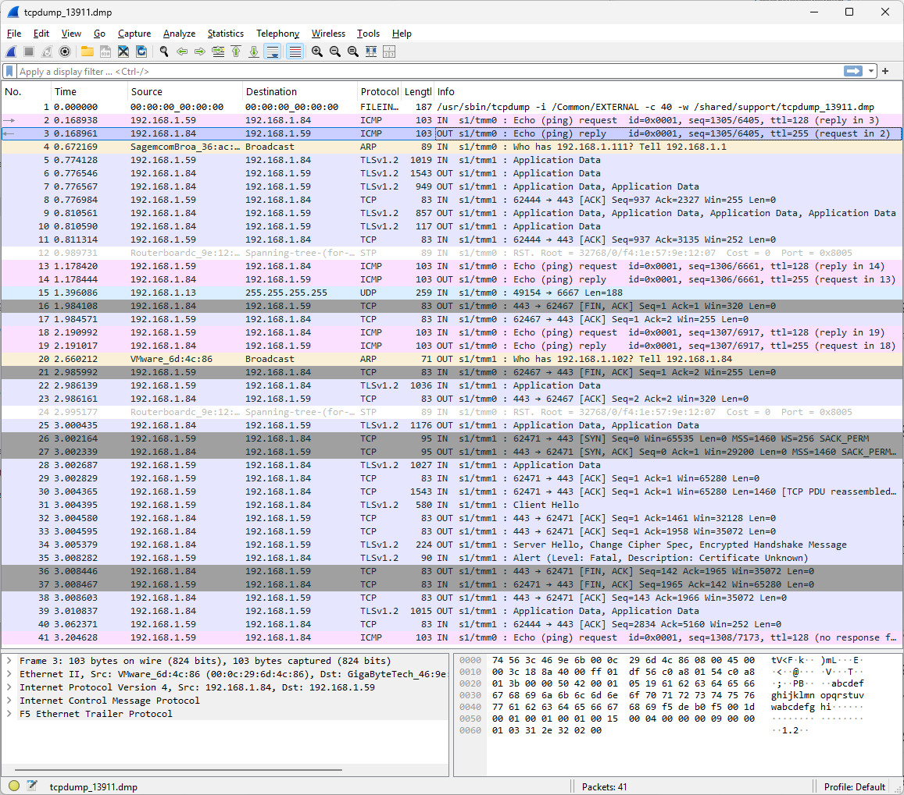
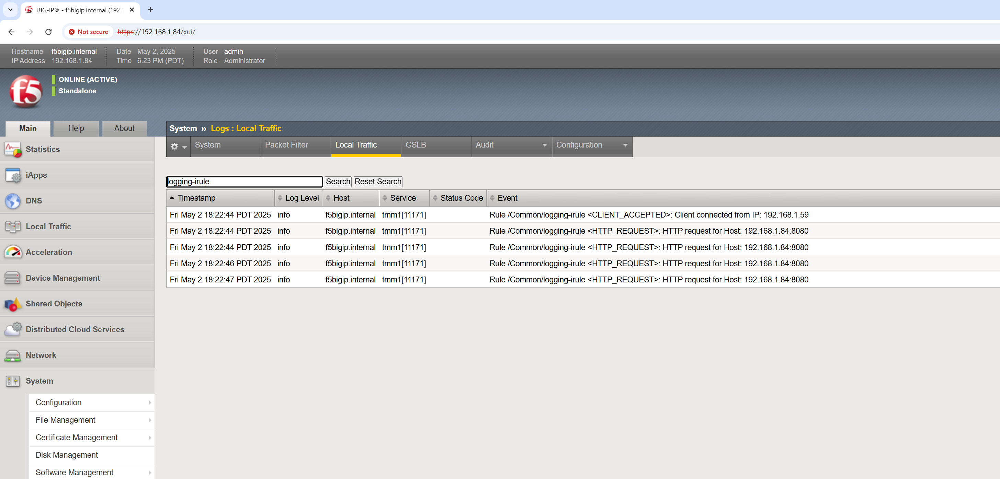
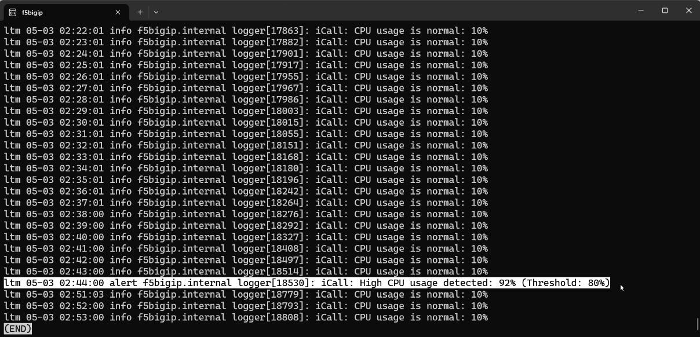

## BIG-IP Logging and Monitoring
### module 1 Chapter 4

In this lab, you will explore basic logging and monitoring techniques in F5 BIG-IP. You will learn how to access system logs, capture network traffic, and implement custom logging using iRules and iCall. This is useful for troubleshooting and monitoring the health of your BIG-IP system.

## 1. System Logs

Similar to other Linux systems, BIG-IP uses a variety of log files to record system events, errors, and informational messages. These logs are crucial for troubleshooting and monitoring the health of your BIG-IP system. You can access these logs via the command line. Some logs are also available through the BIG-IP GUI under **System > Logs**.

### Step 1: Connect to BIG-IP

SSH into your BIG-IP device using your admin credentials.

```bash
ssh admin@<BIG-IP-IP-address>
```

### Step 2: Navigate to Log Directory

Like most Linux systems, BIG-IP stores its logs in the `/var/log` directory. You can list the contents of this directory to see available log files.

```bash
cd /var/log
ls -lh
```

### Step 3: Review Key Logs

Here is a quick reference for the most important logs you will encounter in BIG-IP:

| Type          | Description                                          | Log file                           |
| ------------- | ---------------------------------------------------- | ---------------------------------- |
| audit         | Logs configuration changes.                          | /var/log/audit                     |
| boot          | Messages from the system boot process.               | /var/log/boot.log                  |
| cron          | Logs scheduled job activity.                         | /var/log/cron                      |
| daemon        | Logs from background daemons.                        | /var/log/daemon.log                |
| dmesg         | Kernel ring buffer logs for hardware detection.      | /var/log/dmesg                     |
| GSLB          | Global traffic management logs.                      | /var/log/gtm                       |
| httpd         | Apache Web server error log.                         | /var/log/httpd/httpd\_errors       |
| kernel        | Linux kernel logs.                                   | /var/log/kern.log                  |
| local traffic | Local traffic management events.                     | /var/log/ltm                       |
| mail          | Mail server logs.                                    | /var/log/maillog                   |
| monitor       | Health monitor logs (also see /var/log/monitors/).   | /var/log/ltm, /var/log/monitors/\* |
| sync          | Configuration sync messages and events.              | /var/log/nsyncd.log                |
| packet filter | Logs from packet filter rules.                       | /var/log/pktfilter                 |
| security      | Authentication and access control logs.              | /var/log/secure                    |
| system        | General Linux system events.                         | /var/log/messages                  |
| TMM           | Traffic Management Microkernel events.               | /var/log/tmm                       |
| user          | Logs related to user-level activity.                 | /var/log/user.log                  |
| webui         | Logs from the Configuration utility's web interface. | /var/log/webui.log                 |

### Step 4: View Logs

To view a specific log file, you can use the `cat`, `less`, or `tail` commands. For example, to view the local traffic management log:

```bash
tail -f /var/log/ltm
```

## 2. TCP Dump

TCP Dump is a powerful command-line tool for capturing and analyzing network traffic. It allows you to see the packets being sent and received by your BIG-IP system, which is useful for troubleshooting network issues.

### Step 1: Run a TCP Dump

Capture traffic on the external VLAN:

```bash
tcpdump -i external -w /var/tmp/tcpdump.pcap
```

Stop capture with `Ctrl+C`. 

### Step 2: Analyze the Capture

You can analyze the captured packets using tcpdump itself or by transferring file to your local machine and using Wireshark.



## 3. iRules Logging

iRules are a powerful feature in F5 BIG-IP that allow you to customize the behavior of your traffic management system. iRules support logging, which can be used to capture specific events or data points in your traffic flow. This is particularly useful for debugging and monitoring purposes.

### Step 1: Create an iRule

In the BIG-IP GUI:

1. Navigate to **Local Traffic > iRules > Create**
2. Name it `logging_irule`
3. Paste:

```tcl
when RULE_INIT {
    set static::debug 1
}

when CLIENT_ACCEPTED {
    if { $static::debug } {
        log local0. "Connection accepted from [IP::client_addr]"
    }
}

when HTTP_REQUEST {
    if { $static::debug } {
        log local0. "HTTP request for host: [HTTP::host]"
    }
}
```

4. Click **Finished**

### Step 2: Attach to Virtual Server

1. Navigate to **Local Traffic > Virtual Servers > \[Your VS]**
2. Under **Resources**, click **iRules > Manage**
3. Enable `logging_irule`

### Step 3: Check Logs

Navigate to **System > Logs > Local Traffic**, or run:

```bash
tail -f /var/log/ltm
```

This will show you the log entries generated by your iRule. 



## 4. iCall Logging

Next, we will use iCall to automate logging and alerting based on system performance metrics. iCall allows you to create scripts that can run periodically or in response to specific events.

### Step 1: Create the iCall Script

In this example, we will create a script that checks CPU usage and logs an alert if it exceeds a threshold.
Execute the following commands in the BIG-IP CLI:

```bash
tmsh create /sys icall script cpu_monitor_script

{
  app-service none
  definition {
    set cpu_threshold 80
    set output [exec tmsh show sys performance system]
    foreach line [split $output "\n"] {
      if {[regexp {Utilization\s+(\d+)\s+(\d+)} $line -> current avg]} {
        if {$avg > $cpu_threshold} {
          exec logger -p local0.alert "iCall: High CPU usage detected: ${avg}% (Threshold: ${cpu_threshold}%)"
        } else {
          exec logger -p local0.info "iCall: CPU usage is normal: ${avg}%"
        }
        break
      }
    }
  }
  description none
  events none
}
```

### Step 2: Schedule the Script

Now, we will create a periodic iCall handler to run this script every minute.

```bash
tmsh create /sys icall handler periodic cpu_monitor_handler interval 60 script cpu_monitor_script

tmsh start /sys icall handler periodic cpu_monitor_handler
```

### Step 3: Verify Logs

You can check the logs to see if the iCall script is running and logging alerts based on CPU usage.

```bash
tail -f /var/log/ltm
```



## 5. Summary

In this lab, we learned how to access and analyze system logs in F5 BIG-IP, capture network traffic using TCP Dump, and implement custom logging with iRules and iCall. These skills are useful for troubleshooting and monitoring the health of your BIG-IP system.

Quickly recap the key tools and techniques covered:

* `/var/log` to explore logs
* `tcpdump` for packet captures
* iRules to add custom logging
* iCall to automate alerts based on system performance

Use these techniques to enhance your BIG-IP monitoring and troubleshooting capabilities.