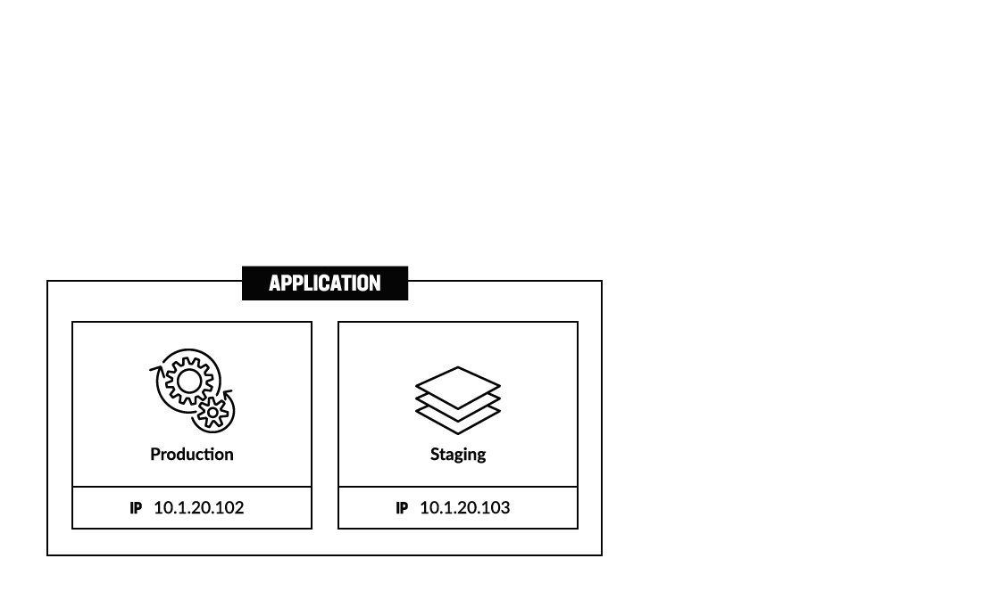
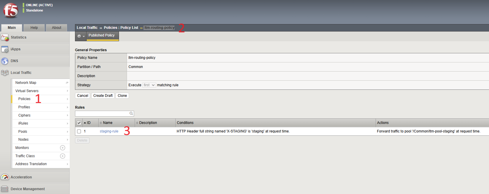
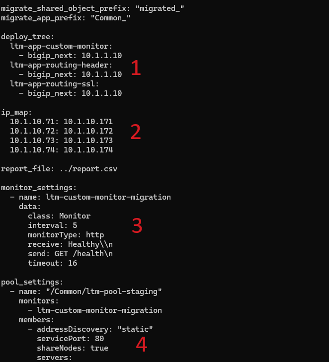

# Migrate with Routing LTM Policy

# Table of Contents

- [Migrate with Routing LTM Policy](#migrate-with-routing-ltm-policy)
- [Table of Contents](#table-of-contents)
- [Overview](#overview)
- [Setup Diagram](#setup-diagram)
- [Environment](#environment)
  - [Pre-requisites](#pre-requisites)
  - [Create App \& Policy in TMOS](#create-app--policy-in-tmos)
  - [Verify Created Policy](#verify-created-policy)
- [Automated Workflow Guide](#automated-workflow-guide)
  - [1. Review Migration Configuration](#1-review-migration-configuration)
  - [2. Review Migration Logs in Real-Time](#2-review-migration-logs-in-real-time)
  - [3. Migrate Application to BIG-IP Next](#3-migrate-application-to-big-ip-next)
  - [4. Test Migrated Routing Policy](#4-test-migrated-routing-policy)

# Overview

This guide showcases the process of automated migration of an application with a routing LTM policy from BIG-IP TMOS to BIG-IP Next. The policy has a rule in it that routes traffic between production and staging environment based on 'staging' header, which is converted to iRule in the course of migration.

# Setup Diagram

For this flow we will use an application that has production and staging environments. Initially, it is deployed in BIG-IP TMOS where LTM policy routes the incoming traffic between two environments based on its rule. We will migrate the application with the policy to BIG-IP Next and convert policy rules to iRules for traffic routing.



# Environment

## Pre-requisites

If this guide is the first one you take, you will need to complete the following environment setup steps. If you have already done those within another guide, you can skip them.

- [Blueprint setup](https://github.com/yoctoserge/bigip_automation_examples/blob/feature/merge-all/bigip/bigip_next/ltm/migrate-ltm-custom-monitors/Readme.md#blueprint-setup-for-f5-employees-or-customers-with-access-to-udf): if you are an F5 employee or customer with access to UDF, you can use BIG-IP Next blueprint.

- [Docker setup (optional)](https://github.com/yoctoserge/bigip_automation_examples/blob/feature/merge-all/bigip/bigip_next/ltm/migrate-ltm-custom-monitors/Readme.md#docker-setup): complete this step ONLY if you haven't done initialization yet, including in other lab and only if you chose to use Docker setup.

- [Application setup](https://github.com/yoctoserge/bigip_automation_examples/blob/feature/merge-all/bigip/bigip_next/ltm/migrate-ltm-custom-monitors/Readme.md#1-application-setup)

- [TMOS initialization](https://github.com/yoctoserge/bigip_automation_examples/blob/feature/merge-all/bigip/bigip_next/ltm/migrate-ltm-custom-monitors/Readme.md#2-tmos-initialization)

## Create App & Policy in TMOS

Enter the following directory:

```bash
bigip_automation_examples/bigip/bigip_next/ltm/migrate-ltm-request/tmos-init
```

Run the command:

```bash
ansible-playbook -i inventory.ini ./playbooks/site.yml
```

This will create an application and its policy.

Next, let's take a look at the created policy. Proceed to the **BIG-IP 15.1.x** component of the deployed blueprint and log in. Navigate to **Policies** under the **Local Traffic** section. In the opened list click on the created **ltm-routing-policy**. You will see that the created policy has its rule requesting to forward traffic to pool '/Common/ltm-pool-staging' at request time if HTTP Header full string named 'X-STAGING' is 'staging' at request time.



## Verify Created Policy

Before proceeding to the migration process, we will verify if the created policy has applied and routes traffic between production & staging environments based on requests.

In the opened command line go to the:

```bash
bigip_automation_examples/bigip/bigip_next/ltm/tmos-migrate
```

Run the first request to the production environment:

```bash
curl -X GET http://10.1.10.71/node-server
```

You will see the following response from the production environment:

```bash
Node server 10.1.20.102
```

Next, we will run the request with the header 'staging' specified:

```bash
curl -X GET http://10.1.10.71/node-server -H "X-Staging: staging"
```

The response will be sent from the staging environment as directed by the policy:

```bash
Node server 10.1.20.103
```

# Automated Workflow Guide

## 1. Review Migration Configuration

First, let's take a look at the specified custom variables for the app, monitor and pool. Open the following file:

```bash
 cat next_vars.yml
```

Firstly, notice to where the application will be deployed, secondly, how its IPs will be changed, and finally, the custom monitor and pool specified for staging, since when different pools are migrated the migration pool might not be in app specification of migration routine.



## 2. Review Migration Logs in Real-Time

Establish one more SSH connection to jumphost. Then enter the following directory:

```bash
bigip_automation_examples/bigip/bigip_next/ltm/tmos-migrate/logs$
```

And run the following command. It will run the logs.

```bash
tail -f ltm_policy_migration.log
```

## 3. Migrate Application to BIG-IP Next

Run the following command in the first command line interface to start the migration:

```bash
ansible-playbook -i inventory.ini ./playbooks/site.yml
```

This will create archive, and record converting policy rules to iRules in the course of migration in the second window set up for logging. Here's an example of converting routing policy to the iRule that includes the policy, the new iRule and its location:

```bash
Converting policy ==>
ltm policy /tenantbfc9054218e1f/Common_ltm-app-routing-header/ltm-routing-policy {
    controls { forwarding }
    requires { http }
    rules {
        staging-rule {
            actions {
                0 {
                    forward
                    select
                    pool /Common/ltm-pool-staging
                }
            }
            conditions {
                0 {
                    http-header
                    name X-STAGING
                    values { staging }
                }
            }
        }
    }
    strategy /Common/first-match
}
iRule ==> /tenantbfc9054218e1f/Common_ltm-app-routing-header/ltm-routing-policy
when HTTP_REQUEST {
  if { [HTTP::header "X-STAGING"] eq "staging" } {
    pool /app/tenantbfc9054218e1f:Common_ltm-app-routing-header/pool/ltm-pool-staging-service
  }
}
ltm-custom-monitor-migration --> ltm-custom-monitor-migration
```

## 4. Test Migrated Routing Policy

Send the first request to the production environment of the migrated application:

```bash
curl -X GET http://10.1.10.171/node-server
```

You will see the response from the production environment:

```bash
Node server 10.1.20.102
```

Next, send the request with the specified 'staging' header:

```bash
curl -X GET http://10.1.10.171/node-server -H "X-Staging: staging"
```

The response will be from the staging environment routed accordingly by the new iRule:

```bash
Node server 10.1.20.103
```

Congrats! You have just migrated application with LTM routing policy from TMOS to BIG-IP Next having converted it into iRule policy.
