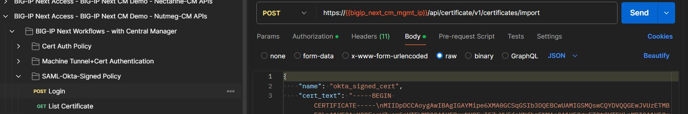
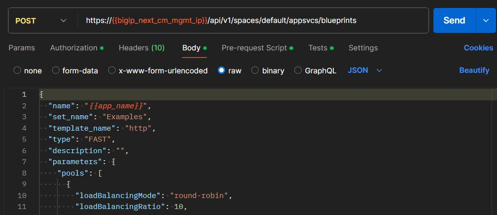
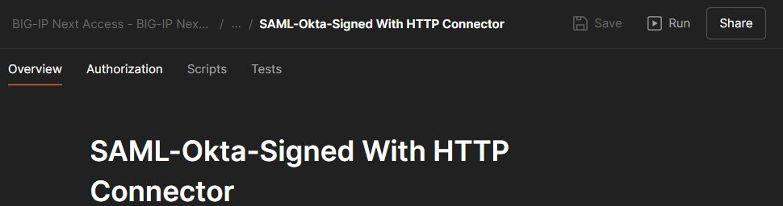
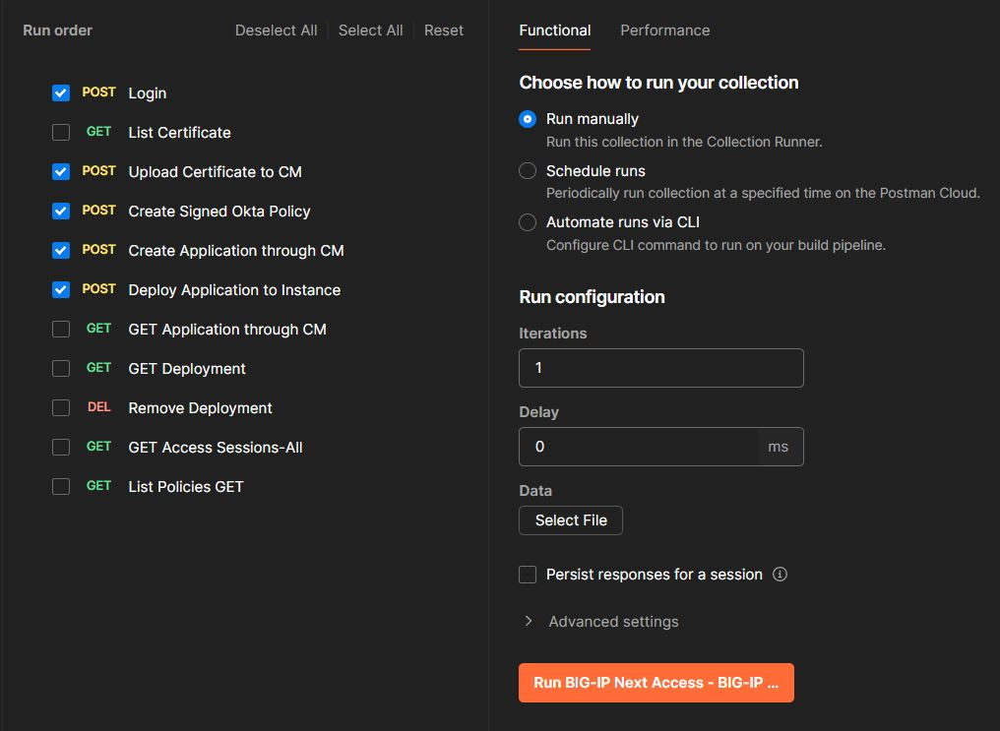

# Integration with Okta (SAML IdP) with HTTP Connector (Per-Session)

## Overview

In this guide we are checking the steps to use postman collection to configure `BIG-IP Next Access` as SAML Service Provider (SP), with Okta Identity Provider (IdP) and using HTTP Connector to fetch risk rating from API server (simulating 3rd party). 

Steps summary, 

1. Update the Postman variables to meet your deployment (Whether via Postman or via CI/CD used flow)
2. Start checking Postman body to meet your requirements as well. 
3. Whether click run to send the postman calls, or run the calls one by one. 

## Update Postman collection variables 

1. Click Import and select the postman collection file downloaded from [Postman collection](https://github.com/f5devcentral/bigip_automation_examples/tree/access-May-1/bigip/bigip_next/next_access/postman_collections). 
2. Once imported, head to variables to update the variable as per your environment. 

## Check Postman body and calls

The collection in question `SAML-Okta-Signed With HTTP Connector`, there's another collection with name `SAML-Okta-Signed With HTTP Connector (Authenticated)` which can be used when the API destination in question require Authentication/Authorization HTTP Connector call prior to the main risk fetch call.

1. Login call to request access token which we will make use of in the subsequent calls. 

2. Policy requirement items for example uploading certificate as in IdP or Creating Net resolver. 

3. Create Security policy. 

4. Create application and attach the security policy. 

5. Deploy application to the instance with additional parameters if any. 

    

## Run postman calls 

1. Select the collection in question `SAML-Okta-Signed With HTTP Connector`, there's another collection with name `SAML-Okta-Signed With HTTP Connector (Authenticated)` which can be used when the API destination in question require Authentication/Authorization HTTP Connector call prior to the main risk fetch call. 

2. Select the calls to run and adjust settings as needed (Run manually, scheduled or automatically) then hit Run. 

