# Deploy and Protect a New App on BIG-IP Next with Security Policy

# Table of Contents

- [Deploy and Protect a New App on BIG-IP Next with Security Policy](#deploy-and-protect-a-new-app-on-big-ip-next-with-security-policy)
- [Table of Contents](#table-of-contents)
- [Overview](#overview)
- [Setup Diagram](#setup-diagram)
- [Environment \& Pre-requisites](#environment--pre-requisites)
- [Blueprint Setup _(for F5 employees or customers with access to UDF)_](#blueprint-setup-for-f5-employees-or-customers-with-access-to-udf)
    - [1. Deploy Blueprint](#1-deploy-blueprint)
    - [2. Setup SSH Keys](#2-setup-ssh-keys)
    - [3. Enter Blueprint](#3-enter-blueprint)
    - [4. Clone Repository](#4-clone-repository)
    - [5. Data Initialization for Docker](#5-data-initialization-for-docker)
  - [Docker Setup](#docker-setup)
  - [Infrastructure Configuration](#infrastructure-configuration)
    - [1. Install Dependencies](#1-install-dependencies)
    - [2. Initialize Environment](#2-initialize-environment)
    - [3. Verify Endpoints](#3-verify-endpoints)
- [Manual Workflow Guide](#manual-workflow-guide)
  - [1. Start Creating an App](#1-start-creating-an-app)
  - [2. Add Pool and Server](#2-add-pool-and-server)
  - [3. Create WAF Security Policy](#3-create-waf-security-policy)
  - [4. Add Pool Member](#4-add-pool-member)
  - [5. Deploy App](#5-deploy-app)
  - [6. Verify App](#6-verify-app)
- [Automated Workflow Guide](#automated-workflow-guide)
  - [1. Prerequisites](#1-prerequisites)
  - [2. Add Access Credentials for BIG-IP Next](#2-add-access-credentials-for-big-ip-next)
  - [3. Initialize Terraform](#3-initialize-terraform)
  - [4. Preview App and Security Policy Config (_optional_)](#4-preview-app-and-security-policy-config-optional)
  - [5. Deploy App and Security Policy](#5-deploy-app-and-security-policy)
  - [6. Verify the Deployed App with its Policy](#6-verify-the-deployed-app-with-its-policy)

# Overview

This guide provides manual walk-through steps and automated Terraform scripts for a "greenfield deployment" of an app to BIG-IP Next. Using BIG-IP Next Central Manager (CM) we will also protect this application with a WAF Policy in blocking mode. You may leverage the provided sample application by using the included Docker.

# Setup Diagram

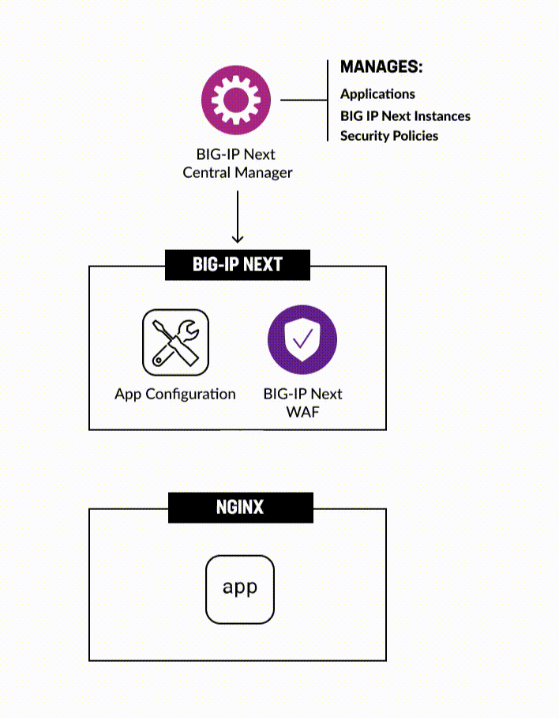

There are two workflows to deploy an app to BIG-IP Next with Next WAF Policy covered by this guide: [manual](#manual-workflow-guide) or [automated](#automated-workflow-guide). The Terraform scripts automate the same steps as in the manual flow.

# Environment & Pre-requisites

You may use your own environment with BIG-IP Next, in which, as a pre-requisite, you need to have at a minimum:

- BIG-IP Next Instance(s), where we will deploy the migrated app config

- BIG-IP Next Central Manager, which we will use for migrating the virtual servers to Next instances and WAF Policy config

For executing automation scripts, you need to utilize a Linux machine with network access to the BIG-IP CM instance. On this Linux machine, you may choose to run Docker in order to take advantage of the sample app(s) and tooling (Ansible, Terraform, etc.)

Before starting application migration we will need to set up our environment. Environment configuration will include the following steps:

- Docker setup (optional)

- Running Ansible playbook

# Blueprint Setup _(for F5 employees or customers with access to UDF)_

**If you are an F5 employee or customer with access to UDF, you can use the following BIG-IP Next blueprint flow as the foundation for your environment: "NEXT WAF-Automation (20.3.0)". Search for this name and utilize the latest version of the blueprint. This GitHub repo is already optimized to work with this UDF blueprint.**

### 1. Deploy Blueprint

Navigate to the **Blueprints** and search for **NEXT WAF-Automation (20.3.0)**. Deploy it.

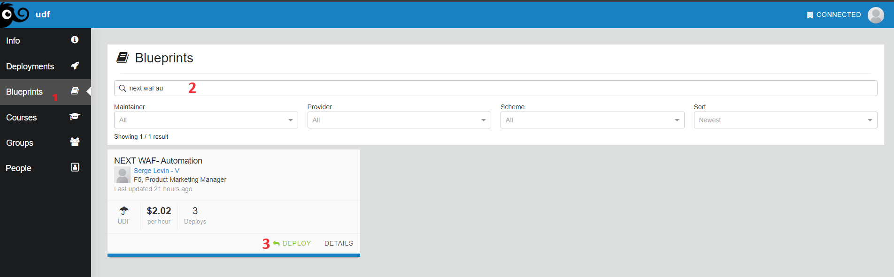

After it has been deployed, navigate to your **Deployments** and start it:

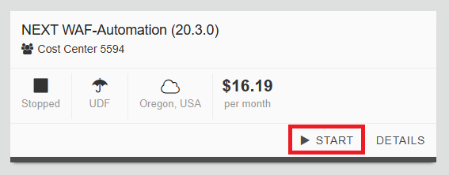

### 2. Setup SSH Keys

To enter the Blueprint VM (jumphost), the SSH tool will be used. In order to setup SSH access keys use [this guide](https://help.udf.f5.com/en/articles/3347769-accessing-a-component-via-ssh).

### 3. Enter Blueprint

After the Blueprint has been deployed and SSH keys are setup, navigate to the **Deployments** section and proceed to the **Details** of your deployment. Select the **Components** tab to see three components we are going to use: **Ubuntu Jump Host (client/server)**, **BIG-IP 15.1.x**, **BIG-IP Next Central Manager**. Proceed to the **Ubuntu Jump Host**.

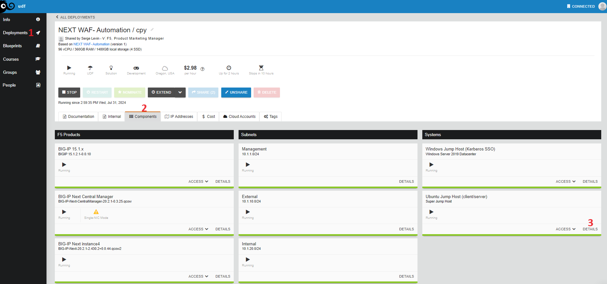

Go to the **Access Methods** tab and copy the SSH external. Execute, to copied command in command line.

### 4. Clone Repository

After that, clone the [repository](https://github.com/yoctoserge/bigip_automation_examples.git). Note that you don't need to specify keys in Blueprint since they are already specified.

### 5. Data Initialization for Docker

**NOTE: Complete this step ONLY if you haven't done initialization yet, including in other lab.**

Go to the following directory of the cloned repository:

```bash
bigip/bigip_next/env-init/docker
```

Run the `init.sh` to create a local key folder:

```bash
sh ./init.sh
```

You can verify that the folder with the SSH keys has been created. The folder is used during Docker build operation.

## Docker Setup

We recommend using a jump host (Linux machine) where you can configure the required services, such as Docker, which includes demo apps. If using UDF Blueprint Deployment, the Ubuntu jump host is already provided with the included SSH keys for the Blueprint environment. Docker setup is only used for initialization and/or [Automated Workflow](#automated-workflow-guide).

**NOTE: At this point if you're using your own (non-UDF) environment, make sure you Git clone clone the [repository](https://github.com/yoctoserge/bigip_automation_examples.git) and navigate to the following directory of the cloned repository:**

```bash
bigip/bigip_next/env-init/docker
```

Next, we will build Docker. Note that executing this command can take some time.

```bash
sh ./build.sh
```

As soon as the build is completed, enter Docker:

```bash
sh ./run.sh
```

## Infrastructure Configuration

### 1. Install Dependencies

Enter the directory:

```bash
bigip/bigip_next/env-init/environment
```

Run the command to install the collections and libraries required in Ansible playbook:

```bash
sh ./install-prerequisites.sh
```

### 2. Initialize Environment

In this step, we will initialize the sample app.

The hosts to install the sample app is configured in **inventory.ini**:

```ini
[app]
10.1.1.4

[app:vars]
ansible_ssh_private_key_file=/home/ubuntu/.ssh/id_rsa
```

The **[app]** secton is the target destination of the deployment for the sample app. It is **Ubuntu Jump Host (client/server)** in **Blueprint** setup. For this demo, no need to change other sections, if any present in the file. The file is configured for the **Blueprint** setup, no need to chage it.

After reviewing the files, run the following command to start initializing:

**Executing initialization via Ansible playbook**

```bash
ansible-playbook -i inventory.ini app_install.yml
```

### 3. Verify Endpoints

Let's verify the app is up and running, execute:

```bash
curl http://10.1.20.102/endpoint1
```

```bash
curl http://10.1.20.102/endpoint2
```

The expected output should look like this:

```
OK. Endpoint - 1
```

# Manual Workflow Guide

## 1. Start Creating an App

Log in BIG-IP Next Central Manager via the deployment we did earlier, and proceed to **Application Workspace**.

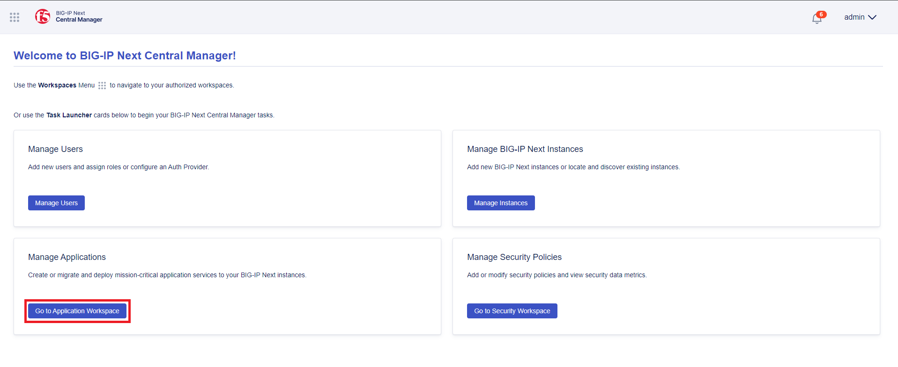

Click the **Start Adding Apps** button. This will open the creation form.

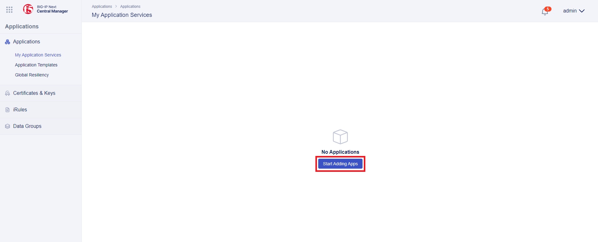

Before moving on to app configuration, select the type of application service, give it a name, and click the **Start Creating** button.

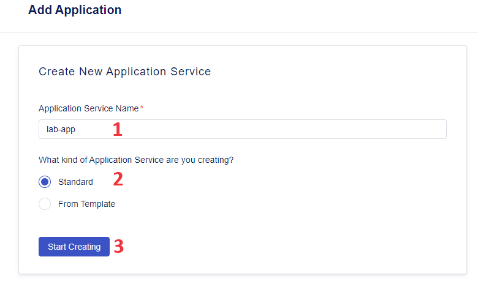

You can type in a description for the application service and move on.

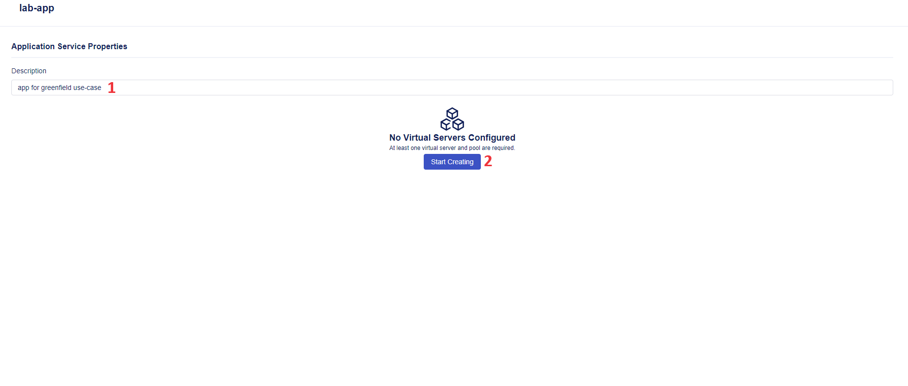

## 2. Add Pool and Server

Next, we will add a pool and virtual server. Navigate to the **Pools** tab and click the **Create** tab.

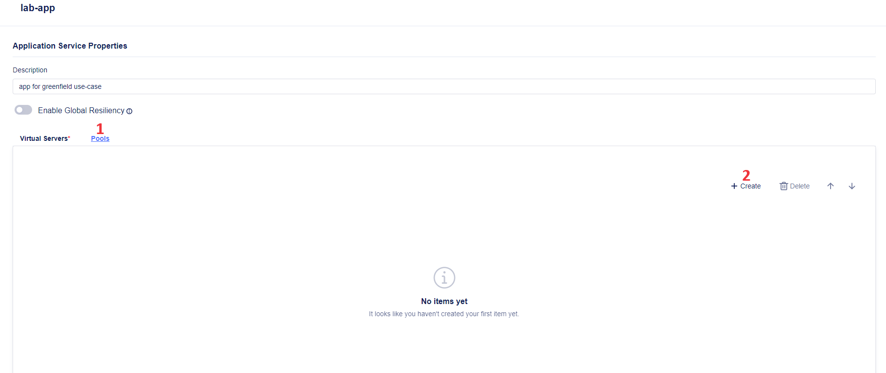

Give the pool a name, make sure to use Service Port **80** and Load-Balancing Mode **round-robin** for this flow. Move on to the **Virtual Servers** tab to configure one for the app.

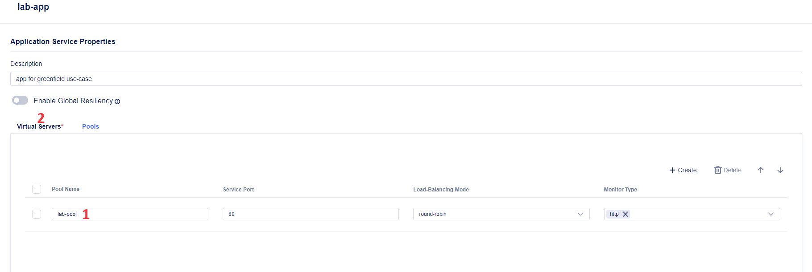

Give the virtual server a name, select the pool we've just added in the drop-down menu and make sure to have Virtual Port **80** specified. As soon as the virtual server has been configured, proceed to adding a WAF Security Policy.

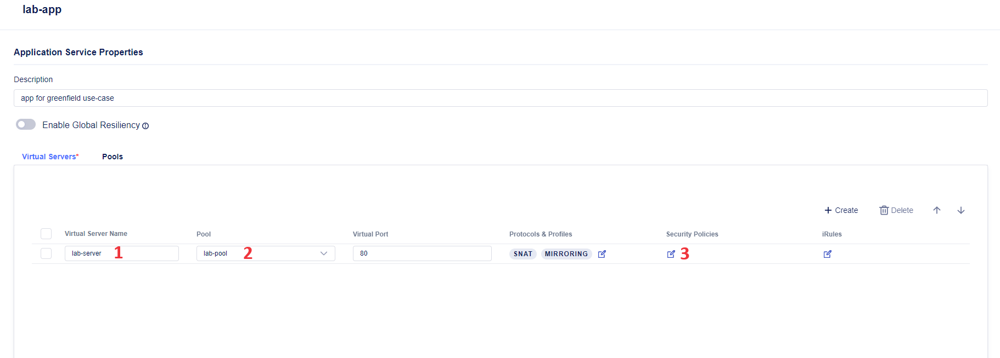

## 3. Create WAF Security Policy

First, we need to enable the WAF Policy using the toggle. Next, click the **Create** button which will open the WAF Policy configuration form.

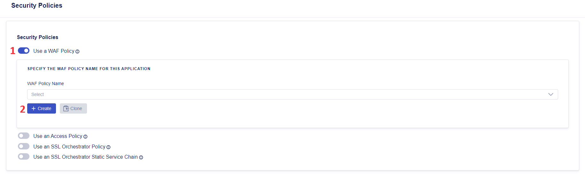

Give WAF policy a click on Advanced View to expand the section for WAF Template Selection. Note the Policy settings such as Bot Defense and Threat Intelligence. Let's select **L7 DoS protection** and let's make sure to have **Blocking** selected for Enforcement Mode. As you can see, BIG-IP Next Central Manager provides day-one enforcement in blocking mode at the time of WAF Policy configuration.

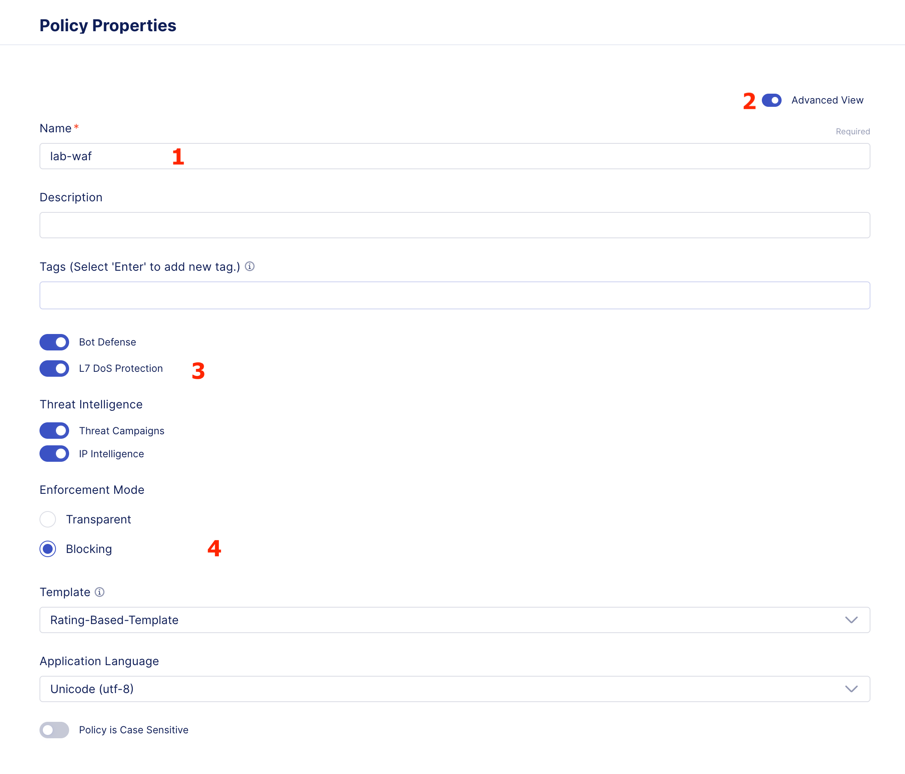

Expand the drop-down for the **Template** taking note of the Ratings Based Template, a new addition in Next WAF, which provides a balanced protection from day one and takes the guesswork out of tuning. When the policy properties have been configured, proceed by clicking **Save**.

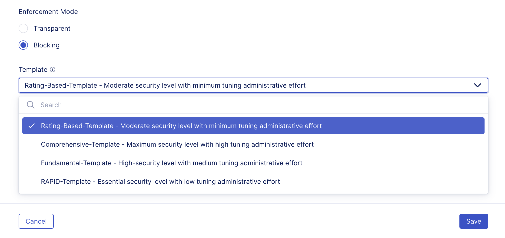

The name should appear in WAF Policy name field. Click **Save** to move on.


Back on the app configuration page, take a look at the configured properties and click **Review & Deploy**.

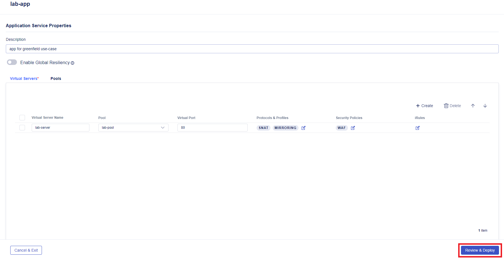

After that, we will specify the deployment instance. CLick the **Start Adding** button, choose the **big-ip-next-03.example.com** instance and add it to the list.

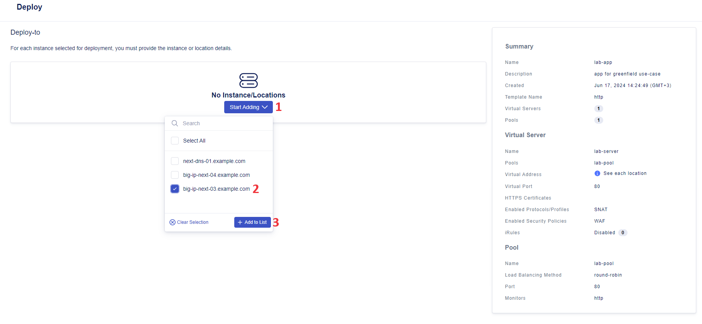

## 4. Add Pool Member

First, specify **10.1.10.94** virtual address. Then, in order to specify the deployment instance, we will add a pool member. Open the drop-down menu under **Members** and select adding a pool member.

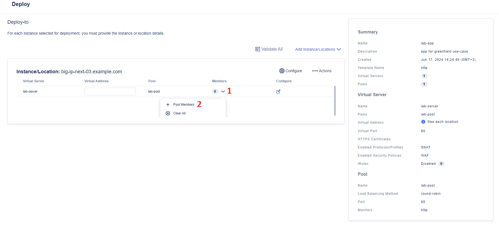

In the opened configuration window add a row and fill it in by giving the pool member a name and specifying the **10.1.10.102** IP Address.

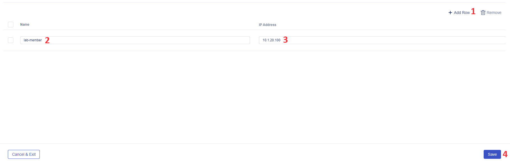

## 5. Deploy App

Back on the deployment instance page, the configured pool member will appear in the table. Click the **Validate All** button. This will start the process of validating all the configurations before deployment.

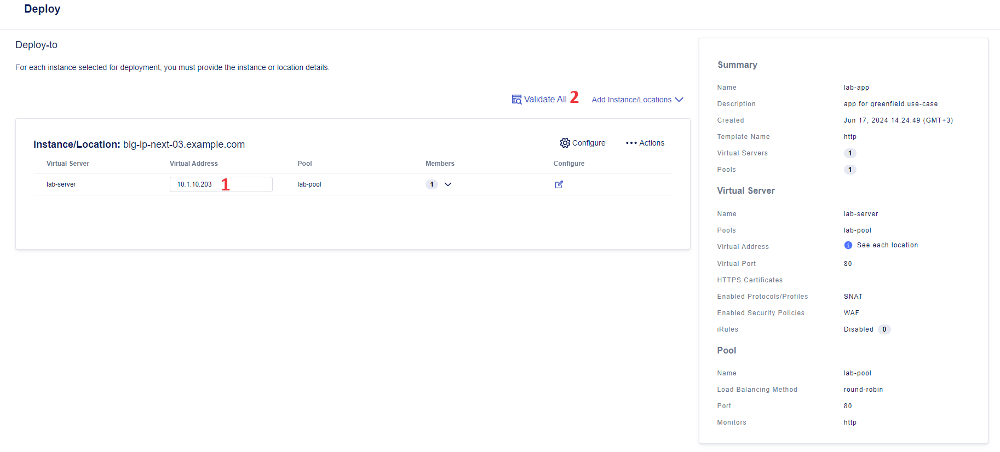

As soon as validation is over, its result will be displayed on the page. If the validation is successful, you can click the **Deploy Changes** button.

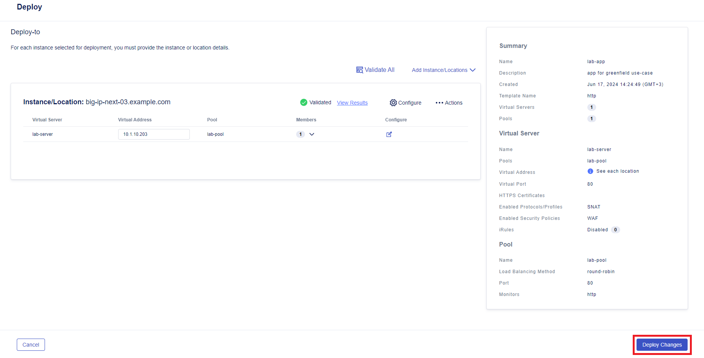

The next window will ask you to confirm application service deployment. Take a look at the app name and deployment instance and click **Yes, Deploy**.

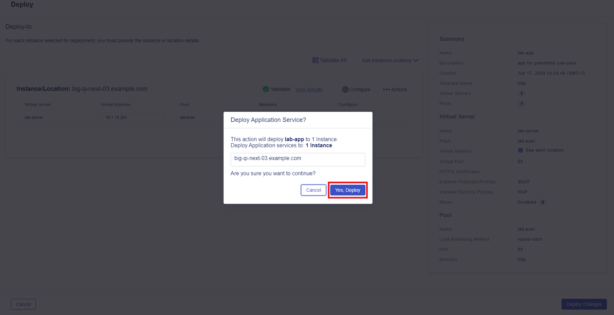

As soon as the deployment process is over, you will see a notification in the lower right corner and the application will be displayed in the table. You can see its health status, instance and security policy we configured.

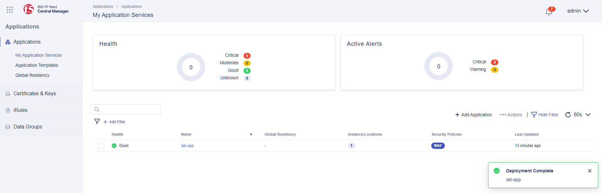

## 6. Verify App

You can verify the app by running the following commands:

```bash
curl http://10.1.10.94/endpoint1
```

```bash
curl http://10.1.10.94/endpoint2
```

The expected output should look like this:

```
OK. Endpoint - 1
```

Also verify that WAF is applied to TMOS routing by running the following commands:

```bash
curl 'http://10.1.10.94/endpoint1?query=<script>alert(1)</script>'
```

```bash
curl 'http://10.1.10.94/endpoint2?query=<script>alert(1)</script>'
```

The expected output should look like:

```
<html><head><title>Request Rejected</title></head><body>The requested URL was rejected. Please consult with your administrator.<br><br>Your support ID is: 7857824916379271192<br><br><a href='javascript:history.back();'>[Go Back]</a></body></html
```

Congrats, you did it! You deployed a new app to BIG-IP Next and applied a WAF policy to it using BIG-IP Next Central Manager. Central Manager lets us configure the WAF Policy in an easy and straightforward way making blocking mode available right away.

# Automated Workflow Guide

## 1. Prerequisites

- Clone and install the repository https://github.com/yoctoserge/bigip_automation_examples.git if you haven't done so yet
- Access to BIG-IP Central Manager
- CLI in Jump Host or Docker to run commands
- Setup Docker (_optional but recommended_)

## 2. Add Access Credentials for BIG-IP Next

Proceed to the following directory:

```bash
bigip/bigip_next/security/deploy-with-new-next-waf
```

First, you need to enter the `input.tfvars` file and specify your own variables:

- Central Manager address (`cm`),
- username and password to access Central Manager,
- BIG-IP Next address (`target`).

Then you go to the `app-as3.json` file which is an AS3 definition of the app to be deployed and contains all app info for the deployment. Update app info as needed. Note that `virtualAddresses` is where the app will be deployed, and `serverAddresses` is the routing address of the app.

Lastly, you can update security policy info, if needed, in the `policy.json` file containing the security policy to be deployed for the app. Note that the policy specified in the file will be deployed in blocking mode.

## 3. Initialize Terraform

In the CLI run the following command to initialize terraform:

```bash
terraform init
```

## 4. Preview App and Security Policy Config (_optional_)

Run the following command to preview the changes that Terraform will execute: the app to be created and the security policy with its configuration.

```bash
terraform plan -var-file=input.tfvars
```

## 5. Deploy App and Security Policy

Run the following command to create and deploy the app and security policy:

```bash
terraform apply -var-file=input.tfvars
```

## 6. Verify the Deployed App with its Policy

First, let's verify the app by running the following commands:

```bash
curl http://10.1.10.93/endpoint1
```

```bash
curl http://10.1.10.93/endpoint2
```

The expected output should look like this:

```
OK. Endpoint - 1
```

Also verify that WAF is applied to TMOS routing by running the following commands:

```bash
curl 'http://10.1.10.93/endpoint1?query=<script>alert(1)</script>'
```

```bash
curl 'http://10.1.10.93/endpoint2?query=<script>alert(1)</script>'
```

The expected output should look like:

```
<html><head><title>Request Rejected</title></head><body>The requested URL was rejected. Please consult with your administrator.<br><br>Your support ID is: 7857824916379271192<br><br><a href='javascript:history.back();'>[Go Back]</a></body></html
```

Congrats, you did it! You deployed a new app to BIG-IP Next and applied a WAF policy to it using BIG-IP Next Central Manager. Central Manager lets us configure the WAF Policy in an easy and straightforward way making blocking mode available right away.

Next, log into your Central Manager and navigate to the **Application Workspace**.


You will see a newly deployed app with its details: health status, locations/instances and security policies.

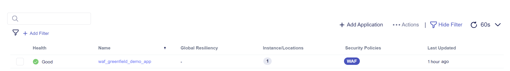

Next, we will take a look at the created security policy. Navigate to the **Security** tab and proceed to **Policies** under the **WAF** section.

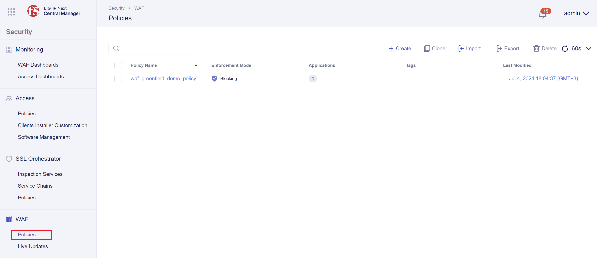

Finally, we can drill down into the created policy details. Click on the policy to proceed.


Congrats! You just completed automated deployment and protection of a new app on BIG-IP Next.
