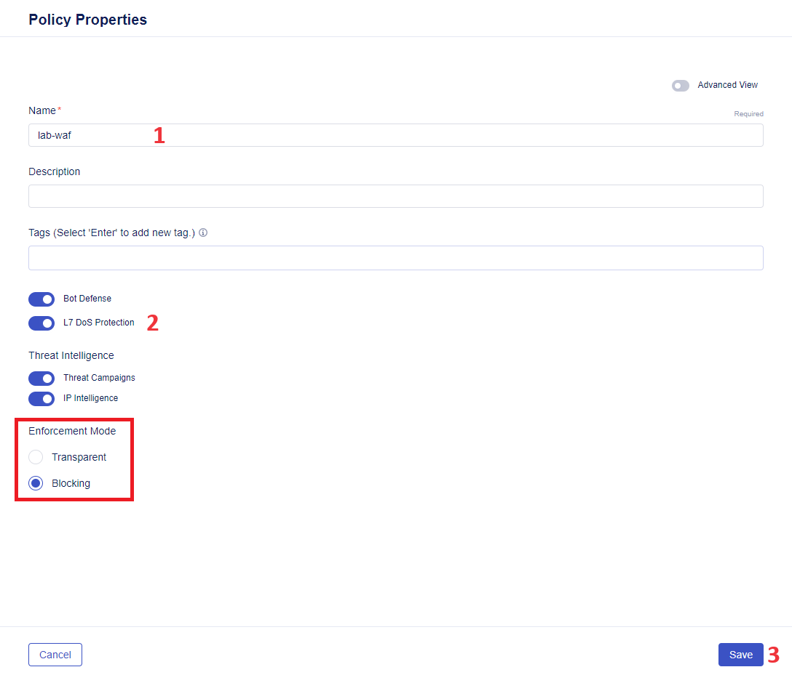

# Deploy a New App to BIG-IP Next with Next WAF Policy

# Table of Contents

- [Deploy a New App to BIG-IP Next with Next WAF Policy](#deploy-a-new-app-to-big-ip-next-with-next-waf-policy)
- [Table of Contents](#table-of-contents)
- [Overview](#overview)
- [Setup Diagram](#setup-diagram)
- [Manual Workflow Guide](#manual-workflow-guide)
  - [1. Start Creating an App](#1-start-creating-an-app)
  - [2. Add Pool and Server](#2-add-pool-and-server)
  - [3. Create WAF Security Policy](#3-create-waf-security-policy)
  - [4. Add Pool Member](#4-add-pool-member)
  - [5. Validate and Deploy](#5-validate-and-deploy)
- [Automated Workflow Guide](#automated-workflow-guide)
  - [1. Prerequisites](#1-prerequisites)
  - [2. Repository files](#2-repository-files)
  - [3. Initialize terraform](#3-initialize-terraform)
  - [4. Preview app and security policy config (optional)](#4-preview-app-and-security-policy-config-optional)
  - [5. Deploy app and security policy](#5-deploy-app-and-security-policy)
  - [6. Verify the deployed app with its policy](#6-verify-the-deployed-app-with-its-policy)
- [Additional Related Resources](#additional-related-resources)

# Overview

In this part of the guide we will take a look at a greenfield use-case where we will deploy an app to BIG-IP Next, as well as create a WAF Policy for it. We will be using BIG-IP Next Central Manager that will let us experience the ease of all deployment process and the possibility to configure Next WAF policy in blocking mode right in the process of its creation.

# Setup Diagram

======TODO======

# Manual Workflow Guide

You can follow the steps in the manual or automated guides below:

## 1. Start Creating an App

Log in BIG-IP Next Central Manager and proceed to **Application Workspace**.


Click the **Start Adding Apps** button. This will open the creation form.


Before moving on to app configuration, give it a name, select kind of application service and click the **Start Creating** button.


You can type in a description for the application service and move on.


## 2. Add Pool and Server

Next, we will add a pool and virtual server. Navigate to the **Pools** tab and click the **Create** tab.


Give pool a name, make sure to use Service Port **80** and Load-Balancing Mode **round-robin** for this flow. Move on to the **Virtual Servers** tab to configure one for the app.


Give virtual server a name, select the pool we've just added in the drop-down menu and make sure to have Virtual Port **80** specified. As soon as the virtual server has been configured, proceed to adding a WAF Security Policy.


## 3. Create WAF Security Policy

First, we need to enable using WAF Policy using the toggle. Next, click the **Create** button which will open WAF Policy configuration form.


Give WAF policy a name and enable the L7 DoS Protection for the app. Take a look at other configuration, such as enabled Bot Defense and Threat Intelligence options. Also make sure to have **Blocking** selected for Enforcement Mode. As you can see, BIG-IP Next Central Manager provides an opportunity to set up the blocking enforcement mode right at the WAF Policy configuration stage which makes the whole process fast and easy and allows us to have blocking mode for our app from day one. When the policy properties have been configured, proceed by clicking **Save**.



The name should appear in WAF Policy name field. Click **Save** to move on.


Back on the app configuration page, take a look at the configured properties and click **Review and Deploy**.


After that, we will specify deployment instance. CLick the **Start Adding** button, choose an instance and add it to the list.


## 4. Add Pool Member

Finally, in order to specify deployment instance, we will add a pool member. Open the drop-down menu under **Members** and select adding a pool member.


In the opened configuration window add a row and fill it in by giving pool member a name and specifying the IP Address.


## 5. Validate and Deploy

Back on the deployment instance page, the configured pool member will appear in the table. Fill in instance virtual address and click the **Validate All** button. This will start the process of validating all the configuration before deployment.


As soon as validation is over, its result will be displayed on the page. If the validation is successful, you can click the **Deploy Changes** button.


The next window will ask you to confirm application service deployment. Take a look at app name and deployment instance and click **Yes, Deploy**.


As soon as the deployment process is over, you will see a notification in the lower right corner and the application will be displayed in the table. You can see its health status, instance and security policy we configured.


Congrats, you did it! You deployed a new app to BIG-IP Next and applied a WAF policy to it using BIG-IP Next Central Manager. Central Manager let us configure the WAF Policy in an easy and straightforward way making blocking mode available right away.

# Automated Workflow Guide

## 1. Prerequisites

- Clone and install the repository ===TODO=== git@github.com:yoctoserge/bigip_automation_examples.git
- Access to BIG-IP Central Manager
- CLI tool

## 2. Repository files

`app-as3.json` is an AS3 definition of app to be deployed and contains all app info for the deployment. Update app info if needed.

`policy.json` is a file of security policy to be deployed for the app. You can update security policy info in the file if needed. The policy specified in the file will be deployed in blocking mode.

`input.tfvars` is a file that contains variables to be specified: Central Manager address (`cm`), username and password to access Central Manager, and BIG-IP Next address (`target`). You need to specify your info there.

## 3. Initialize terraform

In the CLI run the following comman to initialize terraform:

```bash
terraform init
```

## 4. Preview app and security policy config (optional)

Run the following command to preview the changes that Terraform will execute: the app to be created and security policy with its configuration.

```bash
terraform plan -var-file=input.tfvars
```

## 5. Deploy app and security policy

Run the following command to create and deploy the app and security policy:

```bash
terraform apply -var-file=input.tfvars
```

## 6. Verify the deployed app with its policy

Log in your Central Manager and navigate to the **Application Workspace**.


You will see a newly deployed app with its details: health status, locations/instances and security policies.


Next, we will take a look at the created security policy. Navigate to the **Security** tab and proceed to **Policies** under the **WAF** section.


Finally, we can drill down into the created policy details. Click on the policy to proceed.


# Additional Related Resources

=======TODO========
