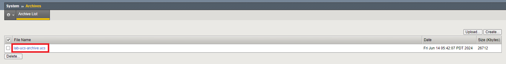
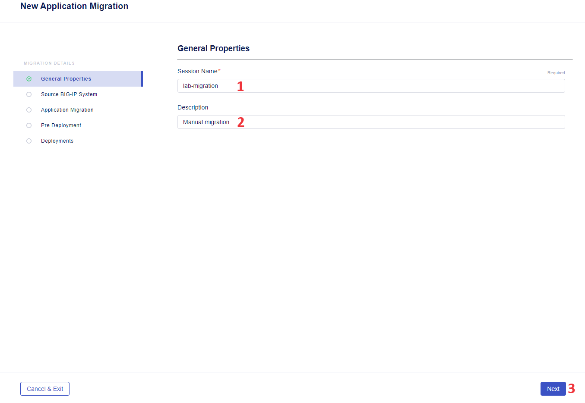
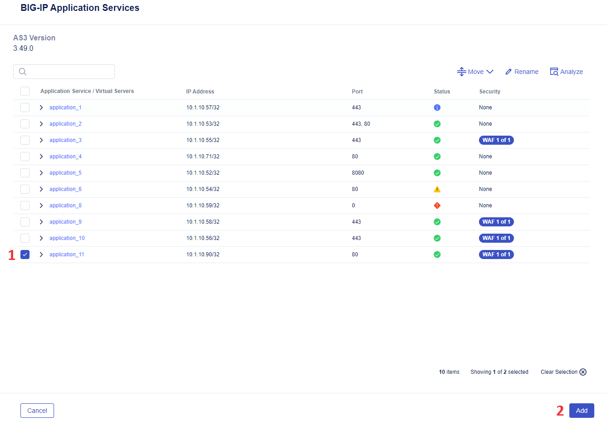
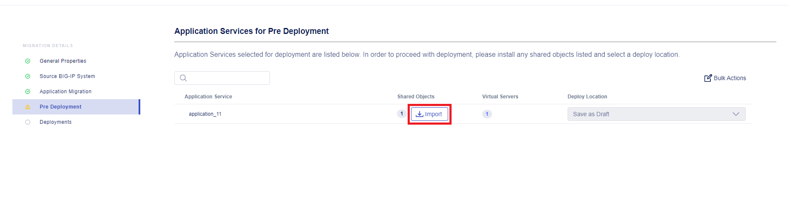
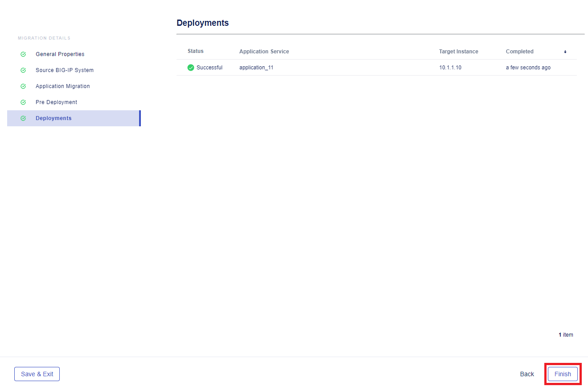
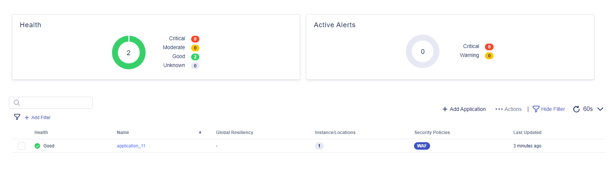

# Table of Contents

- [Table of Contents](#table-of-contents)
- [Overview](#overview)
- [Setup Diagram](#setup-diagram)
- [Environment Setup](#environment-setup)
  - [1. Docker Setup (_optional_)](#1-docker-setup-optional)
    - [1.1 Clone repository](#11-clone-repository)
    - [1.2 Build Docker](#12-build-docker)
    - [1.3 Enter Docker](#13-enter-docker)
    - [1.4 Add SSH private keys](#14-add-ssh-private-keys)
  - [2. Inventory Setup](#2-inventory-setup)
  - [3. Environment Configuration](#3-environment-configuration)
  - [4. Validate NGINX App](#4-validate-nginx-app)
- [Manual Workflow Guide](#manual-workflow-guide)
  - [1. Get BIG-IP UCS Archive](#1-get-big-ip-ucs-archive)
  - [2. Migrate the App](#2-migrate-the-app)
    - [2.1 Upload UCS Archive into Central Manager](#21-upload-ucs-archive-into-central-manager)
    - [2.2 Add Application for Migration](#22-add-application-for-migration)
    - [2.3 Import Shared Objects](#23-import-shared-objects)
    - [2.4 Deploy](#24-deploy)
    - [2.5 Check App Availability](#25-check-app-availability)
- [Automated Workflow Guide](#automated-workflow-guide)
- [Additional Related Resources](#additional-related-resources)

# Overview

This guide showcases migration of an app with a configured WAF policy from Classic BIG-IP to BIG-IP Next using BIG-IP Next Central Manager. BIG-IP Next Central Manager lets us reduce mean time needed for migration of application services. Migration with it runs fast and straightforward, it allows us to migrate our apps with their configured security profiles: WAF, Bot, DDoS.

The first part of the use-case will focus on manual migration of an application, whereas the second one - on automatic way to do that. In the course of the guide we will:

- Set up environment for migration including inventory configuration for migration source and running Ansible playbook.

- Get UCS archive from BIG-IP and start manual migration in BIG-IP Next Central Manager using the file. We will check app availability after its deployment to BIG-IP Next.

- Migrate and deploy the app automatically.

# Setup Diagram

=====TODO======

# Environment Setup

Before starting application migration we will need to set up environment. Environment configuration will include two steps:

- Configuration of inventory for migration source

- Running Ansible playbook

## 1. Docker Setup (_optional_)

If you prefer to not install everything locally but rather use Docker, follow the steps below. Docker setup is only used for initialization and/or [Automated Workflow](#). If you prefer not to use Docker, you can skip this step.

### 1.1 Clone repository

Clone and install the repository: https://github.com/f5devcentral/bigip_automation_examples.git

### 1.2 Build Docker

Enter the folder `bigip/bigip_next/security/migrate-from-cbip/docker-env` and run the following command to build Docker that will include Terraform, Ansible and nano. Note that executing this command can take some time.

```bash
sh ./build.sh
```

### 1.3 Enter Docker

Enter the docker by running the command:

```bash
sh ./run.sh
```

You will see a list of files. Enter the `.ssh`.

### 1.4 Add SSH private keys

Next we will add SSH private keys for Classic BIG-IP and Central Manager. Note that you will need to add keys only for Ansible.

Inside the `.ssh`, you will see `cbip-key` for private key to access Classic BIG-IP and `cm-key` for key to access Central Manager.

Enter the `cbip-key` file by running th following command and fill in the key:

```bash
nano cbip-key
```

Enter the `cm-key` file by running the following command and fill in the key:

```bash
nano cm-key
```

## 2. Inventory Setup

Let's start with inventory configuration for migration source. Go to the inventory file and specify application and CBIP IDs:

```bash
 inventory.ini
```

## 3. Environment Configuration

Next, we will run the following command to configure the source CBIP virtual server, attach WAF policy and validate if BIG-IP is setup correctly and the app is available.

```bach
ansible-playbook -i inventory.ini site.yaml
```

## 4. Validate NGINX App

Now that we have initialized and configured the environment, we can check NGINX App availability by running the command:

======TODO======

```bash
curl http://{nginx_app}/server1
```

# Manual Workflow Guide

In this part of our guide we will showcase a brownfield use case for app manual migration from Classic BIG-IP to BIG-IP Next. Since migration covers WAF policies, in the course of migration we will see how easy and fast it is to migrate an app with a configured WAF policy using BIG-IP Next Central Manager. In order to manually migrate an app with WAF policy we will:

- Get BIG-IP UCS Archive
- Upload UCS Archive into BIG-IP Next Central Manager
- Add the application for migration and import its shared objects
- And finally, deploy the app to a BIG-IP Next instance
- In the end, we will verify the created app and check the availability

## 1. Get BIG-IP UCS Archive

First, we will get a UCS archive that contains the source Classic BIG-IP application services and then import it into BIG-IP Next Central Manager. This will let us view and deploy the app to BIG-IP Next in further steps.

Log in your BIG-IP Configuration Utility and navigate to **System**. In **Archives** click the **Create** button. In the opened form, type in archive name and click **Finish**.


You will see the created archive. Proceed by clicking on it.



Start downloading the created UCS archive.


## 2. Migrate the App

Now that we have the UCS archive for our app, we can start the migration process. We will use BIG-IP Next Central Manager to do that.

### 2.1 Upload UCS Archive into Central Manager

Log in BIG-IP Next Central Manager and proceed to the **Application Workspace**.


On the application management page, click the **Add Application** button.


Click the **New Migration** button. This will open new application migration configuration.


First, we will configure general properties: give it a name and add a description.



Next, we will drag and drop the UCS archive file downloaded [earlier](#1-get-big-ip-ucs-archive). Select grouping application services by IP addresses for this demo flow and click **Next**. Note that file uploading can take some time.


### 2.2 Add Application for Migration

After uploading the UCS archive we will add application for migration by clicking the **Add Application** button.


You will see a list of application services from your Classic BIG-IP. If you want to see if your app is eligible for migration to BIG-IP Next, you can select the application and then proceed to the **Analyze** button in the right upper corner. If the application is eligible, proceed by clicking **Add**.



Next, you will see **Application Migration** page displaying the app to be migrated. Click the **Next** button.


### 2.3 Import Shared Objects

In the **Pre Deployment** step we will import shared objects into Central Manager.



### 2.4 Deploy

And finally, we will select deploy location for the app and click the **Deploy** button. This will start the deployment process that can take some time.


The **Deployments** page will show the deployment result. Take a look and **Finish** it.



### 2.5 Check App Availability

Congrats! Your app together with its security WAF policy is migrated to BIG-IP Next with the help of BIG-IP Next Central Manager which made the whole migration process super fast and easy.



Let's navigate to the **Security** workspace and take a look at the created WAF policy.


Next, we can check app availability by sending the following curl command:

```bash
=======TODO=======
```

# Automated Workflow Guide

=====TODO=========

# Additional Related Resources

=====TODO=========
