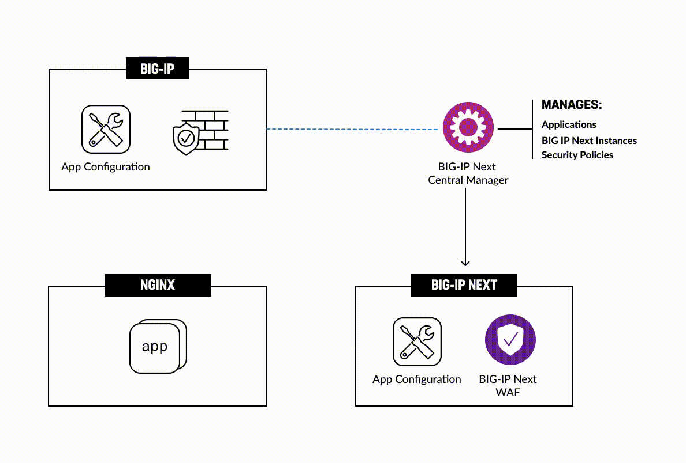
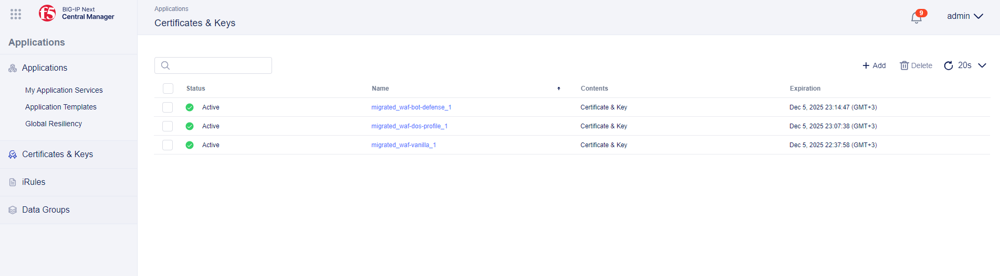

# Table of Contents

- [Table of Contents](#table-of-contents)
- [Overview](#overview)
- [Setup Diagram](#setup-diagram)
- [Environment Setup](#environment-setup)
  - [1. Docker Setup (_optional_)](#1-docker-setup-optional)
    - [1.1 Clone repository](#11-clone-repository)
    - [1.2 Build Docker](#12-build-docker)
    - [1.3 Enter Docker](#13-enter-docker)
    - [1.4 Add SSH private keys](#14-add-ssh-private-keys)
  - [2. Inventory Setup](#2-inventory-setup)
  - [3. Install Dependencies](#3-install-dependencies)
  - [4. Environment Configuration](#4-environment-configuration)
  - [5. Validate NGINX App](#5-validate-nginx-app)
- [Manual Workflow Guide](#manual-workflow-guide)
  - [1. Get BIG-IP UCS Archive](#1-get-big-ip-ucs-archive)
  - [2. Migrate the App](#2-migrate-the-app)
    - [2.1 Upload UCS Archive into Central Manager](#21-upload-ucs-archive-into-central-manager)
    - [2.2 Add Application for Migration](#22-add-application-for-migration)
    - [2.3 Import Shared Objects](#23-import-shared-objects)
    - [2.4 Deploy](#24-deploy)
    - [2.5 Check App Availability](#25-check-app-availability)
- [Automated Workflow Guide](#automated-workflow-guide)
  - [1. Prerequisites](#1-prerequisites)
    - [1.1 Configure connectivity to TMOS](#11-configure-connectivity-to-tmos)
    - [1.2 Configure connectivity to BIG-IP Next](#12-configure-connectivity-to-big-ip-next)
    - [1.3 Configure connectivity to Central Manager and add SSH private keys](#13-configure-connectivity-to-central-manager-and-add-ssh-private-keys)
  - [2. Deployment](#2-deployment)
  - [3. Verify Migrated Application](#3-verify-migrated-application)
    - [3.1 Migrated application](#31-migrated-application)
    - [3.2 Deployed WAF Policy](#32-deployed-waf-policy)
    - [3.3 Deployed Certificates](#33-deployed-certificates)
- [Additional Related Resources](#additional-related-resources)

# Overview

This guide showcases migration of an app with a configured WAF policy from TMOS to BIG-IP Next using BIG-IP Next Central Manager. BIG-IP Next Central Manager lets us reduce mean time needed for migration of application services. Migration with it runs fast and straightforward, it allows us to migrate our apps with their configured security profiles: WAF, Bot, DDoS.

The first part of the use-case will focus on manual migration of an application, whereas the second one - on automatic way to do that. In the course of the guide we will:

- Set up environment for migration including inventory configuration for migration source and running Ansible playbook.

- Get UCS archive from BIG-IP and start manual migration in BIG-IP Next Central Manager using the file. We will check app availability after its deployment to BIG-IP Next.

- Migrate and deploy the app automatically.

# Setup Diagram



# Environment Setup

Before starting application migration we will need to set up environment. Environment configuration will include the following steps:

- Docket setup (optional)

- Configuration of inventory for migration source

- Running Ansible playbook

====NIK=>TO BE DISCUSSED===
**Note: if you are an F5 employee or contractor, you can use the blueprint with the specified parameters for the flow without necessity to replace them with your own.**
====NIK=>TO BE DISCUSSED===

## 1. Docker Setup (_optional_)

If you prefer to not install everything locally but rather use Docker, follow the steps below. Docker setup is only used for initialization and/or [Automated Workflow](#automated-workflow-guide). If you prefer not to use Docker, you can skip this step.

### 1.1 Clone repository

Clone and install the repository: https://github.com/f5devcentral/bigip_automation_examples.git

### 1.2 Build Docker

Enter the folder `bigip/bigip_next/security/migrate-from-tmos/docker-env` and run the following command to build Docker that will include Terraform, Ansible and nano. Note that executing this command can take some time.

```bash
sh ./build.sh
```

### 1.3 Enter Docker

Enter the docker by running the command:

```bash
sh ./run.sh
```

You will see a list of files. Enter the `.ssh`.

### 1.4 Add SSH private keys

Next we will add SSH private keys for TMOS and Central Manager. Note that you will need to add keys only for Ansible.

Inside the `.ssh`, you will see `tmos-key` for private key to access TMOS and `cm-key` for key to access Central Manager.

Enter the `tmos-key` file by running th following command and fill in the key:

```bash
nano tmos-key
```

Enter the `cm-key` file by running the following command and fill in the key:

```bash
nano cm-key
```

## 2. Inventory Setup

Let's start with inventory configuration for migration source. Go to the inventory file and specify application and TMOS IDs:

```bash
 inventory.ini
```

## 3. Install Dependencies

If you are not using the Docker flow, you will need to execute the following:

```bash
install-prerequisites.sh
```

## 4. Environment Configuration

Next, we will run the following command to configure the source TMOS virtual server, attach WAF policy and validate if BIG-IP is setup correctly and the app is available.

```bach
ansible-playbook -i inventory.ini site.yaml
```

## 5. Validate NGINX App

Now that we have initialized and configured the environment, we can check NGINX App availability by running the command:

======TODO======

```bash
curl http://{nginx_app}/server1
```

# Manual Workflow Guide

In this part of our guide we will showcase a brownfield use case for app manual migration from TMOS to BIG-IP Next. Since migration covers WAF policies, in the course of migration we will see how easy and fast it is to migrate an app with a configured WAF policy using BIG-IP Next Central Manager. In order to manually migrate an app with WAF policy we will:

- Get BIG-IP UCS Archive
- Upload UCS Archive into BIG-IP Next Central Manager
- Add the application for migration and import its shared objects
- And finally, deploy the app to a BIG-IP Next instance
- In the end, we will verify the created app and check the availability

## 1. Get BIG-IP UCS Archive

First, we will get a UCS archive that contains the source TMOS application services and then import it into BIG-IP Next Central Manager. This will let us view and deploy the app to BIG-IP Next in further steps.

Log in your BIG-IP Configuration Utility and navigate to **System**. In **Archives** click the **Create** button. In the opened form, type in archive name and click **Finish**.


You will see the created archive. Proceed by clicking on it.


Start downloading the created UCS archive.


## 2. Migrate the App

Now that we have the UCS archive for our app, we can start the migration process. We will use BIG-IP Next Central Manager to do that.

### 2.1 Upload UCS Archive into Central Manager

Log in BIG-IP Next Central Manager and proceed to the **Application Workspace**.


On the application management page, click the **Add Application** button.


Click the **New Migration** button. This will open new application migration configuration.


First, we will configure general properties: give it a name and add a description.


Next, we will drag and drop the UCS archive file downloaded [earlier](#1-get-big-ip-ucs-archive). Select grouping application services by IP addresses for this demo flow and click **Next**. Note that file uploading can take some time.


### 2.2 Add Application for Migration

After uploading the UCS archive we will add application for migration by clicking the **Add Application** button.


You will see a list of application services from your TMOS. If you want to see if your app is eligible for migration to BIG-IP Next, you can select the application and then proceed to the **Analyze** button in the right upper corner. If the application is eligible, proceed by clicking **Add**.


Next, you will see **Application Migration** page displaying the app to be migrated. Click the **Next** button.


### 2.3 Import Shared Objects

In the **Pre Deployment** step we will import shared objects into Central Manager.


### 2.4 Deploy

And finally, we will select deploy location for the app and click the **Deploy** button. This will start the deployment process that can take some time.


The **Deployments** page will show the deployment result. Take a look and **Finish** it.


### 2.5 Check App Availability

Congrats! Your app together with its security WAF policy is migrated to BIG-IP Next with the help of BIG-IP Next Central Manager which made the whole migration process super fast and easy.


Let's navigate to the **Security** workspace and take a look at the created WAF policy.


# Automated Workflow Guide

In this part of the guide we will automatically migrate application to BIG-IP Next with WAF policy and then validate it using Central Manager.

Before proceeding, you need to enter Docker if you chose [Docker setup](#1-docker-setup-optional) option or the environment in Jump Host. Go to the `bigip/bigip_next/security/migrate-from-tmos/migrate` folder where we will update config files.

## 1. Prerequisites

### 1.1 Configure connectivity to TMOS

In the `tmos_vars.yml` file specify the following parameters to establish connection to TMOS:

- `server`
- `server_port`
- `user`
- `password`
- `validate_certs`
- `no_f5_teem`
- name of the file for UCS backup.

### 1.2 Configure connectivity to BIG-IP Next

In the `next_vars.yml` file specify the following parameters to establish connectivity to BIG-IP Next:

- `address`, `user`, `password`, `max_applications` for Central Manager
- `migrate_shared_object_prefix`, `migrate_app_prefix` for prefixes that Central Manager will use
- `ans_vs1` (virtual server in TMOS) and `bigip_next` (address of BIG-IP Next instance to deploy to) for deployment
- `ip_map` specified for virtual addresses for virtual servers to be updated during the migration process (but application addresses within pools won't be changed). These parameters are key value pairs that allow migrating applications with no need to disable them in TMOS. These parameters are specified in case you want to test the migrated application with the original one still up. Please note that original application will not be disabled.

### 1.3 Configure connectivity to Central Manager and add SSH private keys

In the `inventory.ini` file specify the following parameters:

- Central Manager IP address
- SSH private key to access Central Manager
- TMOS IP address
- SSH private key to access TMOS

## 2. Deployment

In the `site.yml` file you can see the migration steps that will be performed:

- Backup TMOS BIG-IP as UCS
- Migration of supported apps to BIG-IP Next that includes both creating and deploying them

Please note that only certificates and WAF policies are migrated.

Start the deployment by running the following command:

```bash
ansible-playbook -i inventory.ini site.yml
```

Note that deployment can take some time.

## 3. Verify Migrated Application

### 3.1 Migrated application

Log in Central Manager and proceed to **Applications**. You will see the application migrated whose name starts with the prefix you indicated in the prerequisites step.


Please note that applications that were not specified in destinations are also migrated but not deployed. You will see `draft` next to their names.

Let's drill down into deployed application details. Click on application to see pool member it is deployed to. Next, you can click the **Edit** button.


In the opened declaration we can see the WAF policy, as well as virtual address that has changed acc to the mapping we specified earlier.


Now let's take a look at a declaration of another application to see that it has another virtual address but the same WAF policy. If an application has a shared resource, e.g. certificate or firewall, this resource is created once and all applications with such resource name will refer to it.


### 3.2 Deployed WAF Policy

Navigate to **Security** => **WAF** = > **Policies**. You will see the migrated policies. Next to each policy you will see number of applications that refer to it. If `0` is indicated, no deployed applications refer to it.


### 3.3 Deployed Certificates

Navigate to **Applications** => **Certificates & Keys**. You will see the list of migrated certificates.



Congrats! You just completed automated migration of application to BIG-IP Next.

# Additional Related Resources

=====TODO=========
