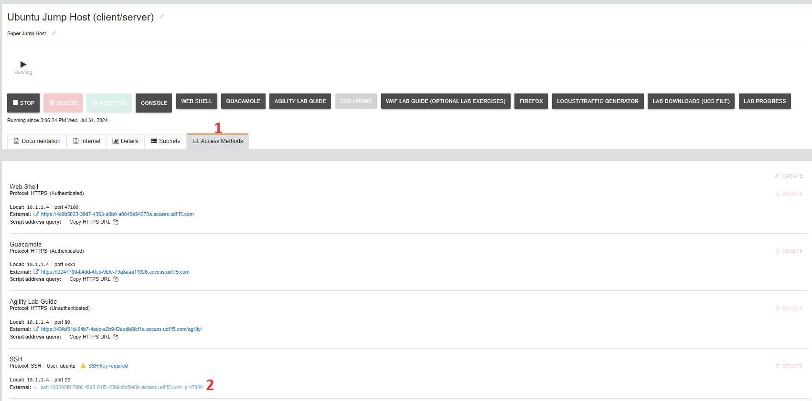
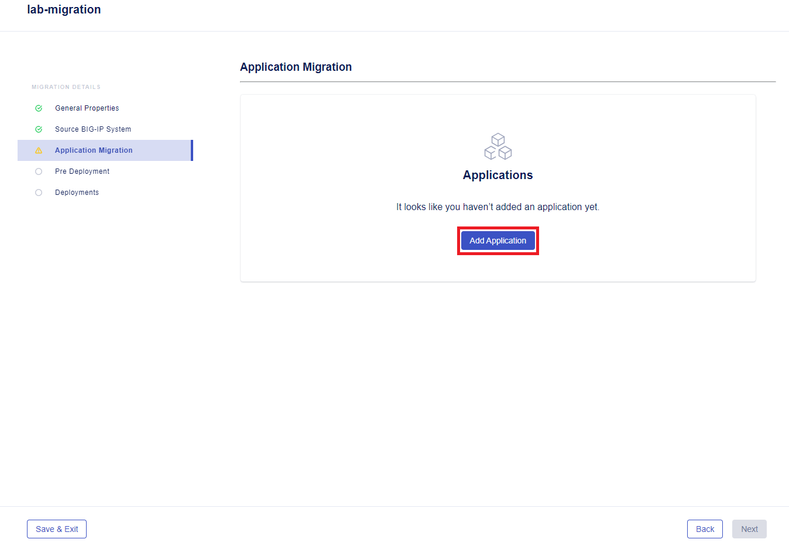
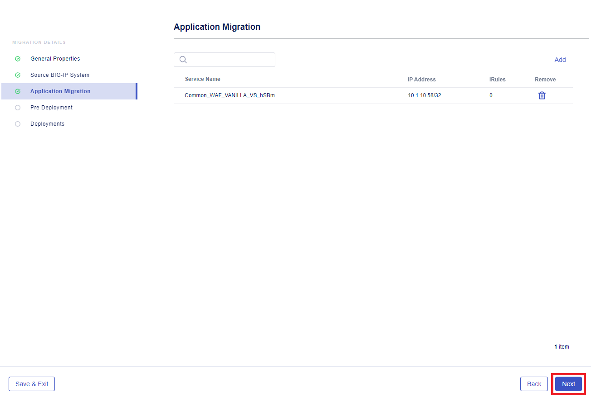
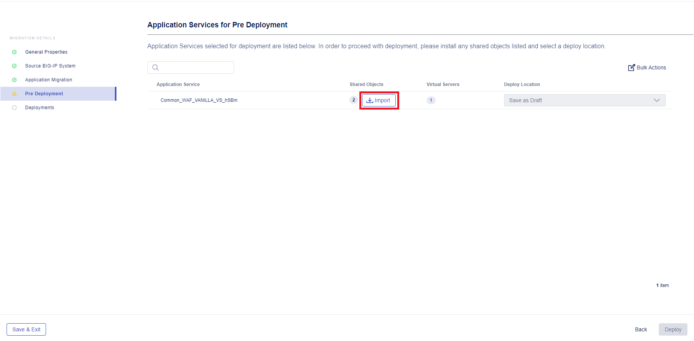
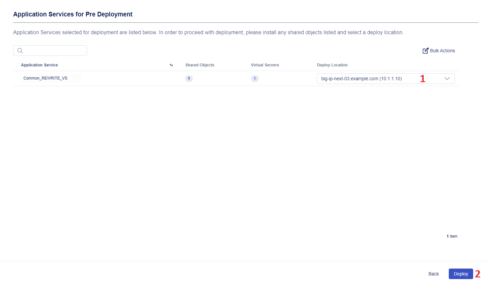
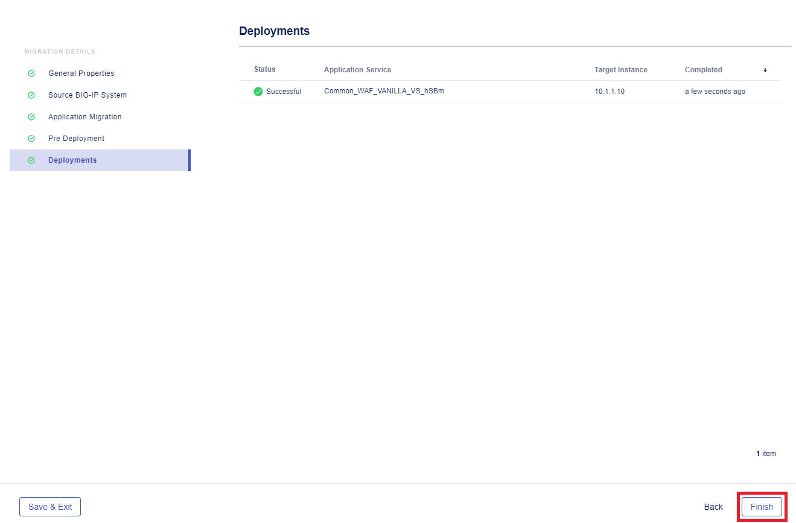

# Migrate Apps from BIG-IP TMOS to BIG-IP Next with Security Policy

# Table of Contents

- [Migrate Apps from BIG-IP TMOS to BIG-IP Next with Security Policy](#migrate-apps-from-big-ip-tmos-to-big-ip-next-with-security-policy)
- [Table of Contents](#table-of-contents)
- [Overview](#overview)
- [Setup Diagram](#setup-diagram)
- [Environment \& Pre-requisites](#environment--pre-requisites)
  - [Blueprint Setup _(for F5 employees or customers with access to UDF)_](#blueprint-setup-for-f5-employees-or-customers-with-access-to-udf)
    - [1. Deploy Blueprint](#1-deploy-blueprint)
    - [2. Copy SSH External](#2-copy-ssh-external)
    - [3. Enter Blueprint](#3-enter-blueprint)
    - [4. Clone Repository](#4-clone-repository)
    - [5. Create Local Key Folder](#5-create-local-key-folder)
    - [6. Build Docker](#6-build-docker)
    - [7. Install Dependencies](#7-install-dependencies)
    - [8. Infrastructure Configuration](#8-infrastructure-configuration)
    - [9. Validate NGINX App and TMOS](#9-validate-nginx-app-and-tmos)
  - [1. Docker Setup (_optional_)](#1-docker-setup-optional)
    - [1.1 Clone repository](#11-clone-repository)
    - [1.2 Build Docker](#12-build-docker)
    - [1.3 Enter Docker](#13-enter-docker)
    - [1.4 Add SSH private keys](#14-add-ssh-private-keys)
    - [1.5 Create Key Folder](#15-create-key-folder)
  - [2. Inventory Setup](#2-inventory-setup)
  - [3. Initialize BIG-IP](#3-initialize-big-ip)
  - [4. Install Dependencies](#4-install-dependencies)
  - [5. Infrastructure Configuration](#5-infrastructure-configuration)
  - [6. Validate NGINX App](#6-validate-nginx-app)
- [Manual Workflow Guide](#manual-workflow-guide)
  - [1. Get BIG-IP UCS Archive](#1-get-big-ip-ucs-archive)
  - [2. Migrate the App](#2-migrate-the-app)
    - [2.1 Upload UCS Archive into Central Manager](#21-upload-ucs-archive-into-central-manager)
    - [2.2 Add Application for Migration](#22-add-application-for-migration)
    - [2.3 Import Shared Objects](#23-import-shared-objects)
    - [2.4 Deploy](#24-deploy)
    - [2.5 Check App Availability](#25-check-app-availability)
- [Automated Workflow Guide](#automated-workflow-guide)
  - [1. Prerequisites](#1-prerequisites)
    - [1.1 Configure connectivity to TMOS](#11-configure-connectivity-to-tmos)
    - [1.2 Configure connectivity to BIG-IP Next](#12-configure-connectivity-to-big-ip-next)
    - [1.3 Configure connectivity to Central Manager and add SSH private keys](#13-configure-connectivity-to-central-manager-and-add-ssh-private-keys)
  - [2. Deployment](#2-deployment)
  - [3. Verify Migrated Application](#3-verify-migrated-application)
    - [3.1 Migrated application](#31-migrated-application)
    - [3.2 Deployed WAF Policy](#32-deployed-waf-policy)
    - [3.3 Deployed Certificates](#33-deployed-certificates)
- [Additional Related Resources](#additional-related-resources)

# Overview

This guide showcases migration of an app with a configured WAF policy from TMOS to BIG-IP Next using BIG-IP Next Central Manager. BIG-IP Next Central Manager accelerates app migration and provides management of your BIG-IP Next infrastructure and app services. We will perform the app migration of virtual server(s) together with the configured security profiles: WAF, Bot, DDoS.

The first part of this guide will focus on _manual_ migration of an application, while the second part focuses on the _automation_ scripts of the migration and config steps:

- Set up environment for migration including inventory configuration for migration source and running Ansible playbook.

- Get UCS archive from BIG-IP and start manual migration in BIG-IP Next Central Manager using the file. We will check app availability after its deployment to BIG-IP Next.

- Migrate and deploy the app automatically.

# Setup Diagram


# Environment & Pre-requisites

You may use your own environment with BIG-IP TMOS and BIG-IP NEXT, in which, as a pre-requisite, you need to have at a minimum:

- BIG-IP TMOS v16 or v17, where we will deploy a sample app virtual server and WAF policy for migration

- BIG-IP NEXT Instance(s), where we will deploy the migrated app config

- BIG-IP NEXT Central Manager, which we will use for migrating the virtual servers to NEXT instances and WAF Policy config

For executing automation scripts, you need to utilize a Linux machine with network access to the BIG-IP instances: BIG-IP TMOS, BIG-IP CM.
On this Linux machine you may choose to run Docker in order to take advantage of the sample app(s) and tooling (Ansible, Terraform, etc.)

Before starting application migration we will need to set up our environment. Environment configuration will include the following steps:

- Docker setup (optional)

- Configuration of inventory for migration source

- Running Ansible playbook

## Blueprint Setup _(for F5 employees or customers with access to UDF)_

**If you are an F5 employee or customer with access to UDF, you can use the following BIG-IP NEXT blueprint flow as the foundation for your environment: "NEXT WAF- Automation". Search for this name and utilize the latest version of the blueprint. This GitHub repo is already optimized to work with this UDF blueprint.**

### 1. Deploy Blueprint

Navigate to the **Blueprints** and search for **NEXT WAF- Automation**. Deploy it.


### 2. Copy SSH External

After the Blueprint has been deployed, navigate to the **Deployments** section and proceed to the **Details** of your deployment. Select the **Components** tab to see three components we are going to use: **Ubuntu Jump Host (client/server)**, **BIG-IP 15.1.x**, **BIG-IP Next Central Manager**. Proceed to the **Ubuntu Jump Host**.


Go to the **Access Methods** tab and copy the SSH external:



### 3. Enter Blueprint

Next, enter Blueprint using your SSH key via command line interface. You can use [this guide](https://help.udf.f5.com/en/articles/3347769-accessing-a-component-via-ssh) on accessing the object via SSH.

### 4. Clone Repository

After that, clone the [repository](https://github.com/f5devcentral/bigip_automation_examples.git). Note that you don't need to specify keys in Blueprint since they are already specified.

### 5. Create Local Key Folder

Go to the `bigip/bigip_next/security/migrate-from-tmos/docker-env/` directory of the cloned repository. Run the `init.sh` to create a local key folder:

```bash
./init.sh
```

You can verify that the folder with the keys has been created.

### 6. Build Docker

Next, we will build Docker. Note that executing this command can take some time.

```bash
./build.sh
```

### 7. Install Dependencies

Install dependencies to install the collections and libraries required in Ansible playbook by running the following command:

```bash
install-prerequisites.sh
```

### 8. Infrastructure Configuration

Enter `bigip/bigip_next/security/migrate-from-tmos/init` to initialize BIG-IP to resolve the app. Note that the app will be resolved in **10.1.10.90** and **10.1.10.91** IPs which are virtual addresses of routing via TMOS. The app itself will be in **10.1.20.102** IP. Run the following command to start initializing:

```bash
ansible-playbook -i inventory.ini site.yaml
```

### 9. Validate NGINX App and TMOS

Let's verify the app is up and running:

```bash
curl http://10.1.20.102/server1
```

```bash
curl http://10.1.20.102/server2
```

Verify TMOS routing by running the following commands:

```bash
curl http://10.1.10.90/server1
```

```bash
curl http://10.1.10.91/server1
```

Congrats! We have just completed configuration of infrastructure that will be used for further [manual](#manual-workflow-guide) or [automated](#automated-workflow-guide) flow steps of this guide to migrate app from BIG-IP TMOS to BIG-IP Next.

## 1. Docker Setup (_optional_)

We recommend using a jump host (Linux machine) where you can configure the required services, such as Docker, which includes demo apps. Docker setup is only used for initialization and/or [Automated Workflow](#automated-workflow-guide). If you prefer not to use Docker, you can skip this step.

### 1.1 Clone repository

Clone and install the repository: https://github.com/f5devcentral/bigip_automation_examples.git

### 1.2 Build Docker

Enter the folder `bigip/bigip_next/security/migrate-from-tmos/docker-env` and run the following command to build Docker that will include Terraform, Ansible and nano. Note that executing this command can take some time.

```bash
sh ./build.sh
```

### 1.3 Enter Docker

Enter the docker by running the command:

```bash
sh ./run.sh
```

You will see a list of files. Enter the `.ssh`.

### 1.4 Add SSH private keys

Next we will add SSH private keys for TMOS and Central Manager. Note that you will need to add keys only for Ansible.

Inside the `.ssh`, you will see `tmos_key` for private key to access TMOS and `cm_key` for key to access Central Manager.

Enter the `tmos_key` file by running th following command and fill in the key:

```bash
nano tmos_key
```

Enter the `cm_key` file by running the following command and fill in the key:

```bash
nano cm_key
```

### 1.5 Create Key Folder

Go to the `bigip/bigip_next/security/migrate-from-tmos/docker-env/` directory and run the `init.sh` to create a local key folder:

```bash
sh ./init.sh
```

You can verify that the folder with the keys has been created.

## 2. Inventory Setup

Let's start with inventory configuration for the migration source. Go to the inventory file and specify application and TMOS IDs:

```bash
 inventory.ini
```

## 3. Initialize BIG-IP

Go to the `tmos_vars.yml` and update the values to resolve the app as needed.

## 4. Install Dependencies

If you are not using the Docker flow, you will need to execute the following to install the collections and libraries required in Ansible playbook:

```bash
install-prerequisites.sh
```

## 5. Infrastructure Configuration

Next, we will run the following command to configure the source TMOS virtual server, attach the WAF policy and validate if BIG-IP is setup correctly and the app is available.

```bash
ansible-playbook -i inventory.ini site.yaml
```

## 6. Validate NGINX App

Now that we have initialized and configured the infrastructure, we can check NGINX App availability and TMOS by running the commands:

For the app:

```bash
curl http://10.1.20.102/server1
```

```bash
curl http://10.1.20.102/server2
```

For TMOS:

```bash
curl http://10.1.10.90/server1
```

```bash
curl http://10.1.10.91/server1
```

# Manual Workflow Guide

In this part we will provide manual steps with the associated screens for a "brownfield" use-case, i.e. a migration of an existing application from TMOS to BIG-IP Next. Using BIG-IP Next Central Manager ensures migration of configuration options such as WAF policies. The following steps will demonstrate the manual migration process:

- Get BIG-IP UCS Archive
- Upload UCS Archive into BIG-IP Next Central Manager
- Add the application for migration and import its shared objects
- And finally, deploy the app to a BIG-IP Next instance
- In the end, we will verify the created app and check the availability

## 1. Get BIG-IP UCS Archive

First, we will get a UCS archive that contains the source TMOS application services and then import it into BIG-IP Next Central Manager. This will let us view and deploy the app to BIG-IP Next in further steps.

Log into your BIG-IP TMOS instance and navigate to **System**. In **Archives** click the **Create** button. In the opened form, type in archive name and click **Finish**.


You will see the created archive. Proceed by clicking on it.


Start downloading the created UCS archive.


## 2. Migrate the App

Now that we have the UCS archive for our app, we can start the migration process. We will use BIG-IP Next Central Manager to do that.

### 2.1 Upload UCS Archive into Central Manager

Log in BIG-IP Next Central Manager and proceed to the **Application Workspace**.


On the application management page, click the **Add Application** button.


Click the **New Migration** button. This will open new application migration configuration.


First, we will configure general properties: give it a name and add a description.


Next, we will drag and drop the UCS archive file downloaded [earlier](#1-get-big-ip-ucs-archive). Select grouping application services by IP addresses for this demo flow and click **Next**. Note that file uploading can take some time.


### 2.2 Add Application for Migration

After uploading the UCS archive we will add application for migration by clicking the **Add Application** button.



You will see a list of application services from your TMOS. If you want to see if your app is eligible for migration to BIG-IP Next, you can select the application and then proceed to the **Analyze** button in the right upper corner. If the application is eligible, proceed by clicking **Add**.


Next, you will see **Application Migration** page displaying the app to be migrated. Click the **Next** button.



### 2.3 Import Shared Objects

In the **Pre Deployment** step we will import shared objects into Central Manager.



### 2.4 Deploy

And finally, we will select deploy location for the app and click the **Deploy** button. This will start the deployment process that can take some time.



The **Deployments** page will show the deployment result. Take a look and **Finish** it.



### 2.5 Check App Availability

Congrats! Your app together with its security WAF policy is migrated to BIG-IP Next with the help of BIG-IP Next Central Manager which made the whole migration process super fast and easy.


Let's navigate to the **Security** workspace and take a look at the created WAF policy.


# Automated Workflow Guide

In this part of the guide we will automatically migrate application to BIG-IP Next with WAF policy and then validate it using Central Manager.

Before proceeding, you need to enter Docker if you chose [Docker setup](#1-docker-setup-optional) option or the environment in Jump Host. Go to the `bigip/bigip_next/security/migrate-from-tmos/migrate` folder where we will update config files.

## 1. Prerequisites

### 1.1 Configure connectivity to TMOS

In the `tmos_vars.yml` file specify the following parameters to establish connection to TMOS:

- `server`
- `server_port`
- `user`
- `password`
- `validate_certs`
- `no_f5_teem`
- name of the file for UCS backup.

### 1.2 Configure connectivity to BIG-IP Next

In the `next_vars.yml` file specify the following parameters to establish connectivity to BIG-IP Next:

- `address`, `user`, `password`, `max_applications` for Central Manager
- `migrate_shared_object_prefix`, `migrate_app_prefix` for prefixes that Central Manager will use
- `ans_vs1` (virtual server in TMOS) and `bigip_next` (address of BIG-IP Next instance to deploy to) for deployment
- `ip_map` specified for virtual addresses for virtual servers to be updated during the migration process (but application addresses within pools won't be changed). These parameters are key value pairs that allow migrating applications with no need to disable them in TMOS. These parameters are specified in case you want to test the migrated application with the original one still up. Please note that original application will not be disabled.

### 1.3 Configure connectivity to Central Manager and add SSH private keys

In the `inventory.ini` file specify the following parameters:

- Central Manager IP address
- SSH private key to access Central Manager
- TMOS IP address
- SSH private key to access TMOS

## 2. Deployment

In the `site.yml` file you can see the migration steps that will be performed:

- Backup TMOS BIG-IP as UCS
- Migration of supported apps to BIG-IP Next that includes both creating and deploying them

Please note that only certificates and WAF policies are migrated.

Start the deployment by running the following command:

```bash
ansible-playbook -i inventory.ini site.yml
```

Note that deployment can take some time.

## 3. Verify Migrated Application

### 3.1 Migrated application

Log in Central Manager and proceed to **Applications**. You will see the application migrated whose name starts with the prefix you indicated in the prerequisites step.


Please note that applications that were not specified in destinations are also migrated but not deployed. You will see `draft` next to their names.

Let's drill down into deployed application details. Click on application to see pool member it is deployed to. Next, you can click the **Edit** button.


In the opened declaration we can see the WAF policy, as well as virtual address that has changed acc to the mapping we specified earlier.


Now let's take a look at a declaration of another application to see that it has another virtual address but the same WAF policy. If an application has a shared resource, e.g. certificate or firewall, this resource is created once and all applications with such resource name will refer to it.


### 3.2 Deployed WAF Policy

Navigate to **Security** => **WAF** = > **Policies**. You will see the migrated policies. Next to each policy you will see number of applications that refer to it. If `0` is indicated, no deployed applications refer to it.


### 3.3 Deployed Certificates

Navigate to **Applications** => **Certificates & Keys**. You will see the list of migrated certificates.


Congrats! You just completed automated migration of application to BIG-IP Next with its WAF Policy and certificates.

# Additional Related Resources

=====TODO=========
