# Migrate Apps from BIG-IP TMOS to BIG-IP Next with Security Policy

# Table of Contents

- [Migrate Apps from BIG-IP TMOS to BIG-IP Next with Security Policy](#migrate-apps-from-big-ip-tmos-to-big-ip-next-with-security-policy)
- [Table of Contents](#table-of-contents)
- [Overview](#overview)
- [Setup Diagram](#setup-diagram)
- [Environment \& Pre-requisites](#environment--pre-requisites)
  - [Blueprint Setup _(for F5 employees or customers with access to UDF)_](#blueprint-setup-for-f5-employees-or-customers-with-access-to-udf)
    - [1. Deploy Blueprint](#1-deploy-blueprint)
    - [2. Setup SSH Keys](#2-setup-ssh-keys)
    - [3. Enter Blueprint](#3-enter-blueprint)
    - [4. Clone Repository](#4-clone-repository)
    - [5. Data Initialization for Docker](#5-data-initialization-for-docker)
  - [Docker Setup](#docker-setup)
    - [1. Build Docker](#1-build-docker)
    - [2. Add SSH Private Keys](#2-add-ssh-private-keys)
  - [Infrastructure Configuration](#infrastructure-configuration)
    - [1. Install Dependencies](#1-install-dependencies)
    - [2. Initialize BIG-IP](#2-initialize-big-ip)
    - [3. Verify Apps and TMOS](#3-verify-apps-and-tmos)
    - [4. Network Map](#4-network-map)
- [Manual Workflow Guide](#manual-workflow-guide)
  - [1. Get BIG-IP UCS Archive](#1-get-big-ip-ucs-archive)
  - [2. Migrate the App](#2-migrate-the-app)
    - [2.1 Upload UCS Archive into Central Manager](#21-upload-ucs-archive-into-central-manager)
    - [2.2 Migrate as Draft](#22-migrate-as-draft)
    - [2.3 Update Application Virtual Address](#23-update-application-virtual-address)
    - [2.4 Add Default Properties for Monitor](#24-add-default-properties-for-monitor)
    - [2.5 Deploy the Application to Big-IP Next Instance](#25-deploy-the-application-to-big-ip-next-instance)
    - [2.6 Check App Availability](#26-check-app-availability)
- [Automated Workflow Guide](#automated-workflow-guide)
  - [1. Prerequisites](#1-prerequisites)
    - [1.1 Configure Connectivity to TMOS](#11-configure-connectivity-to-tmos)
    - [1.2 Configure Connectivity to BIG-IP Next](#12-configure-connectivity-to-big-ip-next)
    - [1.3 Configure Connectivity to Central Manager and Add SSH Private Keys](#13-configure-connectivity-to-central-manager-and-add-ssh-private-keys)
  - [2. Migration and Deployment](#2-migration-and-deployment)
  - [3. Verify Migrated Application](#3-verify-migrated-application)
    - [3.1 Verify via Central Manager UI](#31-verify-via-central-manager-ui)
      - [3.1.1 Migrated Application](#311-migrated-application)
      - [3.1.2 Deployed WAF Policy](#312-deployed-waf-policy)
      - [3.1.3 Deployed Certificates](#313-deployed-certificates)
    - [3.2 Verify via CLI](#32-verify-via-cli)

# Overview

This guide showcases the migration of an app with a configured WAF policy from TMOS to BIG-IP Next using BIG-IP Next Central Manager. BIG-IP Next Central Manager accelerates app migration and provides management of your BIG-IP Next infrastructure and app services. We will perform the app migration of virtual server(s) together with the configured security profiles: WAF, Bot, DDoS.

The first part of this guide will focus on _manual_ migration of an application, while the second part focuses on the _automation_ scripts of the migration and config steps:

- Set up environment for migration including inventory configuration for migration source and running Ansible playbook.

- Get UCS archive from BIG-IP and start manual migration in BIG-IP Next Central Manager using the file. We will check app availability after its deployment to BIG-IP Next.

- Migrate and deploy the app automatically.

# Setup Diagram

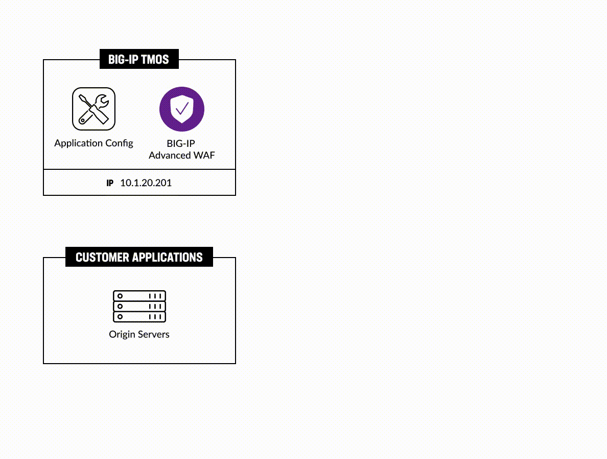

# Environment & Pre-requisites

You may use your own environment with BIG-IP TMOS and BIG-IP Next, in which, as a pre-requisite, you need to have at a minimum:

- BIG-IP TMOS v16 or v17, where we will deploy a sample app virtual server and WAF policy for migration

- BIG-IP Next Instance(s), where we will deploy the migrated app config

- BIG-IP Next Central Manager, which we will use for migrating the virtual servers to Next instances and WAF Policy config

For executing automation scripts, you need to utilize a Linux machine with network access to the BIG-IP instances: BIG-IP TMOS, BIG-IP CM.
On this Linux machine you may choose to run Docker in order to take advantage of the sample app(s) and tooling (Ansible, Terraform, etc.)

Before starting application migration we will need to set up our environment. Environment configuration will include the following steps:

- Docker setup (optional)

- Configuration of inventory for migration source

- Running Ansible playbook

## Blueprint Setup _(for F5 employees or customers with access to UDF)_

**If you are an F5 employee or customer with access to UDF, you can use the following BIG-IP Next blueprint flow as the foundation for your environment: "NEXT WAF-Automation (20.3.0)". Search for this name and utilize the latest version of the blueprint. This GitHub repo is already optimized to work with this UDF blueprint.**

### 1. Deploy Blueprint

Navigate to the **Blueprints** and search for **NEXT WAF-Automation (20.3.0)**. Deploy it.


After it has been deployed, navigate to your **Deployments** and start it:

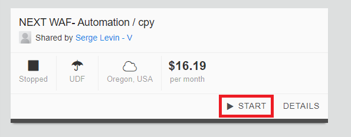

### 2. Setup SSH Keys

To enter the Blueprint VM (jumphost), the SSH tool will be used. In order to set up SSH access keys use [this guide](https://help.udf.f5.com/en/articles/3347769-accessing-a-component-via-ssh).

### 3. Enter Blueprint

After the Blueprint has been deployed and SSH keys are setup, navigate to the **Deployments** section and proceed to the **Details** of your deployment. Select the **Components** tab to see three components we are going to use: **Ubuntu Jump Host (client/server)**, **BIG-IP 15.1.x**, **BIG-IP Next Central Manager**. Proceed to the **Ubuntu Jump Host**.

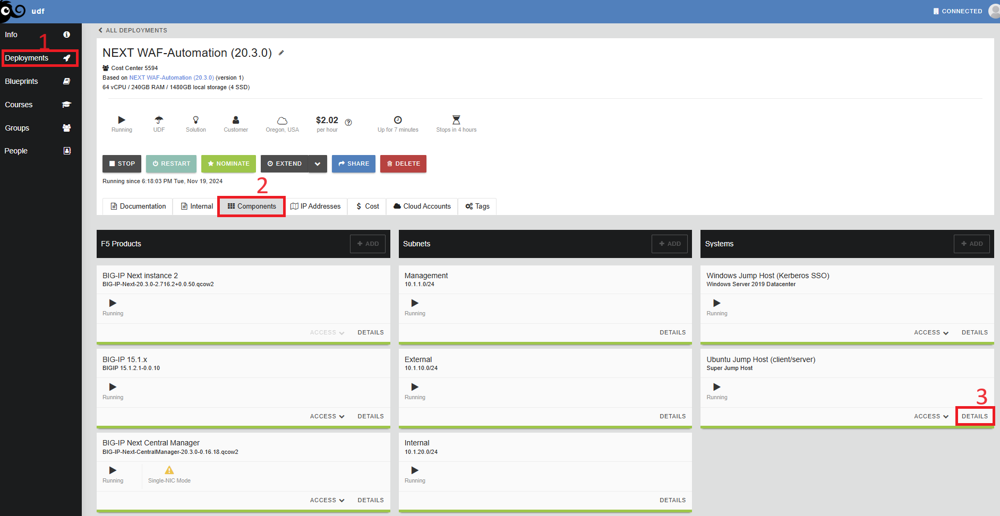

Go to the **Access Methods** tab and copy the SSH external. Execute copied command in the command line.

### 4. Clone Repository

After that, clone the [repository](https://github.com/yoctoserge/bigip_automation_examples.git). Note that you don't need to specify the SSH keys in Blueprint since they are already specified.

### 5. Data Initialization for Docker

**NOTE: Complete this step ONLY if you haven't done initialization yet, including in other lab.**

Go to the following directory of the cloned repository:

```bash
bigip/bigip_next/env-init/docker
```

Run the `init.sh` to create a local key folder:

```bash
sh ./init.sh
```

You can verify that the folder with the SSH keys has been created. The folder is used during Docker build operation.

## Docker Setup

We recommend using a jump host (Linux machine) where you can configure the required services, such as Docker, which includes demo apps. If using UDF Blueprint Deployment, the Ubuntu jump host is already provided with the included SSH keys for the Blueprint environment. Docker setup is only used for initialization and/or [Automated Workflow](#automated-workflow-guide).

**NOTE: At this point if you're using your own (non-UDF) environment, make sure you Git clone clone the [repository](https://github.com/yoctoserge/bigip_automation_examples.git) and navigate to the following directory of the cloned repository:**

```bash
bigip/bigip_next/env-init/docker
```

### 1. Build Docker

Next, we will build Docker. Note that executing this command can take some time.

```bash
sh ./build.sh
```

As soon as the build is completed, enter Docker:

```bash
sh ./run.sh
```

### 2. Add SSH Private Keys

**If you followed the Blueprint flow, you need to skip this step because the keys are already included.**

Next, we will add SSH private keys for TMOS and Central Manager. Note that you will need to add keys only for Ansible.

Inside the `.ssh`, you will see `tmos_key` for private key to access TMOS and `cm_key` for key to access Central Manager.

Enter the `tmos_key` file by running the following command and fill in the key:

```bash
nano tmos_key
```

Enter the `cm_key` file by running the following command and fill in the key:

```bash
nano cm_key
```

## Infrastructure Configuration

### 1. Install Dependencies

Navigate to

```bash
bigip/bigip_next/env-init/environment
```

Run the command to install the collections and libraries required in Ansible playbook:

```bash
sh ./install-prerequisites.sh
```

### 2. Initialize BIG-IP

In this step, we will initialize BIG-IP to resolve the app.

If you would like to make changes to the IP addressed pre-defined for the sample app(s), you can do so here. Note that by default, the app will be resolved in **10.1.10.90**, **10.1.10.91**, **10.1.10.95** IPs which are virtual addresses of routing via TMOS. The app itself will be in **10.1.20.102** IP.

The configuration used for initialization is defined in **tmos_vars.yml** file, which you can modify only if you choose to do so, making sure the structure follows the default yml layout below. You can proceed to the step to execute Ansible playbook below without making any changes as well.

```yml
provider:
  server: 10.1.1.12
  server_port: 443
  user: admin
  password: admin
  validate_certs: false
  no_f5_teem: false

node_ip: 10.1.20.102
node_name: ans_node
pool_name: ans_pool
virtual_server:
  - name: auto_ans_vs1
    ip: 10.1.10.90
  - name: auto_ans_vs2
    ip: 10.1.10.91
  - name: manual_ans_vs1
    ip: 10.1.10.95
virtual_server_port: 80
asm_policy_name: ans_policy_asm
ltm_policy_name: ans_policy_ltm
```

File has three main sections:

1. Provider setup - config to enter BigIP TMOS node
2. Sample application setup: **node_ip**, **node_name** and **pool_name**
3. List of Virtual Servers to be created in TMOS Big-IP
4. Policy name configuration. Policy is created in **blocking** mode and the signatures and set to be **enforced**

Data in tmos_vars.yml file corresponds to the Blueprint setup. So, in case of Bluperint usage, nothing is required to change in it. In case of running initialization scripts in custom environment please check the IPs and names, so they will not override anything.

The hosts to install the sample app and call TMOS Big-IP commands are configured in **inventory.ini**:

```ini
[app]
10.1.1.4

[app:vars]
ansible_ssh_private_key_file=/home/ubuntu/.ssh/id_rsa

[tmos]
10.1.1.12

[tmos:vars]
ansible_ssh_private_key_file=/home/ubuntu/.ssh/tmos_key
ansible_ssh_user=root
```

The **[app]** section is the target destination of the deployment for the sample app. It is **Ubuntu Jump Host (client/server)** in **Blueprint** setup. Access to TMOS Big-IP is specified in **[tmos]** section. The file is configured for the **Blueprint** setup, no need to change it.

After reviewing the files, run the following command to start initializing:

**Executing initialization via Ansible playbook**

```bash
ansible-playbook -i inventory.ini site.yml
```

### 3. Verify Apps and TMOS

Let's verify the app is up and running, execute:

```bash
curl http://10.1.20.102/endpoint1
```

```bash
curl http://10.1.20.102/endpoint2
```

The expected output should look like this:

```
OK. Endpoint - 1
```

Verify TMOS routing by running the following commands:

```bash
curl http://10.1.10.90/endpoint1
```

```bash
curl http://10.1.10.91/endpoint2
```

The expected output should look like this:

```
OK. Endpoint - 1
```

Also, verify that WAF is applied to TMOS routing by running the following commands:

```bash
curl 'http://10.1.10.90/endpoint1?query=<script>alert(1)</script>'
```

```bash
curl 'http://10.1.10.91/endpoint2?query=<script>alert(1)</script>'
```

The expected output should look like:

```
<html><head><title>Request Rejected</title></head><body>The requested URL was rejected. Please consult with your administrator.<br><br>Your support ID is: 7857824916379271192<br><br><a href='javascript:history.back();'>[Go Back]</a></body></html
```

### 4. Network Map

The resulting infrastructure for BIG-IP TMOS will have three sample virtual servers to support both Automated migration (auto_ans_vs1 and vs2), as well as Manual migration (manual_ans_vs1) with the corresponding pools:

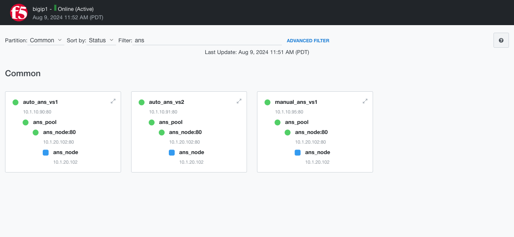

# Manual Workflow Guide

In this part, we will provide manual steps with the associated screens for a "brownfield" use case, i.e. a migration of an existing application from TMOS to BIG-IP Next. Using BIG-IP Next Central Manager ensures migration of configuration options such as WAF policies. The following steps will demonstrate the manual migration process:

- Get BIG-IP UCS Archive
- Upload UCS Archive into BIG-IP Next Central Manager
- Add the application for migration and import its shared objects
- And finally, deploy the app to a BIG-IP Next instance
- In the end, we will verify the created app and check the availability

## 1. Get BIG-IP UCS Archive

First, we will get a UCS archive that contains the source TMOS application services and then import it into BIG-IP Next Central Manager. This will let us view and deploy the app to BIG-IP Next in further steps.

Log into your BIG-IP TMOS instance via the deployment we did earlier. Go to the **BIG-IP 15.1.x** component and then select **TMUI**. Enter **admin** and **admin** as login and password.


Navigate to **System**. In **Archives** click the **Create** button. In the opened form, type in the archive name and click **Finish**.


You will see the created archive. Proceed by clicking on it.


Start downloading the created UCS archive.

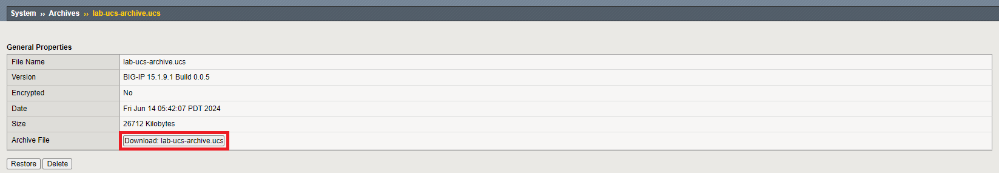

## 2. Migrate the App

Now that we have the UCS archive for our app, we can start the migration process. We will use BIG-IP Next Central Manager to do that.

### 2.1 Upload UCS Archive into Central Manager

Log in BIG-IP Next Central Manager and proceed to the **Application Workspace**.


On the application management page, click the **Add Application** button.

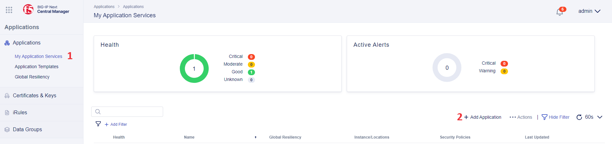

Click the **New Migration** button. This will open a new application migration configuration.

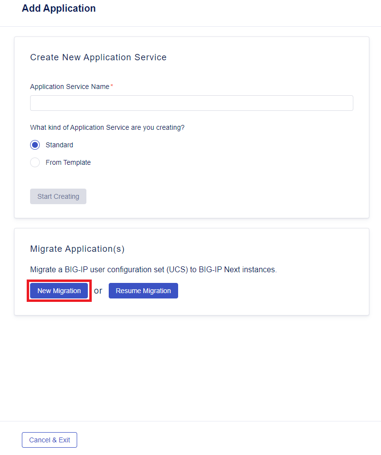

First, we will give session a name.

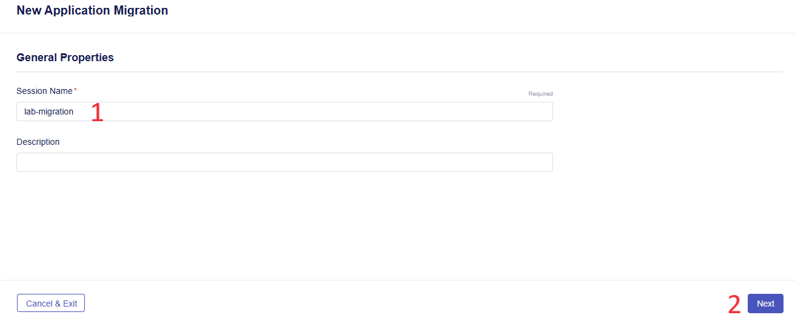

Next, we will drag and drop the UCS archive file downloaded [earlier](#1-get-big-ip-ucs-archive), and enter the BIG-IP TMOS master key. In case of **Blueprint** usage, the master key is:

```
cgGaYTNid4Gvqdelf/85cw==
```

Select grouping application services by IP addresses for this demo flow and click **Next**. Note that file uploading can take some time.


### 2.2 Migrate as Draft

After uploading the UCS archive you will see a list of application services. Select an application and click **Migrate as Draft**.

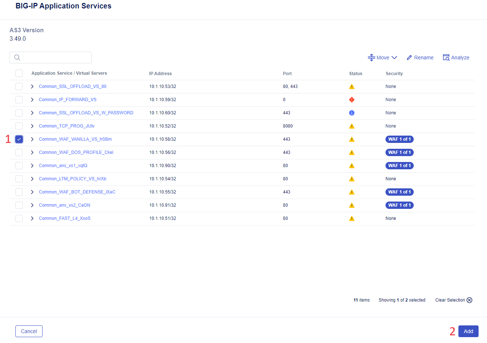

Confirm the migration including the shared objects.

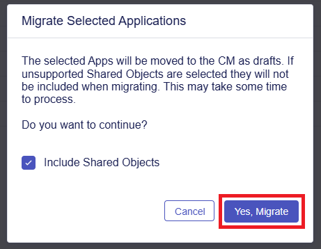

The readiness status of the selected application will change to **Migrated**. Complete by clicking the **Save & Exit** button.


### 2.3 Update Application Virtual Address

If we deploy the application now, there will be an IP address conflict. So, in order to preserve the old routes and create the new ones, the IP address of the migrated app is necessary to be updated. To update, click on the application migrated as draft:

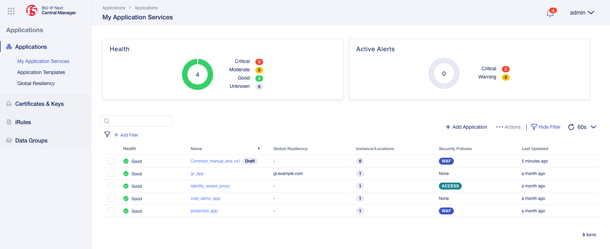

In the opened window of AS3 Declaration, find the **virtualAddresses** key and replace **10.1.10.95** IP address with **10.1.10.195**.

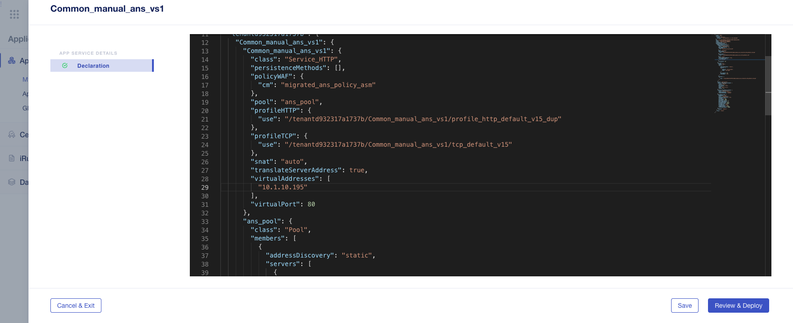

### 2.4 Add Default Properties for Monitor

In the same opened window of AS3 Declaration scroll down to find `"monitor_http_default***"` configuration. Paste the following settings for the monitor:

```
        "class": "Monitor",
        "interval": 5,
        "monitorType": "http",
        "receive": "",
        "send": "GET /\\r\\n",
        "timeout": 16
```

Complete by clicking the **Review & Deploy** button.


### 2.5 Deploy the Application to Big-IP Next Instance

In the opened window, click the **Start Adding** button and select the **big-ip-next-03-example.com** instance.

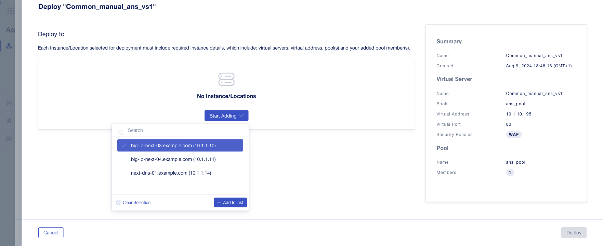

The deploy instance will be added. Click the **Deploy** button:

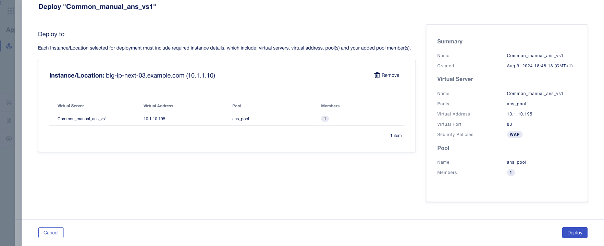

### 2.6 Check App Availability

Congrats! Your app along with the corresponding security WAF policy is migrated to BIG-IP Next with the help of BIG-IP Next Central Manager which streamlines the entire migration process.

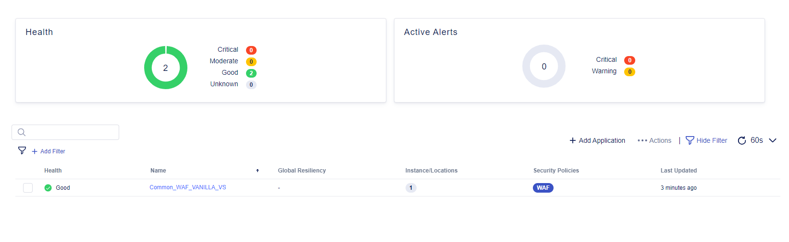

Let's navigate to the **Security** workspace and take a look at the created WAF policy.

**Note that your screen may look different**.

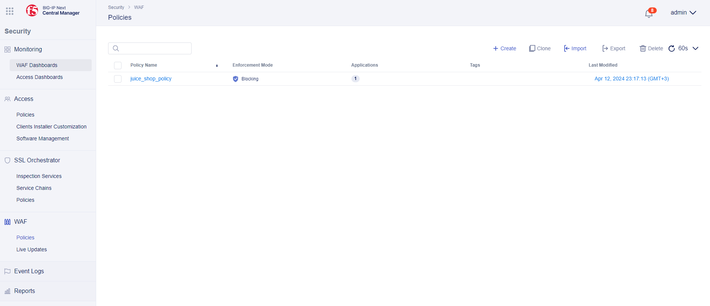

Now, let's send some requests to the migrated application:

```bash
curl http://10.1.10.195/endpoint1
```

```bash
curl http://10.1.10.195/endpoint2
```

The expected output should look like this:

```
OK. Endpoint - 1
```

And check that WAF is migrated too:

```bash
curl 'http://10.1.10.195/endpoint1?query=<script>alert(1)</script>'
```

The result should look like this:

```
<html><head><title>Request Rejected</title></head><body>The requested URL was rejected. Please consult with your administrator.<br><br>Your support ID is: 7837105753625208781<br><br><a href='javascript:history.back();'>[Go Back]</a></body></html>
```

Now, switch to the **WAF Dashboards**, select **Last 5 Minutes** and see that the event has been created, with the request intercepted and details displayed:

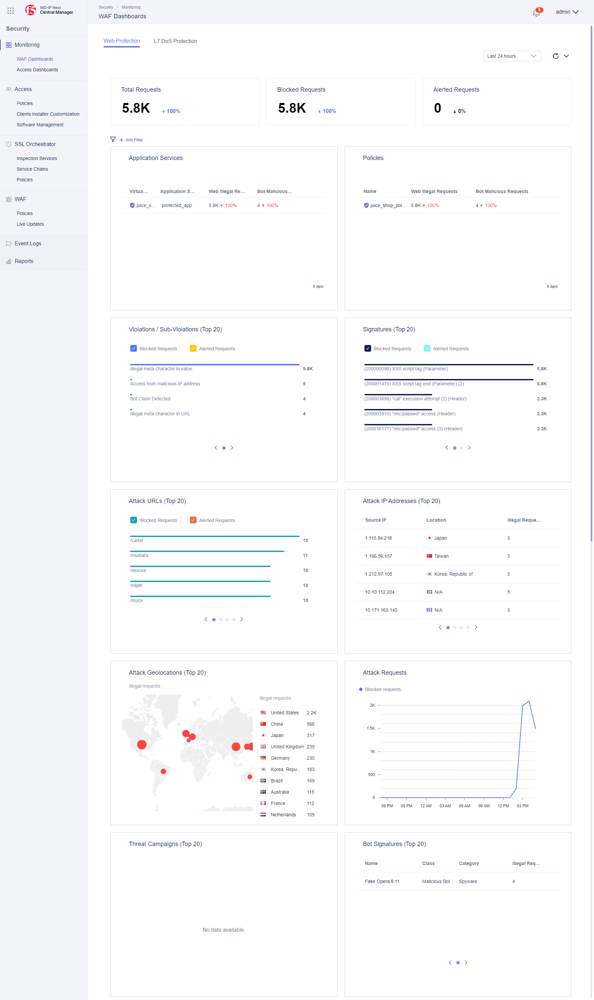

# Automated Workflow Guide

In this part of the guide, we will automatically migrate the application with two virtual servers to BIG-IP Next with a shared WAF policy and then verify it using Central Manager UI as well as CLI.

Before proceeding, you need to enter Docker if you chose [Docker setup](#docker-setup) option or the environment in Jump Host. Go to the following folder where we will update config files:

```bash
bigip/bigip_next/security/migrate-from-tmos/migrate
```

## 1. Prerequisites

### 1.1 Configure Connectivity to TMOS

In the `tmos_vars.yml` file specify the following parameters to establish a connection to TMOS:

- `server`
- `server_port`
- `user`
- `password`
- `validate_certs`
- `no_f5_teem`
- name of the file for UCS backup.

### 1.2 Configure Connectivity to BIG-IP Next

In the `next_vars.yml` file specify the following parameters to establish connectivity to BIG-IP Next:

- `address`, `user`, `password`, `max_applications` for Central Manager
- `migrate_shared_object_prefix`, `migrate_app_prefix` for prefixes that Central Manager will use
- `auto_ans_vs1` (virtual server in TMOS) and `bigip_next` (address of BIG-IP Next instance to deploy to) for deployment
- `ip_map` specified for virtual addresses for virtual servers to be updated during the migration process (but application addresses within pools won't be changed). Note that during the migration process the addresses will be updated accordingly: **10.1.10.90 => 10.1.10.190** and **10.1.10.91 => 10.1.10.191**. The original application will not be disabled and its routing will go via **10.1.10.90** & **10.1.10.91**, whereas the new routing will go via **10.1.10.190** & **10.1.10.191** which will let two simultaneous routings go to the app.

### 1.3 Configure Connectivity to Central Manager and Add SSH Private Keys

In the `inventory.ini` file specify the following parameters:

- Central Manager IP address
- SSH private key to access Central Manager
- TMOS IP address
- SSH private key to access TMOS

## 2. Migration and Deployment

In the `site.yml` file you can see the migration steps that will be performed:

- Backup TMOS BIG-IP as UCS
- Migration of supported apps to BIG-IP Next that includes both creating and deploying them

Please note that only certificates and WAF policies are migrated. **NOTE: For migration of iRules and Monitors look at the LTM migration workflow guide in this repository.**

Start the deployment by running the following command:

```bash
ansible-playbook -i inventory.ini site.yml
```

Note that deployment can take some time.

Review the migration report. We recommend reviewing Status, taking note of those indicated Red and Blue, which may require manual action to resolve:

```bash
~/.local/bin/csvlook -d ',' --max-column-width 30 report.csv
```

The report may look like this:

```
| Old_Vs_Name               | New_App_Name                   | Status | Old_IP_Address | New_IP_Address | Unsupported                    |
| ------------------------- | ------------------------------ | ------ | -------------- | -------------- | ------------------------------ |
| WAF_BOT_DEFENSE           | Common_WAF_BOT_DEFENSE         | yellow | 10.1.10.55     | -              | ltm virtual /tenant37286d41... |
| auto_ans_vs1              | Common_auto_ans_vs1            | yellow | 10.1.10.90     | 10.1.10.190    | ltm monitor http /tenantb32... |
| IP_FORWARD_VS             | Common_IP_FORWARD_VS           | red    | 10.1.10.59     | -              | ltm virtual /tenantbe4fbd4b... |
| TCP_PROG                  | Common_TCP_PROG                | yellow | 10.1.10.52     | -              | ltm profile http /tenant990... |
| WAF_DOS_PROFILE           | Common_WAF_DOS_PROFILE         | yellow | 10.1.10.56     | -              | ltm profile client-ssl /ten... |
| FAST_L4                   | Common_FAST_L4                 | yellow | 10.1.10.51     | -              | ltm virtual-address /tenant... |
| manual_ans_vs1            | Common_manual_ans_vs1          | yellow | 10.1.10.95     | -              | ltm profile tcp /tenant8327... |
| auto_ans_vs2              | Common_auto_ans_vs2            | yellow | 10.1.10.91     | 10.1.10.191    | ltm virtual-address /tenant... |
| WAF_VANILLA_VS            | Common_WAF_VANILLA_VS          | yellow | 10.1.10.58     | -              | ltm profile http /tenant02b... |
| SSL_OFFLOAD_VS_80         | Common_SSL_OFFLOAD_VS_443      | yellow | 10.1.10.53     | -              | ltm virtual-address /tenant... |
| SSL_OFFLOAD_VS_443        | Common_SSL_OFFLOAD_VS_443      | yellow | 10.1.10.53     | -              | ltm profile tcp /tenant903b... |
| SSL_OFFLOAD_VS_W_PASSWORD | Common_SSL_OFFLOAD_VS_W_PAS... | blue   | 10.1.10.60     | -              | ltm profile http /tenantd0b... |
| LTM_POLICY_VS             | Common_LTM_POLICY_VS           | yellow | 10.1.10.54     | -              | ltm policy /tenantd5e4afcf1... |
```

## 3. Verify Migrated Application

### 3.1 Verify via Central Manager UI

#### 3.1.1 Migrated Application

Log in to Central Manager and proceed to **Applications**. You will see the application migrated whose name starts with the prefix you indicated in the prerequisites step.

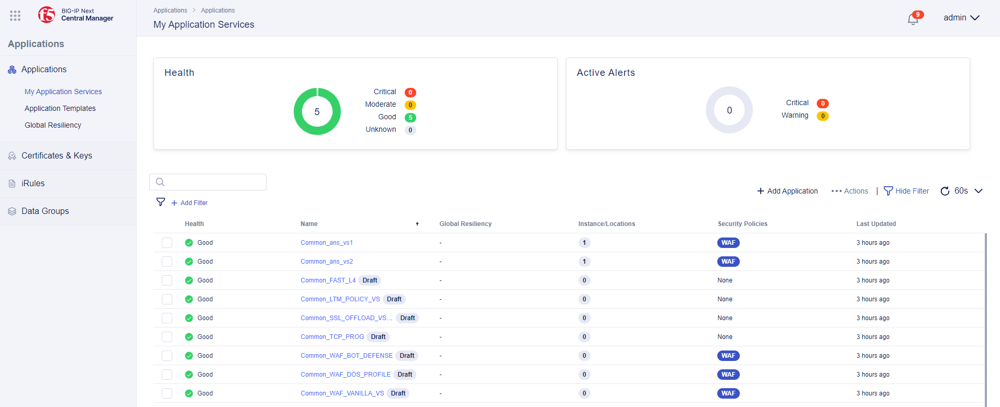

Please note that applications that were not specified in destinations are also migrated but not deployed. You will see `draft` next to their names.

Let's drill down into deployed application details. Click on the application to see the pool member it is deployed to. Next, you can click the **Edit** button.

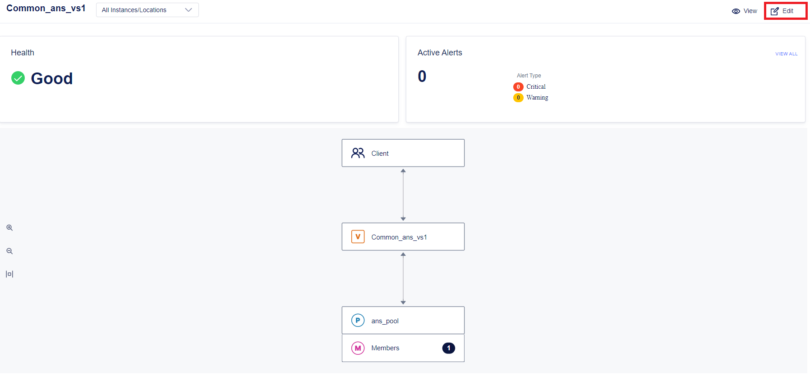

In the opened declaration we can see the WAF policy, as well as the virtual address that has changed according to the mapping we specified earlier.


Now let's take a look at a declaration of another application to see that it has another virtual address but the same WAF policy. If an application has a shared resource, e.g. certificate or firewall, this resource is created once and all applications with such resource name will refer to it.

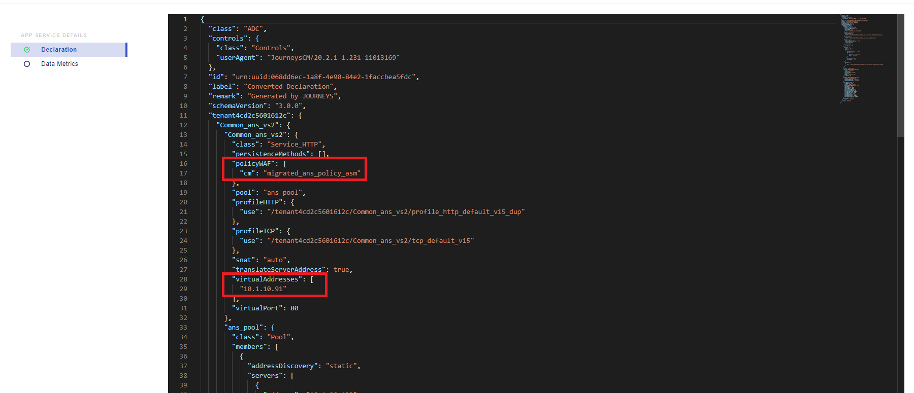

#### 3.1.2 Deployed WAF Policy

Navigate to **Security** => **WAF** = > **Policies**. You will see the migrated policies. Next to each policy, you will see the number of applications that refer to it. If `0` is indicated, no deployed applications refer to it.

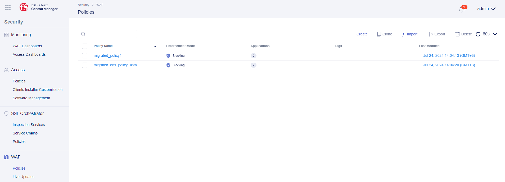

#### 3.1.3 Deployed Certificates

Navigate to **Applications** => **Certificates & Keys**. You will see the list of migrated certificates.

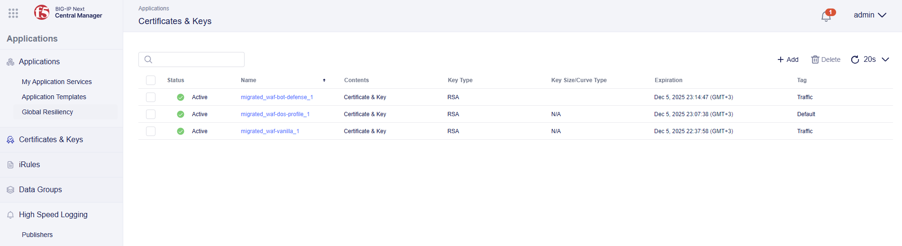

### 3.2 Verify via CLI

Finally, we can verify the migrated and deployed app by running the following commands to the new routing in BIG-IP Next:

```bash
curl http://10.1.10.190/endpoint1
```

```bash
curl http://10.1.10.191/endpoint1
```

Verify that WAF was migrated too:

```bash
curl 'http://10.1.10.191/endpoint1?query=<script>alert(1)</script>'
```

The expected output should look like this:

```
<html><head><title>Request Rejected</title></head><body>The requested URL was rejected. Please consult with your administrator.<br><br>Your support ID is: 7857824916379271192<br><br><a href='javascript:history.back();'>[Go Back]</a></body></html
```

The old routing via TMOS can also be verified by sending the ping to it:

```bash
curl http://10.1.10.90/endpoint1
```

```bash
curl http://10.1.10.91/endpoint1
```

Congrats! You just completed the automated migration of the application to BIG-IP Next with its WAF Policy and certificates.
