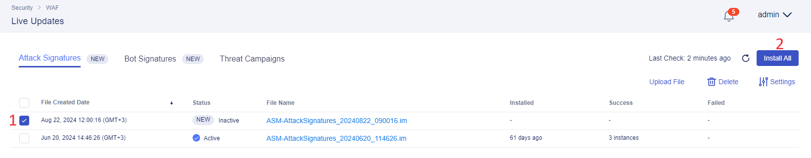

# Update Signature Package for Next WAF in Central Manager and Push to All Instances

# Table of Contents

- [Update Signature Package for Next WAF in Central Manager and Push to All Instances](#update-signature-package-for-next-waf-in-central-manager-and-push-to-all-instances)
- [Table of Contents](#table-of-contents)
- [Overview](#overview)
- [Manual Workflow Guide](#manual-workflow-guide)

# Overview

This guide provides manual walk-through steps and automated Terraform scripts for updating signature package for Next WAF in Central Manager and then pushing them to all the instances.

# Manual Workflow Guide

Log in BIG-IP Next Central Manager via the GUI of the deployment we did earlier or via your own one, and proceed to **Security Workspace**.

Go to the **Live Updates** section and click the button to manually download latest updates to Central Manager.

Download and installation to Central Manager will start. Note that this process can take some time.

After the installation to the Central Manager has been completed, the file will appear on the list. Select the file and click **Install All** to upload the update file to the instances. This will open a window with the detailed information.

CLick on the **Instances** tab to see the instances update file will be installed to. Proceed by clicking **Install All**.

Confirm the installation.

CLick the installed file to drill down into the details.

Navigate to the **Instances** tab and take a look at the installation status.

