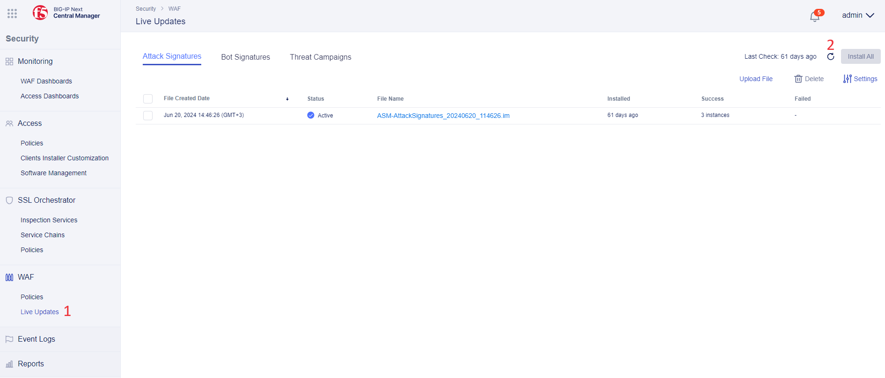
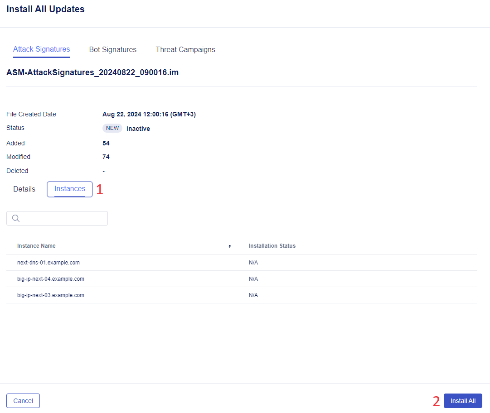
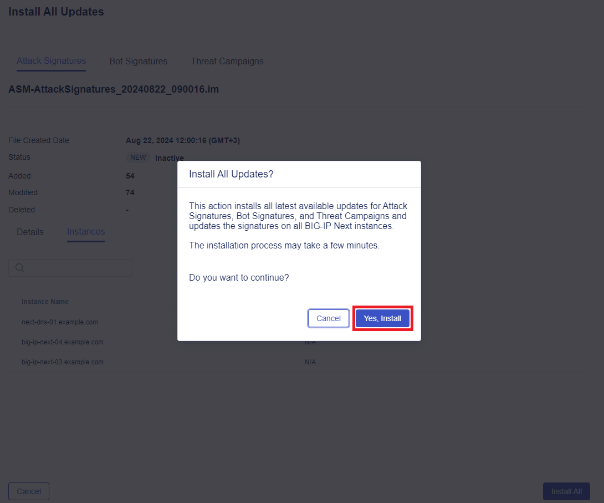
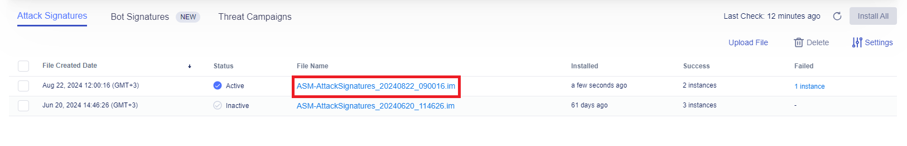
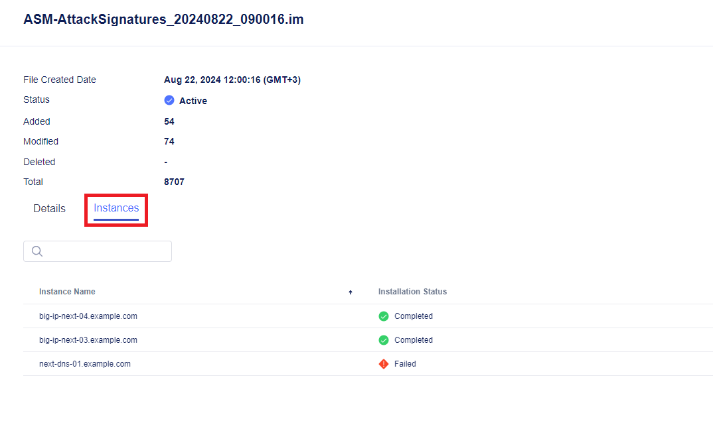

# Update Signature Package for Next WAF in Central Manager and Push to All Instances

# Table of Contents

- [Update Signature Package for Next WAF in Central Manager and Push to All Instances](#update-signature-package-for-next-waf-in-central-manager-and-push-to-all-instances)
- [Table of Contents](#table-of-contents)
- [Overview](#overview)
- [Docker Setup](#docker-setup)
- [Manual Workflow Guide](#manual-workflow-guide)
- [Automated Workflow Guide](#automated-workflow-guide)
  - [1. Configure Connectivity](#1-configure-connectivity)
  - [2. Configure Update Logging](#2-configure-update-logging)
    - [2.1 Connect to Running Docker](#21-connect-to-running-docker)
    - [2.2 Review Logs in Real-Time](#22-review-logs-in-real-time)
  - [3. Checking for Updates and Installing Them](#3-checking-for-updates-and-installing-them)
  - [4. Reports](#4-reports)
    - [4.1 Live Update Report](#41-live-update-report)
    - [4.2 Push Updates Report](#42-push-updates-report)
    - [4.3 Realtime Live Update Logs](#43-realtime-live-update-logs)

# Overview

This flow is one of three use-cases of the [Operations](https://github.com/yoctoserge/bigip_automation_examples/blob/feature/merge-all/bigip/bigip_next/security/operations/Readme.md) series on applying updates to Next WAF. It provides manual walk-through steps and automated Terraform scripts for updating signature package for Next WAF in Central Manager and then pushing them to all the instances.

# Docker Setup

You may choose to use the included Docker. You may run it on Linux machine in order to take advantage of Ansible tooling.

If you chose to use Docker, follow the steps to set it up in this [guide](https://github.com/yoctoserge/bigip_automation_examples/blob/feature/merge-all/bigip/bigip_next/security/deploy-with-new-next-waf#docker-setup).

# Manual Workflow Guide

Log in BIG-IP Next Central Manager via the GUI of the deployment we did earlier or via your own one, and proceed to **Security Workspace**.


Go to the **Live Updates** section. You will see the **Attack Signatures** tab. Click the button to manually download latest updates for **Attack Signatures** to Central Manager. You can repeat this step for **Bot Signatures** and **Threat Campaigns** accordingly.



Download and installation of Attack Signatures updates to Central Manager will start. Note that this process can take some time.

After the installation to the Central Manager has been completed, the file will appear on the list. Select the file and click **Install All** to upload the update file to the instances. This will open a window with the detailed information.


Click on the **Instances** tab to see the instances update file will be installed to. Proceed by clicking **Install All**.



Confirm the installation.



CLick the installed file to drill down into the details.



Navigate to the **Instances** tab and take a look at the installation status.



# Automated Workflow Guide

In this part of the guide we will automatically check for Next WAF updates of **Attack Signatures**, **Bot Signatures** and **Threat Campaigns**, and then install them to the instances after that.

**Before proceeding, you need to enter Docker if you chose [Docker Setup](#docker-setup) option or the environment in Jump Host.**

## 1. Configure Connectivity

Proceed to the following file:

```bash
bigip/bigip_next/security/operations/live-update/next_vars.yml
```

First, specify the following parameters for Central Manager to establish connectivity. Second, specify files to save reports to. And finally, indicate update task timeout time in minutes. Note that if you have three and more BIG IP Next nodes for updates, you might need 15 and more minutes:

```yml
central_manager:
  address: 10.1.1.5
  user: admin
  password: Welcome1234567!

check_updates_report: ../check-updates-report.txt
push_updates_report: ../push-updates-report.txt
task_timeout_minutes: 15
```

## 2. Configure Update Logging

### 2.1 Connect to Running Docker

If the docker option is used, there is a possibility to see the logs of the update installation process. First, you need to establish one more SSH connection to jumphost. Second, connect to the running docker. To do that navigate to:

```bash
bigip/bigip_next/env-init/docker
```

In this folder run the following command to connect to the running Docker:

```bash
sh ./connect.sh
```

### 2.2 Review Logs in Real-Time

Proceed to the following folder:

```bash
bigip/bigip_next/security/operations/live-update
```

Run the following command to review logs:

```bash
tail -f ./logs/cm_polling.log
```

## 3. Checking for Updates and Installing Them

Navigate to the following directory in your first CLI:

```bash
bigip/bigip_next/security/operations/live-update
```

Start checking for updates of Attack Signatures, Bot Signatures and Threat Campaigns and pushing them all to the instances by running the following command in the first Docker connect CLI:

```bash
ansible-playbook playbooks/site.yml
```

You will see the update status in the second CLI set up for logging.

**Note that this process can take some time.**

There are two files in `bigip/bigip_next/security/operations/live-update/playbooks` that can be run separately if needed:

- `bigip/bigip_next/security/operations/live-update/playbooks/check_live_update.yml` to check if there are updates available

- `bigip/bigip_next/security/operations/live-update/playbooks/push_updates.yml` to push the updates

## 4. Reports

### 4.1 Live Update Report

Run the following command to view update logs:

```bash
cat check-updates-report.txt
```

You will see the following report as output showing live update time, its status, errors if any, downloaded / installed files:

```
Check live update: 2024-09-24T09:59:59.798777Z -- 2024-09-24T10:00:07.183222Z
Status: completed

+-----------------------------------------------+-----------------------+----------------------+
| File                                          | Downloaded            | Installed            |
+-----------------------------------------------+-----------------------+----------------------+
| BotSignatures_20240918_092245.im              | X                     |                      |
| ThreatCampaigns_20240922_094028.im            | X                     |                      |
| ASM-AttackSignatures_20240919_075902.im       | X                     |                      |
+-----------------------------------------------+-----------------------+----------------------+
```

### 4.2 Push Updates Report

Run the following command to view the report:

```bash
cat push-updates-report.txt
```

You will see the following report as output showing the files and time they were pushed:

```
|-----------------------------------------------|----------------------------------|----------------------------------|-----------------------------------------------|--------------|
| Filename                                      | Created                          | Completed                        | Hostname                                      | Status       |
|-----------------------------------------------|----------------------------------|----------------------------------|-----------------------------------------------|--------------|
| ASM-AttackSignatures_20240919_075902.im       | 2024-09-23T12:32:44.712737Z      | 2024-09-23T12:35:43.598947Z      | big-ip-next-03.example.com                    | completed    |
| ASM-AttackSignatures_20240919_075902.im       | 2024-09-23T12:32:44.712737Z      | 2024-09-23T12:35:43.598947Z      | big-ip-next-04.example.com                    | completed    |
| ASM-AttackSignatures_20240919_075902.im       | 2024-09-23T12:32:44.712737Z      | 2024-09-23T12:35:43.598947Z      | next-dns-01.example.com                       | failed       |
|-----------------------------------------------|----------------------------------|----------------------------------|-----------------------------------------------|--------------|
| BotSignatures_20240918_092245.im              | 2024-09-23T12:35:43.606853Z      | 2024-09-23T12:38:17.678116Z      | big-ip-next-03.example.com                    | completed    |
| BotSignatures_20240918_092245.im              | 2024-09-23T12:35:43.606853Z      | 2024-09-23T12:38:17.678116Z      | big-ip-next-04.example.com                    | completed    |
| BotSignatures_20240918_092245.im              | 2024-09-23T12:35:43.606853Z      | 2024-09-23T12:38:17.678116Z      | next-dns-01.example.com                       | failed       |
|-----------------------------------------------|----------------------------------|----------------------------------|-----------------------------------------------|--------------|
| ThreatCampaigns_20240922_094028.im            | 2024-09-23T12:38:17.685855Z      | 2024-09-23T12:40:52.589464Z      | big-ip-next-03.example.com                    | completed    |
| ThreatCampaigns_20240922_094028.im            | 2024-09-23T12:38:17.685855Z      | 2024-09-23T12:40:52.589464Z      | big-ip-next-04.example.com                    | completed    |
| ThreatCampaigns_20240922_094028.im            | 2024-09-23T12:38:17.685855Z      | 2024-09-23T12:40:52.589464Z      | next-dns-01.example.com                       | failed       |
|-----------------------------------------------|----------------------------------|----------------------------------|-----------------------------------------------|--------------|
```

### 4.3 Realtime Live Update Logs

You will see the following logs in the second connected CLI:

```
Task Polling: ca1dc7ea-0ab6-4ad1-873f-3198d4063d03 - Live Update Check Status > running
Task Polling: ca1dc7ea-0ab6-4ad1-873f-3198d4063d03 - Live Update Check Status > running
Task Polling: ca1dc7ea-0ab6-4ad1-873f-3198d4063d03 - Live Update Check Status > completed
Task Polling: 3d0d15c0-e933-46c5-be73-0ffaa2ec2eb4 - Live Update Bulk Installation > running
Task Polling: 3d0d15c0-e933-46c5-be73-0ffaa2ec2eb4 - Live Update Bulk Installation > running
Task Polling: 3d0d15c0-e933-46c5-be73-0ffaa2ec2eb4 - Live Update Bulk Installation > running
Task Polling: 3d0d15c0-e933-46c5-be73-0ffaa2ec2eb4 - Live Update Bulk Installation > running
Task Polling: 3d0d15c0-e933-46c5-be73-0ffaa2ec2eb4 - Live Update Bulk Installation > running
Task Polling: 3d0d15c0-e933-46c5-be73-0ffaa2ec2eb4 - Live Update Bulk Installation > running
Task Polling: 3d0d15c0-e933-46c5-be73-0ffaa2ec2eb4 - Live Update Bulk Installation > running
...
Task Polling: 3d0d15c0-e933-46c5-be73-0ffaa2ec2eb4 - Live Update Bulk Installation > running
Installing file: 3d0d15c0-e933-46c5-be73-0ffaa2ec2eb4 - ASM-AttackSignatures_20240919_075902.im
...
Task Polling: 3d0d15c0-e933-46c5-be73-0ffaa2ec2eb4 - Live Update Bulk Installation > running
Installing file: 3d0d15c0-e933-46c5-be73-0ffaa2ec2eb4 - ASM-AttackSignatures_20240919_075902.im
...
Installing file: 3d0d15c0-e933-46c5-be73-0ffaa2ec2eb4 - BotSignatures_20240918_092245.im
Task Polling: 3d0d15c0-e933-46c5-be73-0ffaa2ec2eb4 - Live Update Bulk Installation > running
Installing file: 3d0d15c0-e933-46c5-be73-0ffaa2ec2eb4 - BotSignatures_20240918_092245.im
Task Polling: 3d0d15c0-e933-46c5-be73-0ffaa2ec2eb4 - Live Update Bulk Installation > completed
Task Polling: aefa7751-59d0-42cf-b67b-9cbebd6f20b8 - Live Update Installation > completed
Task Polling: 1f496150-8560-4d25-8b0d-cb7e5632a5cc - Live Update Installation > completed
Task Polling: 83e1d615-f99d-4a49-833a-d0203cbe1009 - Live Update Installation > completed
```
