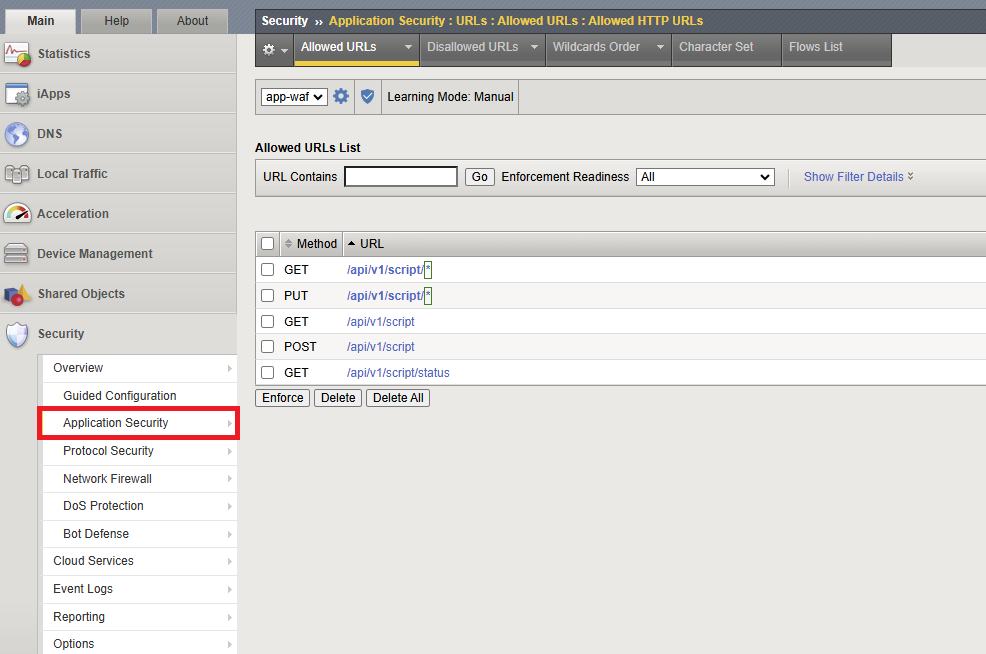

# API Endpoint Protection

# Table of Contents

- [Overview](#overview)
-

==TODO===

# Overview

==TODO==
**This guide belongs to the series of [Operations](https://github.com/yoctoserge/bigip_automation_examples/blob/feature/merge-all/bigip/bigip_next/security/operations/Readme.md) guides on applying updates to Next WAF to protect an application. It provides manual walk-through steps and automated Terraform scripts for updating security policy for Next WAF in Central Manager.
For this guide we will use the app with a WAF policy setup and deployed in the [Deploy and Protect a New App on BIG-IP Next with Security Policy](https://github.com/yoctoserge/bigip_automation_examples/blob/feature/merge-all/bigip/bigip_next/security/deploy-with-new-next-waf/Readme.md#environment--pre-requisites) guide.**

# Environment & Pre-requisites

## Blueprint Setup _(for F5 employees or customers with access to UDF)_

### 1. Deploy Blueprint

**If you are an F5 employee or customer with access to UDF, you can use the following BIG-IP blueprint flow as the foundation for your environment: "BigIp Automation". Search for this name and utilize the latest version of the blueprint. This GitHub repo is already optimized to work with this UDF blueprint.**

Navigate to the **Blueprints** and search for **BigIp Automation**. Deploy it.

=====TODO=====


After it has been deployed, navigate to your **Deployments** and start it:

=====TODO=====


### 2. Setup SSH Keys

To enter the Blueprint VM (jumphost), the SSH tool will be used. In order to set up SSH access keys use [this guide](https://help.udf.f5.com/en/articles/3347769-accessing-a-component-via-ssh).

### 3. Enter Blueprint

After the Blueprint has been deployed and SSH keys are setup, navigate to the **Deployments** section and proceed to the **Details** of your deployment. Select the **Components** tab and proceed to the **Ubuntu Jump Host**.

=====TODO=====


Go to the **Access Methods** tab and copy the SSH external. Execute copied command in the command line.

## Docker Compose

**If you are using the UDF Blueprint, you do not need to install Docker since it is already pre-installed there.**

Docker compose is to be installed in this machine. Run the following command to verify if you have it:

```bash
docker compose
```

If the command cannot be executed, you need to install Docker Compose.

## Infrastructure Configuration

### 1. Clone Repository

After that, clone the [repository](https://github.com/f5devcentral/bigip_automation_examples.git). Note that you don't need to specify the SSH keys in Blueprint since they are already specified.

### 2. Run Test App

Proceed to the following directory:

```
cd ~/bigip_automation_examples/bigip/bigip_next/security/operations/open-api-protection/cicd-environment/server-git/repo/app/automation
```

And run the following command to start the app:

```
ansible-playbook -i inventory.ini ./playbooks/app-restart-deploy.yml
```

### 3. Setup TMOS Initial Settings

Now that the app is up and running, we need to add it to TMOS. Run the following command:

```bash
ansible-playbook -i inventory.ini ./playbooks/tmos_setup.yml --extra-vars 'tmos_user=admin tmos_password=admin'
```

### 4. Verify App

Finally, we will verify the app is up and running. Check the application internal route by running the following command:

```bash
curl http://10.1.10.97/internal/node-info
```

You will see system information in the output which means the app is run.

# Manual Workflow Guide

The manual workflow of this guide showcases protection of API endpoint of an existing app using OpenAPI (Swagger file). The existing security policy will be updated using OpenAPI with a list of allowed URLs. In this way we will protect internal routes and make them not visible to positive security via Open API. For this purpose we will need to create a security policy.

## 1. Create Security Policy

In the Blueprint deployed earlier navigate to the **BIG-IP 15.1.x** component and select **TMUI**.


Log in with the **admin** & **admin** credentials and navigate to the **Application Security** => **Security Policies**. Click the button to add a policy.


In the opened form fill in the required information:

- give policy **app-waf** name
- select the **API Security** template
- upload the swagger file stored in the following directory:

```bash
bigip/bigip_next/security/operations/open-api-protection/cicd-environment/server-git/repo/app/src/swagger.json
```

- select the created virtual server


## 2. Verify Protection

Run the following command:

```bash
curl http://10.1.10.97/internal/node-info
```

You will see the following response without the detailed system information which means that internal routes are now hidden, and only external are available:

```bash
{"supportID": "8211137541852626960"}
```

You can also verify the protection status in TMOS. Navigate to **Application Security** => **URLs**. You will see the list of allowed URLs.



# Automated Workflow Guide

===TODO====

**In this part of the guide we will use Ansible to first update the WAF policy by uploading a new OpenAPI swagger file, and then adding a `delete` handler to it.
via CI/CD environment. It will connect updates of positive security related to possible change of app API.**

## 1. Run CI/CD Environment

First, navigate to the following directory:

```bash
cd ~/bigip_automation_examples/bigip/bigip_next/security/operations/open-api-protection/cicd-environment
```

And then initialize the environment:

```bash
./init.sh
```

After that, build Docker:

```bash
docker compose build
```

This command will compose Docker for Jenkins, Git SCM, initialize Jenkins with initial parameters for Swagger file to be built and deployed, initialize Git SCM with sources of app that will be built and deployed via CI/CD.

And finally, run CI/CD environment including Git and Jenkins connected to each other:

```bash
docker compose up -d
```

## 2. Connect Jenkins to BIG-IP

Since we do not keep credentials in scripts, we will need to add those to Jenkins.

In the Blueprint deployed earlier navigate to the **Ubuntu Jump Host (client/server)** and proceed to **Firefox**.

**If you are not using the UDF Blueprint, open your browser for the 9090 port on your Jump Host.**


In the opened Firefox tab go to http://10.1.10.4:9090. This will open Jenkins on Jumphost at 9090 port.

In the opened page enter **admin** for both username and password.


Navigate to **Manage Jenkins** > **Credentials**. Click the **global** button.


Click the **Add Credentials** button.


Fill in the opened form:

- **admin** for username,
- **admin** for password,
- **bigip-access** for ID.


Now Jenkins is setup for running deployment.

## 3. Add `delete` to Policy

### 3.1 Clone App Repo

Go to the `/tmp` folder in your Ubuntu terminal and run the following command:

```bash
git clone ssh://git@10.1.1.4:8022/home/git/script-crud-service.git
```

Type in **password** for the requested password.

Enter the `cd script-crud-service` folder and change the branch:

```bash
git checkout main
```

### 3.2 Update routes

Now let's take a look at the structure. In the `routes` you can see two files - `.new` and `.js`. So we will need to rename those - the current ones to the `old` for record, and the new one to the current script.

```bash
├── Jenkinsfile
├── automation
│   ├── ansible.cfg
│   ├── filters
│   │   └── make_filename_unique.py
│   ├── inventory.ini
│   ├── library
│   │   └── next_polling_deploy_module.py
│   ├── next_vars.yml
│   ├── playbooks
│   │   ├── app-restart-deploy.yml
│   │   ├── swagger-next.yml
│   │   ├── swagger-tmos.yml
│   │   └── tmos_setup.yml
│   └── tmos_vars.yml
└── src
    ├── Dockerfile
    ├── app.js
    ├── models
    │   └── scriptModel.yml
    ├── package.json
    ├── routes
    │   ├── internalRoutes.js
    │   ├── scriptRoutes.js
    │   └── scriptRoutes.new
    ├── swagger.js
    └── swagger.json

7 directories, 20 files
```

Rename the files as follows:

```bash
mv ./src/routes/scriptRoutes.js ./src/routes/scriptRoutes.old
```

and

```bash
mv ./src/routes/scriptRoutes.new ./src/routes/scriptRoutes.js
```

### 3.3 Push Updates

Now that we have a new route, as well as setup CI/CD, we can push these updates to Git SCM:

```bash
git add .
```

Next, describe the commit:

```bash
git commit -m "new routes"
```

If you see the `*** Please tell me who you are.` message, run the following commands with the default user info. However if you want to personalize it, you can use your own information:

```bash
git config --global user.email user@example.com
git config --global user.name "User Name"
```

Finally, run again:

```bash
git commit -m "new routes"
```

and

```bash
git push
```

### 3.4 Review Updates

First, go to Jenkins to see the run pipeline. Enter it and proceed to the **Pipeline Console** showing the job progress.


Finally, we can verify if Swagger definition at BIG-IP is updated via TMOS.

Go back to your deployment and proceed to TMOS. Navigate to **Application Security** => **URLs**. You will see the added `delete` URL.


