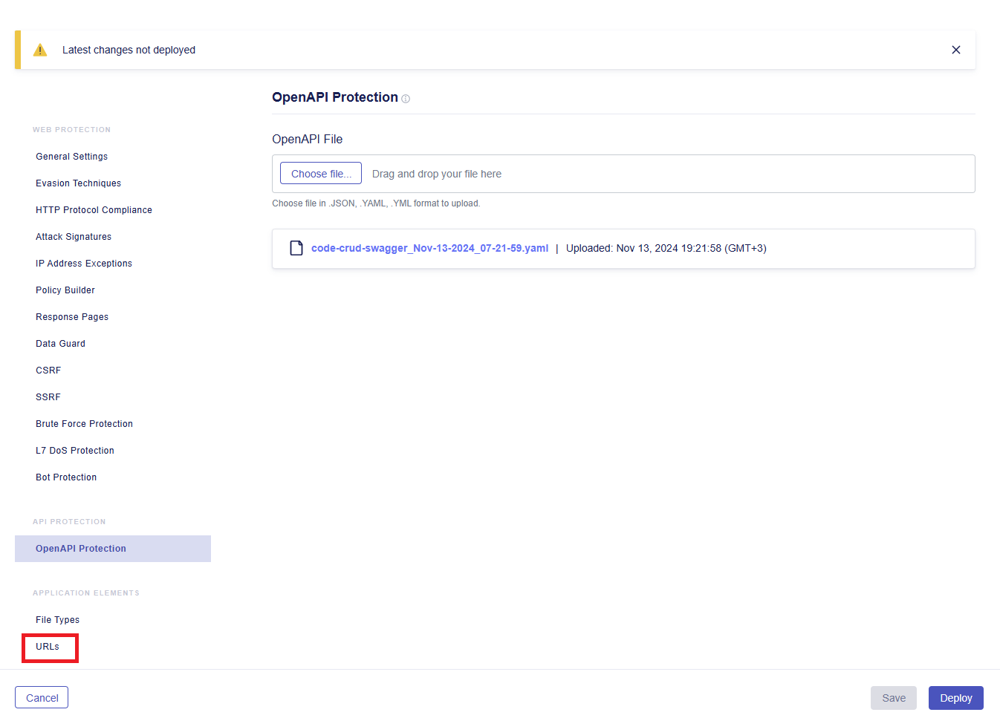
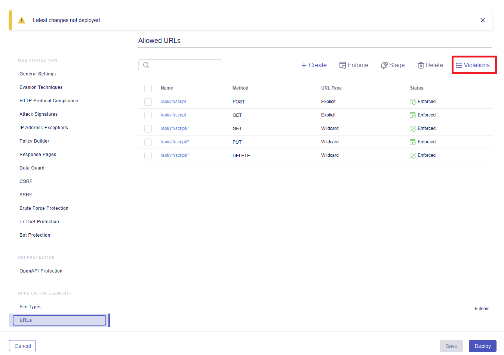
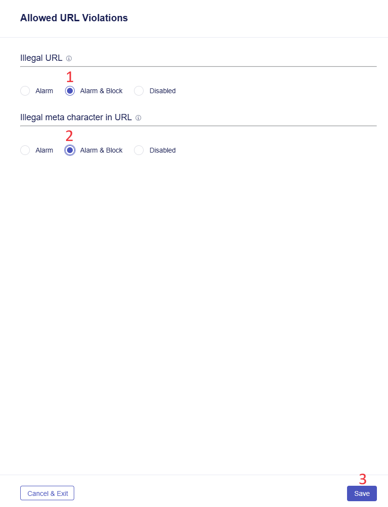
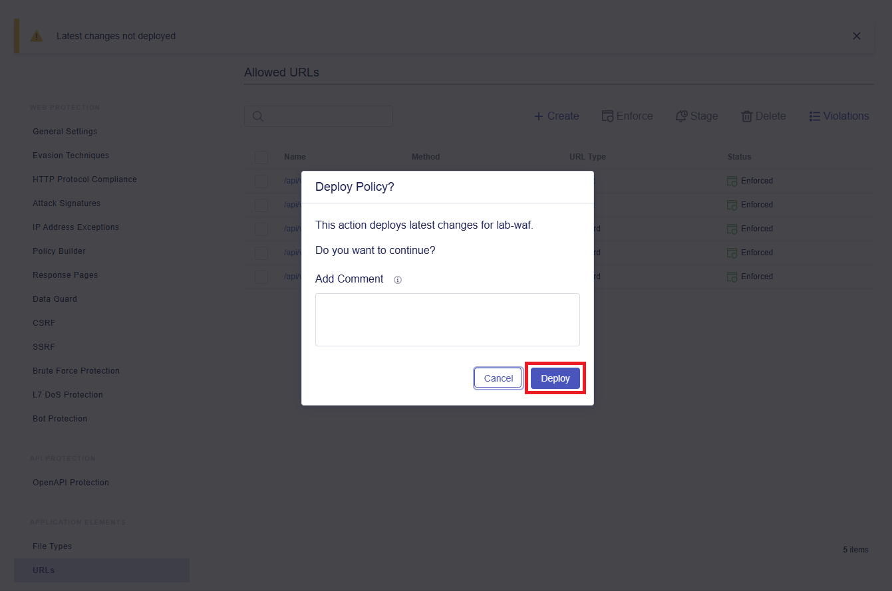
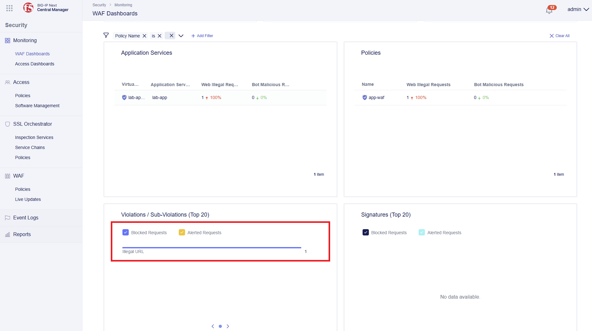

# API Endpoint Protection based on Open API specs with Next WAF

# Table of Contents

- [API Endpoint Protection based on Open API specs with Next WAF](#api-endpoint-protection-based-on-open-api-specs-with-next-waf)
- [Table of Contents](#table-of-contents)
- [Overview](#overview)
- [Manual Workflow Guide](#manual-workflow-guide)
  - [1. Verification](#1-verification)
    - [1.1 Verify Swagger File](#11-verify-swagger-file)
    - [1.2 Verify App](#12-verify-app)
  - [2. Upload Swagger](#2-upload-swagger)
  - [3. Configure Violations](#3-configure-violations)
  - [4. Deploy Updated Policy](#4-deploy-updated-policy)
  - [5. Verify OpenAPI Endpoint Protection](#5-verify-openapi-endpoint-protection)
    - [5.1 Send Request](#51-send-request)
    - [5.2 Security Dashboard](#52-security-dashboard)

# Overview

This guide belongs to the series of [Operations](https://github.com/yoctoserge/bigip_automation_examples/blob/feature/merge-all/bigip/bigip_next/security/operations/Readme.md) guides on applying updates to Next WAF to protect an application. It provides manual walk-through steps and automated Terraform scripts for updating security policy for Next WAF in Central Manager.

This guide showcases protection of API endpoint of an existing app using OpenAPI (Swagger file). The existing security policy will be updated using OpenAPI with a list of allowed URLs. Blocking and creating alarms for violations will be configured. And as a result, all requests will pass only through the API specified in OpenAPI.

For this guide we will use the app with a WAF policy setup and deployed in the [Deploy and Protect a New App on BIG-IP Next with Security Policy](https://github.com/yoctoserge/bigip_automation_examples/blob/feature/merge-all/bigip/bigip_next/security/deploy-with-new-next-waf/Readme.md#environment--pre-requisites) guide.

# Manual Workflow Guide

## 1. Verification

We are going to apply the OpenAPI (Swagger) file to the security policy so that all requests could go only through the API specified in the file. First, let's see the file.

Go to the following directory to see the `code-crud-swagger.yaml` file:

```bash
bigip/bigip_next/env-init/environment/templates
```

You will see the following Swagger file:

```yml
openapi: 3.0.0
info:
  title: Script API
  description: API to perform CRUD operations on Scripts
  version: 1.0.0
servers:
  - url: /api/v1
paths:
  /script:
    get:
      summary: Get all scripts
      responses:
        "200":
          description: A list of scripts
          content:
            application/json:
              schema:
                type: array
                items:
                  $ref: "#/components/schemas/Script"
    post:
      summary: Create a new script
      requestBody:
        required: true
        content:
          application/json:
            schema:
              $ref: "#/components/schemas/Script"
      responses:
        "201":
          description: Script created successfully
          content:
            application/json:
              schema:
                $ref: "#/components/schemas/Script"
  /script/{id}:
    get:
      summary: Get script by ID
      parameters:
        - name: id
          in: path
          required: true
          schema:
            type: string
      responses:
        "200":
          description: The requested script
          content:
            application/json:
              schema:
                $ref: "#/components/schemas/Script"
        "404":
          description: Script not found
    put:
      summary: Update an existing script by ID
      parameters:
        - name: id
          in: path
          required: true
          schema:
            type: string
        - name: name
          in: query
          required: false
          schema:
            type: string
          description: The new name of the script
        - name: description
          in: query
          required: false
          schema:
            type: string
          description: The new description of the script
        - name: code
          in: query
          required: false
          schema:
            type: string
          description: The new code of the script
          example: "<script>alert('script test')</script>"
        - name: orderNumber
          in: query
          required: false
          schema:
            type: integer
          description: The order number of the script
      responses:
        "200":
          description: Script updated successfully
          content:
            application/json:
              schema:
                $ref: "#/components/schemas/Script"
        "404":
          description: Script not found
    delete:
      summary: Delete a script by ID
      parameters:
        - name: id
          in: path
          required: true
          schema:
            type: string
      responses:
        "204":
          description: Script deleted successfully
        "404":
          description: Script not found

components:
  schemas:
    Script:
      type: object
      required:
        - name
        - code
      properties:
        id:
          type: string
          description: Unique identifier for the script
          example: "12345"
        name:
          type: string
          description: The name of the script
          example: "Sample Script"
        description:
          type: string
          description: A description of the script
          example: "This is a sample script for demonstration purposes."
        code:
          type: string
          description: Code of the script
          example: "<script>alert('script test')</script>"
        orderNumber:
          type: integer
          description: The order number of the script
          example: 1
```

### 1.1 Verify Swagger File

Check that endpoints are not specified in the Swagger file by running the following command:

```bash
cat code-crud-swagger.yaml | grep endpoint
```

### 1.2 Verify App

Verify the application return:

```bash
curl http://10.1.10.94/endpoint1
```

The following output will be returned:

```
OK. Endpoint - 1
```

## 2. Upload Swagger

Log in BIG-IP Next Central Manager via the GUI and navigate to the **Security Workspace** => **WAF** => **Policies**.


Click on the policy created in [this](https://github.com/yoctoserge/bigip_automation_examples/blob/feature/merge-all/bigip/bigip_next/security/deploy-with-new-next-waf/Readme.md#environment--pre-requisites) guide, navigate to the **OpenAPI Protection** section and click the **Choose file** button. It will open the upload window.


In the opened window select the Swagger file from the following directory:

```bash
bigip/bigip_next/env-init/environment/templates/code-crud-swagger.yaml
```

The file will appear in the OpenAPI Protection window. Click **Save**.


Central Manager will ask you to confirm the replacement of the file. Confirm it:


You will see the uploaded file and the date of the operation.

## 3. Configure Violations

Next, proceed to the **URLs** tab.



On the URLs page you will see the list of allowed URLs specified in the uploaded Swagger file. Go to the **Violations** tab.



Select **Alarm & Block** for the illegal URLs and meta characters in URLs. Then save the configuration.



## 4. Deploy Updated Policy

Now that the OpenAPI Protection is applied with its list of allowed URLs, and violations are configured, we can deploy the policy update. Click the **Deploy** button.


Add comment if needed and confirm policy deploy.



As soon as the deployment is completed, you will see the **Deploy completed successfully** notification.

## 5. Verify OpenAPI Endpoint Protection

### 5.1 Send Request

Proceed to the following directory:

```bash
bigip/bigip_next/env-init/environment/templates
```

Run the following command to verify that request to our app is blocked:

```bash
curl http://10.1.10.94/endpoint1
```

You will see the following output:

```bash
{"Support ID": "........"}
```

### 5.2 Security Dashboard

Go back to Central Manager to see the request we just sent. Proceed to the **WAF Dashboards**. You will see the policy we deployed and the blocked illegal request.


