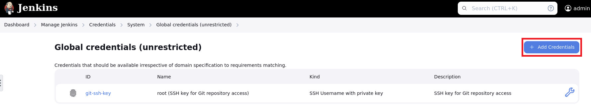
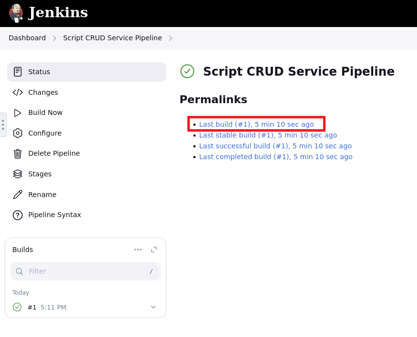

# API Endpoint Protection based on Open API specs with Next WAF

# Table of Contents

- [API Endpoint Protection based on Open API specs with Next WAF](#api-endpoint-protection-based-on-open-api-specs-with-next-waf)
- [Table of Contents](#table-of-contents)
- [Overview](#overview)
- [Manual Workflow Guide](#manual-workflow-guide)
  - [1. Verification](#1-verification)
    - [1.1 Verify Swagger File](#11-verify-swagger-file)
    - [1.2 Verify App](#12-verify-app)
  - [2. Upload Swagger](#2-upload-swagger)
  - [3. Configure Violations](#3-configure-violations)
  - [4. Deploy Updated Policy](#4-deploy-updated-policy)
  - [5. Verify OpenAPI Endpoint Protection](#5-verify-openapi-endpoint-protection)
    - [5.1 Send Request](#51-send-request)
    - [5.2 Security Dashboard](#52-security-dashboard)
- [Automated Workflow Guide](#automated-workflow-guide)
  - [Blueprint Setup _(for F5 employees or customers with access to UDF)_](#blueprint-setup-for-f5-employees-or-customers-with-access-to-udf)
    - [1. Deploy Blueprint](#1-deploy-blueprint)
    - [2. Setup SSH Keys](#2-setup-ssh-keys)
    - [3. Enter Blueprint](#3-enter-blueprint)
  - [PREREQUISITES Docker COmpose](#prerequisites-docker-compose)
    - [4. Clone Repository](#4-clone-repository)
  - [5 Automation scripts](#5-automation-scripts)
  - [NExt vars file](#next-vars-file)
  - [Since we do not keep user name and password for CM access in repository, Ansible running command will include those:](#since-we-do-not-keep-user-name-and-password-for-cm-access-in-repository-ansible-running-command-will-include-those)
  - [Verify the policy update](#verify-the-policy-update)
- [Adding `delete` Handler](#adding-delete-handler)
  - [1 Run CI/CD](#1-run-cicd)
  - [Build CI/CD Environment](#build-cicd-environment)
  - [Add CM Creds to Jenkins](#add-cm-creds-to-jenkins)
  - [Go to the `/tmp` folder in your Ubuntu terminal.](#go-to-the-tmp-folder-in-your-ubuntu-terminal)
  - [Add DELETE Handler to Application](#add-delete-handler-to-application)

# Overview

This guide belongs to the series of [Operations](https://github.com/f5devcentral/bigip_automation_examples/tree/main/bigip/bigip_next/security/operations/Readme.md) guides on applying updates to Next WAF to protect an application. It provides manual walk-through steps and automated Terraform scripts for updating security policy for Next WAF in Central Manager.

This guide showcases protection of API endpoint of an existing app using OpenAPI (Swagger file). The existing security policy will be updated using OpenAPI with a list of allowed URLs. Blocking and creating alarms for violations will be configured. And as a result, all requests will pass only through the API specified in OpenAPI.

For this guide we will use the app with a WAF policy setup and deployed in the [Deploy and Protect a New App on BIG-IP Next with Security Policy](https://github.com/f5devcentral/bigip_automation_examples/blob/main/bigip/bigip_next/security/deploy-with-new-next-waf/Readme.md#environment--pre-requisites) guide.

# Manual Workflow Guide

## 1. Verification

We are going to apply the OpenAPI (Swagger) file to the security policy so that all requests could go only through the API specified in the file. First, let's see the file.

Go to the following directory to see the `code-crud-swagger.yaml` file:

```bash
bigip/bigip_next/env-init/environment/templates
```

You will see the following Swagger file:

```yml
openapi: 3.0.0
info:
  title: Script API
  description: API to perform CRUD operations on Scripts
  version: 1.0.0
servers:
  - url: /api/v1
paths:
  /script:
    get:
      summary: Get all scripts
      responses:
        "200":
          description: A list of scripts
          content:
            application/json:
              schema:
                type: array
                items:
                  $ref: "#/components/schemas/Script"
    post:
      summary: Create a new script
      requestBody:
        required: true
        content:
          application/json:
            schema:
              $ref: "#/components/schemas/Script"
      responses:
        "201":
          description: Script created successfully
          content:
            application/json:
              schema:
                $ref: "#/components/schemas/Script"
  /script/{id}:
    get:
      summary: Get script by ID
      parameters:
        - name: id
          in: path
          required: true
          schema:
            type: string
      responses:
        "200":
          description: The requested script
          content:
            application/json:
              schema:
                $ref: "#/components/schemas/Script"
        "404":
          description: Script not found
    put:
      summary: Update an existing script by ID
      parameters:
        - name: id
          in: path
          required: true
          schema:
            type: string
        - name: name
          in: query
          required: false
          schema:
            type: string
          description: The new name of the script
        - name: description
          in: query
          required: false
          schema:
            type: string
          description: The new description of the script
        - name: code
          in: query
          required: false
          schema:
            type: string
          description: The new code of the script
          example: "<script>alert('script test')</script>"
        - name: orderNumber
          in: query
          required: false
          schema:
            type: integer
          description: The order number of the script
      responses:
        "200":
          description: Script updated successfully
          content:
            application/json:
              schema:
                $ref: "#/components/schemas/Script"
        "404":
          description: Script not found
    delete:
      summary: Delete a script by ID
      parameters:
        - name: id
          in: path
          required: true
          schema:
            type: string
      responses:
        "204":
          description: Script deleted successfully
        "404":
          description: Script not found

components:
  schemas:
    Script:
      type: object
      required:
        - name
        - code
      properties:
        id:
          type: string
          description: Unique identifier for the script
          example: "12345"
        name:
          type: string
          description: The name of the script
          example: "Sample Script"
        description:
          type: string
          description: A description of the script
          example: "This is a sample script for demonstration purposes."
        code:
          type: string
          description: Code of the script
          example: "<script>alert('script test')</script>"
        orderNumber:
          type: integer
          description: The order number of the script
          example: 1
```

### 1.1 Verify Swagger File

Make sure endpoints are not specified in the Swagger file by running the following command:

```bash
cat code-crud-swagger.yaml | grep endpoint
```

### 1.2 Verify App

Verify that our app returns requests:

```bash
curl http://10.1.10.94/endpoint1
```

It will be returned with the following output:

```
OK. Endpoint - 1
```

## 2. Upload Swagger

Log in BIG-IP Next Central Manager via the GUI and navigate to the **Security Workspace** => **WAF** => **Policies**.


Click on the policy created in [this](https://github.com/f5devcentral/bigip_automation_examples/blob/main/bigip/bigip_next/security/deploy-with-new-next-waf/Readme.md#environment--pre-requisites) guide, navigate to the **OpenAPI Protection** section and click the **Choose file** button. It will open the upload window.


In the opened window select the Swagger file from the following directory:

```bash
bigip/bigip_next/env-init/environment/templates/code-crud-swagger.yaml
```

The file will appear in the OpenAPI Protection window. Click **Save**.


Central Manager will ask you to confirm the replacement of the file. Confirm it:


You will see the uploaded file and the date of the operation.

## 3. Configure Violations

Next, proceed to the **URLs** tab.


On the URLs page you will see the list of allowed URLs specified in the uploaded Swagger file. Go to the **Violations** tab.


Select **Alarm & Block** for the illegal URLs and meta characters in URLs. Then save the configuration.


## 4. Deploy Updated Policy

Now that the OpenAPI Protection is applied with its list of allowed URLs, and violations are configured, we can deploy the policy update. Click the **Deploy** button.


Add comment if needed and confirm policy deploy.


As soon as the deployment is completed, you will see the **Deploy completed successfully** notification.

## 5. Verify OpenAPI Endpoint Protection

### 5.1 Send Request

Proceed to the following directory:

```bash
bigip/bigip_next/env-init/environment/templates
```

Run the following command to verify that request to our app is blocked:

```bash
curl http://10.1.10.94/endpoint1
```

You will see the following output:

```bash
{"Support ID": "........"}
```

### 5.2 Security Dashboard

Go back to Central Manager to see the request we just sent. Proceed to the **WAF Dashboards**. You will see the policy we deployed and the blocked illegal request.


# Automated Workflow Guide

In this part of the guide we will use Ansible to update the WAF policy by uploading a new OpenAPI swagger file - `json`. TBD

## Blueprint Setup _(for F5 employees or customers with access to UDF)_

**If you are an F5 employee or customer with access to UDF, you can use the following BIG-IP Next blueprint flow as the foundation for your environment: "NEXT WAF-Automation (20.3.0)". Search for this name and utilize the latest version of the blueprint. This GitHub repo is already optimized to work with this UDF blueprint.**

### 1. Deploy Blueprint

Navigate to the **Blueprints** and search for **Next WAF - Automation**. Deploy it.


After it has been deployed, navigate to your **Deployments** and start it:


### 2. Setup SSH Keys

To enter the Blueprint VM (jumphost), the SSH tool will be used. In order to set up SSH access keys use [this guide](https://help.udf.f5.com/en/articles/3347769-accessing-a-component-via-ssh).

### 3. Enter Blueprint

After the Blueprint has been deployed and SSH keys are setup, navigate to the **Deployments** section and proceed to the **Details** of your deployment. Select the **Components** tab to see three components we are going to use: **Ubuntu Jump Host (client/server)**, **BIG-IP 15.1.x**, **BIG-IP Next Central Manager**. Proceed to the **Ubuntu Jump Host**.


Go to the **Access Methods** tab and copy the SSH external. Execute copied command in the command line.

## PREREQUISITES Docker COmpose

Note that docker compose is to be installed in this machine

Run the following command to verify you have it:

```bash
docker compose
```

If the command cannot be executed, you need to install Docker Compose. However if you are using the UDF Blueprint, you do not need to install it since it is already pre-installed.

### 4. Clone Repository

After that, clone the [repository](https://github.com/yoctoserge/bigip_automation_examples.git). Note that you don't need to specify the SSH keys in Blueprint since they are already specified.

## 5 Automation scripts

Let's take a look at automation scripts.

Proceed to the following directory:

```bash
bigip_automation_examples/bigip/bigip_next/security/operations/open-api-protection/cicd-environment/server-git/repo
```

And run the following command:

```bash
tree
```

If you do not have it installed, you can first run:

```bash
sudo apt install tree
```

The `tree` command will show the following repo structure, consisting of the Jenkins file, automation folder, swagger file to be installed, folder with application sources:

```bash
.
├── Jenkinsfile
├── automation
│   ├── ansible.cfg
│   ├── filters
│   │   └── make_filename_unique.py
│   ├── next_vars.yml
│   └── playbooks
│       └── site.yml
├── interface
│   └── swagger.json
└── src
    ├── app.js
    ├── models
    │   └── scriptModel.yml
    ├── package-lock.json
    ├── package.json
    ├── routes
    │   ├── scriptRoutes.js
    │   └── scriptRoutes.new
    └── swagger.js

7 directories, 13 files
```

## NExt vars file

Proceed to the following directory:

```bash
bigip_automation_examples/bigip/bigip_next/security/operations/open-api-protection/cicd-environment/server-git/repo/automation$
```

And enter the variable file:

```bash
cat next_vars.yml
```

You will see CM address and a list of policies to update:

```bash
central_manager:
  address: 10.1.1.5

policies_to_update:
  - lab-waf
```

## Since we do not keep user name and password for CM access in repository, Ansible running command will include those:

```bash
ansible-playbook ./playbooks/site.yml  --extra-vars 'central_manager_user=admin central_manager_password=Welcome1234567!'
```

## Verify the policy update

Log in BIG-IP Next Central Manager and proceed to the **Security Workspace**. Proceed to **Policies** under the **WAF** section. CLick on the policy created in the Manual Workflow.


Scroll the file down and take a look at the `put` and `component` elements:


# Adding `delete` Handler

In this part of the guide we will add a `delete` handler to the existing app policy. In order to do that, we will need to update the WAF security policy. So we will create a job inside CI/CD envrioment using app sources. It will automatically, when new routes appear, update API definition in BIG-IP Next.

We will use DOcker Compose to run the CD/CI environment where Git Server and Jenkins server are pre-configured. We will pull the repo from the Git SCM, update sources and push back. After that the pre-configured pipeline will address Jenkins server from Git Server, and go to BIG-IP Next from Jenkins.

## 1 Run CI/CD

Go to the following directory:

```bash
bigip_automation_examples/bigip/bigip_next/security/operations/open-api-protection/cicd-environment
```

Run the initialiation script:

```bash
./init.sh
```

## Build CI/CD Environment

You can use the following command regardless of wherther you use Blueprint or not.

This cimmand will compose Docker for Jenkins, Git SCM, initializaes Jenkins with initial parameters for swager file build and deploy, initializes Git SCM with sources of app that will be built and deployed vis CI/CD.

```bash
docker compose build
```

Note that this can take some time.

NExt, run the following command to create Jenkins server and Git server:

```bash
docker compose up
```

## Add CM Creds to Jenkins

In the blueprint installed earlier navigate to the **Ubuntu Jump Host (client/server)** and proceed to **Firefox**:


In the opened Firefox tab go to http://10.1.1.4:9090. This will open Jenkins on Jumohost on 9090 port.

If you are not using the UDF Blueprint, open your browser for the 9090 port on your Jumphost.

In the opened page enter **admin** for username and password. You will see the created job.


Since we do not keep credentials for BIG-IP Next access, navigate to **Manage Jenkins** > **Credentials**. Click the **global** button.


Click the **Add Credentials** button.



Fill in the opened form: **admin** for username, **Welcome1234567!** for password, and **bigipnext-access** ID.


Now Jenkins is setup for running deployment to BIG-IP Next.

## Go to the `/tmp` folder in your Ubuntu terminal.

Run the following command:

```bash
git clone ssh://git@localhost:8022/home/git/script-crud-service.git
```

Type in **password** for the requested password.

Enter the folder: `script-crud-service` and change the branch:

```bash
git checkout main
```

## Add DELETE Handler to Application

Go to the

```bash
./src/routes
```

Rename the files as follows:

```bash
mv scriptRoutes.js scriptRoutes.old
```

```bash
mv scriptRoutes.new scriptRoutes.js
```

Verify:

Enter the file:

```bash
cat scriptRoutes.js | grep delete
```

You will see the delete handler:

```bash
 *   delete:
 *         description: Script deleted successfully
router.delete("/:id", (req, res) => {
```

Now that we have a new delete route, as well as CI/CD is setup, we can push these updates to Git SCM:

```bash
git add .
```

Next, describe the commit:

```bash
git commit -m "Add delete handler"
```

If you see such message:

`*** Please tell me who you are.`

Run the following commands with the default user info. However if you want to personalize it, you can use your real information:

```bash
git config --global user.email "lab-test@example.com"
```

And then:

```bash
git config --global user.name "Lab Test"
```

And then run again:

```bash
git commit -m "Add delete handler"
```

```bash
git push
```

Go back to your Jenkins. You will see the run pipeline. Enter it and proceed to the **Last build**.



From here navigate to **Console Output**.


Wait for the task to be completed successfully:


Go back to BIG-IP Next Central Manager and proceed to the **Security Workspace**. Proceed to **Policies** under the **WAF** section. CLick on the policy created in the Manual Workflow and navigate to **Open API Protection**. You will see the updated OpenAPI File:


Click on the file to enter it. Scroll down to see the newly added `delete` handler:


