# DRAFT: Scale API Security Session demo

# Table of Contents

- [DRAFT: Scale API Security Session demo](#draft-scale-api-security-session-demo)
- [Table of Contents](#table-of-contents)
- [Environment Setup](#environment-setup)
- [Manual Configuration](#manual-configuration)
  - [Enable Server Maintenance Mode using Policy via TMOS](#enable-server-maintenance-mode-using-policy-via-tmos)
    - [Test Sites Availability](#test-sites-availability)
    - [Create Policy and Maintenance Rule](#create-policy-and-maintenance-rule)
    - [Add Policy to Virtual Server](#add-policy-to-virtual-server)
    - [Test Maintenance Mode](#test-maintenance-mode)
    - [Disable Maintenance Mode \& Test](#disable-maintenance-mode--test)
  - [Enable Server Maintenance Mode using iRule via TMOS](#enable-server-maintenance-mode-using-irule-via-tmos)
    - [Test Sites Availability](#test-sites-availability-1)
    - [Create Maintenance iRule](#create-maintenance-irule)
    - [Add iRule to Virtual Server](#add-irule-to-virtual-server)
    - [Test Maintenance Mode](#test-maintenance-mode-1)
    - [Disable Maintenance Mode \& Test](#disable-maintenance-mode--test-1)
- [Automated Configuration](#automated-configuration)
  - [Enable Server Maintenance Mode using Policy via Terraform](#enable-server-maintenance-mode-using-policy-via-terraform)
    - [Test Sites Availability](#test-sites-availability-2)
    - [Run Terraform with Maintenance Policy](#run-terraform-with-maintenance-policy)
      - [1. Initialize Terraform](#1-initialize-terraform)
      - [2. Import Server](#2-import-server)
      - [3. Apply Terraform](#3-apply-terraform)
    - [Test Maintenance Mode](#test-maintenance-mode-2)
    - [Disable Maintenance Mode](#disable-maintenance-mode)
    - [Check Policy \& Test](#check-policy--test)
  - [Avoid Path Traversal using iRule via Ansible](#avoid-path-traversal-using-irule-via-ansible)
    - [Add iRule](#add-irule)
    - [Test Added iRule](#test-added-irule)
    - [Detach iRule](#detach-irule)
  - [Update Application to Scale via GitOPS](#update-application-to-scale-via-gitops)
    - [Run CI/CD Environment](#run-cicd-environment)
    - [Connect Jenkins to BIG-IP](#connect-jenkins-to-big-ip)
    - [Scale Application](#scale-application)
      - [1. Check Current Server Configuration](#1-check-current-server-configuration)
      - [2. Overview iRule](#2-overview-irule)
      - [3. Run Zoom Out Pipeline](#3-run-zoom-out-pipeline)
      - [4. Check Applied iRule](#4-check-applied-irule)
    - [Test Waiting Room](#test-waiting-room)
    - [Zoom In Application](#zoom-in-application)
      - [1. Run Zoom In Pipeline](#1-run-zoom-in-pipeline)
      - [2. Check Updated Server Configuration](#2-check-updated-server-configuration)

# Environment Setup

Proceed to the following directory:

```bash
bigip/bigip_next/security/operations/scale-api-security/env-setup/playbooks
```

First, install the app:

```bash
app_install.yml
```

Next, run TMOS setup:

```bash
tmos_setup.yml
```

# Manual Configuration

In this part of the guide we have two sites on one virtual server. We will manually move the first one to maintenance mode, whereas the second one will stay up and running. In the first use-case, we will use LLM security policy with a maintenance rule, in the second use-case - maintenance iRule via TMOS.

## Enable Server Maintenance Mode using Policy via TMOS

In order to switch the server to maintenance mode, we will configure LTM policy with a maintenance rule. Then we will add the policy to the virtual server and test site availability. Note that we will specify host name of one site in the policy rule since there can be a few sites in one virtual server.

### Test Sites Availability

First, run the following command to see the `app.domain.local` is up and running:

```bash
curl --resolve app.domain.local:80:10.1.10.41 http://app.domain.local/action
```

Then, test the second `app-2.domain.local` site:

```bash
curl --resolve app-2.domain.local:80:10.1.10.41 http://app-2.domain.local/action
```

As you can see from both outputs, both sites are in `Performing Action`.

### Create Policy and Maintenance Rule

In the Blueprint you deployed go to the **Components** tab and find the **BIG-IP 15.1.x** component. Proceed to TMUI. Enter **admin** for both username and password.


Navigate to **Local Traffic** => **Policies** and click the **Create** button.

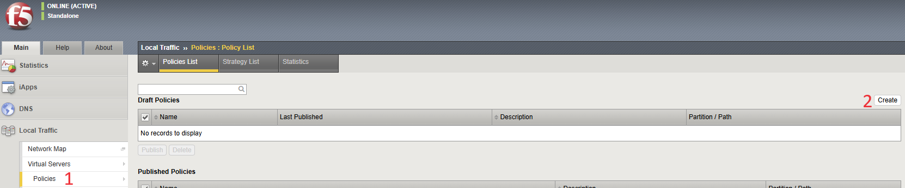

Give policy a name and click the **Create Policy** button.


Next we will add a maintenance rule. Click the **Create** button.


We will add requests from the first site to this rule. To start with, give rule a name. Then specify all the required configuration for the rule: **HTTP Host**, **app.domain.local**, at **request** time. Select **forward traffic** to **pool** and choose the maintenance pool.


Go back to policy list, select the policy we created and click **Publish**.

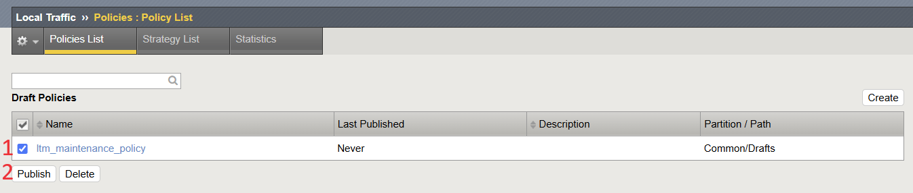

### Add Policy to Virtual Server

Navigate to **Local Traffic** => **Virtual Servers** => **Virtual Server List**. Enter the server and proceed to **Resources**. Click the **Manage** button for policies.


Select the policy we created earlier for this server from the **Available** list and move it to the **Enabled** section. Complete the process by clicking **Finished**.

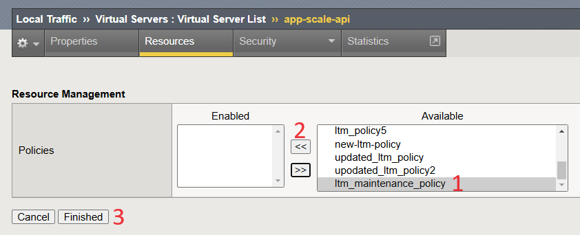

### Test Maintenance Mode

First, run the request to the first site:

```bash
curl --resolve app.domain.local:80:10.1.10.41 http://app.domain.local/action
```

Then, try the second one:

```bash
curl --resolve app-2.domain.local:80:10.1.10.41 http://app-2.domain.local/action
```

As you can see from the outputs, the first site has changed its status and is in `Maintenance mode` now, whereas the second one is still performing `Performing Action`.

### Disable Maintenance Mode & Test

Back in your TMOS, **Virtual Servers** => **Virtual Server List**, in the opened server configuration proceed to **Resources** and click the **Manage** button for policies.

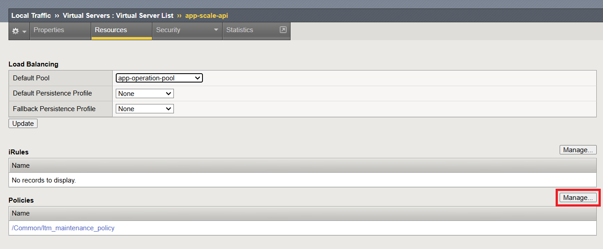

Remove the added maintenance policy and click **Finished**.


Finally, let's test the sites. First, run the following command:

```bash
curl --resolve app.domain.local:80:10.1.10.41 http://app.domain.local/action
```

Then, the second one:

```bash
curl --resolve app-2.domain.local:80:10.1.10.41 http://app-2.domain.local/action
```

As you can see from the outputs, both sites are in `Performing Action`.

## Enable Server Maintenance Mode using iRule via TMOS

In this part we will create maintenance iRule and use it to enable maintenance mode for the site.

### Test Sites Availability

First, run the following command to see the `app.domain.local` is up and running:

```bash
curl --resolve app.domain.local:80:10.1.10.41 http://app.domain.local/action
```

Then, test the second `app-2.domain.local` site:

```bash
curl --resolve app-2.domain.local:80:10.1.10.41 http://app-2.domain.local/action
```

As you can see from both outputs, both sites are in `Performing Action`.

### Create Maintenance iRule

Go to TMOS, proceed to **Local Traffic** => **iRules** => **iRule List**. Click the **Create** button.


Give iRule a name and paste the following definition:

```bash
when HTTP_REQUEST {
  if { [HTTP::host] eq "app.domain.local" } {
    pool app-maintenance-pool
  }
}
```

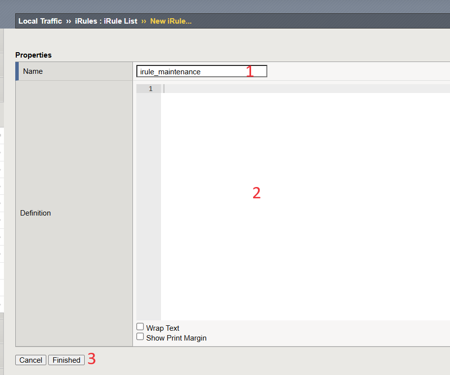

### Add iRule to Virtual Server

Navigate to **Local Traffic** => **Virtual Servers** => **Virtual Server List**. Enter the server and proceed to **Resources**. Click the **Manage** button for iRules.


Select the iRule we created earlier for this server from the **Available** list and move it to the **Enabled** section. Complete the process by clicking **Finished**.

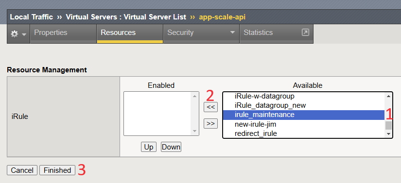

### Test Maintenance Mode

First, run the request to the first site:

```bash
curl --resolve app.domain.local:80:10.1.10.41 http://app.domain.local/action
```

Then, try the second one:

```bash
curl --resolve app-2.domain.local:80:10.1.10.41 http://app-2.domain.local/action
```

As you can see from the outputs, the first site has changed its status and is in `Maintenance mode` now, whereas the second one is still performing.

### Disable Maintenance Mode & Test

Back in your TMOS, **Virtual Servers** => **Virtual Server List**, in the opened server configuration click the **Manage** button under iRules.

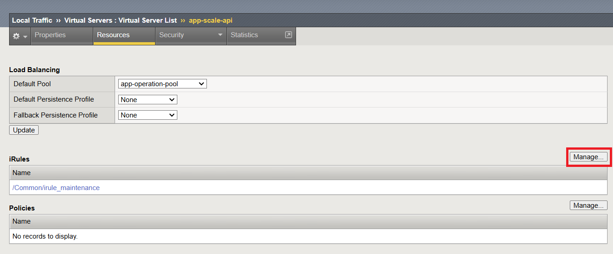

Remove the added maintenance iRule and click **Finished**.


Finally, let's test the sites. First, run the following command:

```bash
curl --resolve app.domain.local:80:10.1.10.41 http://app.domain.local/action
```

Then, the second one:

```bash
curl --resolve app-2.domain.local:80:10.1.10.41 http://app-2.domain.local/action
```

As you can see from the outputs, both sites are back to `Performing Action`.

# Automated Configuration

## Enable Server Maintenance Mode using Policy via Terraform

In this part of the guide we will use Terraform automated scripts to switch one of the sites that are on one virtual server to maintenance mode, whereas the second one will stay up and running. We will use LTM policy to do that.

### Test Sites Availability

First, run the following command to see the `app.domain.local` is up and running:

```bash
curl --resolve app.domain.local:80:10.1.10.41 http://app.domain.local/action
```

Then, test the second `app-2.domain.local` site:

```bash
curl --resolve app-2.domain.local:80:10.1.10.41 http://app-2.domain.local/action
```

As you can see from both outputs, both sites are in `Performing Action`.

### Run Terraform with Maintenance Policy

Go to the following directory:

```bash
cd ~/bigip_automation_examples/bigip/bigip_next/security/operations/scale-api-security/maintenance-terraform
```

Take a look at the maintenance policy we are going to use:

```bash
bigip/bigip_next/security/operations/scale-api-security/maintenance-terraform/main.tf
```

#### 1. Initialize Terraform

Initialize Terraform by running the following command:

```bash
terraform init
```

#### 2. Import Server

Since we already have infrastructure in TMOS, we cannot apply the configuration. First, we will need to import server configuration to Terraform local state, and only after that we will apply Terraform scenario.

Run the following command to import server configuration to Terraform:

```bash
terraform import bigip_ltm_virtual_server.http /Common/app-scale-api
```

#### 3. Apply Terraform

Finally, run Terraform planning:

```bash
terraform plan
```

And then apply:

```bash
terraform apply
```

Type in `yes` to perform the action.

### Test Maintenance Mode

First, we will check the applied maintenance policy via TMOS. Log in TMOS via the **BIG-IP 15.1.x** component. Enter **admin** for both username and password.


Navigate to **Local Traffic** => **Policies** => **Policy List**. You will see the published policy.

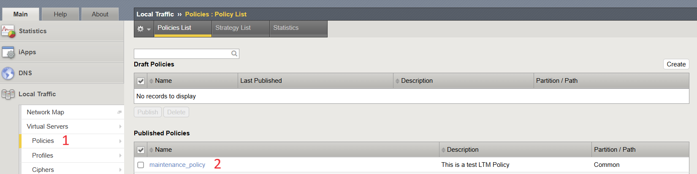

Next, proceed to **Virtual Servers** => **Virtual Server List**. Enter the server and proceed to **Resources**. You will see the applied maintenance policy.


Next, we will test the maintenance mode. First, run the first site:

```bash
curl --resolve app.domain.local:80:10.1.10.41 http://app.domain.local/action
```

Then, try the second one:

```bash
curl --resolve app-2.domain.local:80:10.1.10.41 http://app-2.domain.local/action
```

As you can see from the outputs, the first site has changed its status and is in `Maintenance mode` now, whereas the second one is still performing.

### Disable Maintenance Mode

Enter the following file:

```bash
bigip/bigip_next/security/operations/scale-api-security/maintenance-terraform/main.tf
```

Remove the policy in the end of the file:

```bash
 policies    = [var.policy_name]
```

Run the updated Terraform with removed policy:

```bash
terraform plan
```

And then apply:

```bash
terraform apply
```

Type in `yes` to perform the action.

### Check Policy & Test

First, we will check the removed maintenance policy via TMOS. In **Virtual Servers** proceed to **Virtual Server List**. Enter the server and proceed to **Resources**. You will see that that applied earlier maintenance policy is removed.


After that, we will test sites availability.

First, run the following command:

```bash
curl --resolve app.domain.local:80:10.1.10.41 http://app.domain.local/action
```

Then, the second one:

```bash
curl --resolve app-2.domain.local:80:10.1.10.41 http://app-2.domain.local/action
```

As you can see from the output, both sites are in `Performing Action`.

## Avoid Path Traversal using iRule via Ansible

Apply avoid path traversal attack rule at scale: to a bunch of servers. To specify the servers list, open the config [file](https://github.com/yoctoserge/bigip_automation_examples/blob/feature/scale-api-security/bigip/bigip_next/security/operations/scale-api-security/ata-ansible/tmos_vars.yml) and update the list:

```bash
bigip/bigip_next/security/operations/scale-api-security/ata-ansible/tmos_vars.yml
```

Then we can take a look at the iRule we are going to apply by opening this [link](https://github.com/yoctoserge/bigip_automation_examples/blob/feature/scale-api-security/bigip/bigip_next/security/operations/scale-api-security/ata-ansible/templates/irule.tcl) or navigating to:

```bash
bigip/bigip_next/security/operations/scale-api-security/ata-ansible/templates/irule.tcl
```

### Add iRule

Run the command to create the iRule and add to a batch of 20 virtual servers:

```bash
ansible-playbook ./playbooks/create-attach-rule.yml
```

### Test Added iRule

First, we will take a look at the added iRule vie TMOS.

In **Virtual Servers** proceed to **Virtual Server List**. Enter the server and proceed to **Resources**. You will see the added iRule.

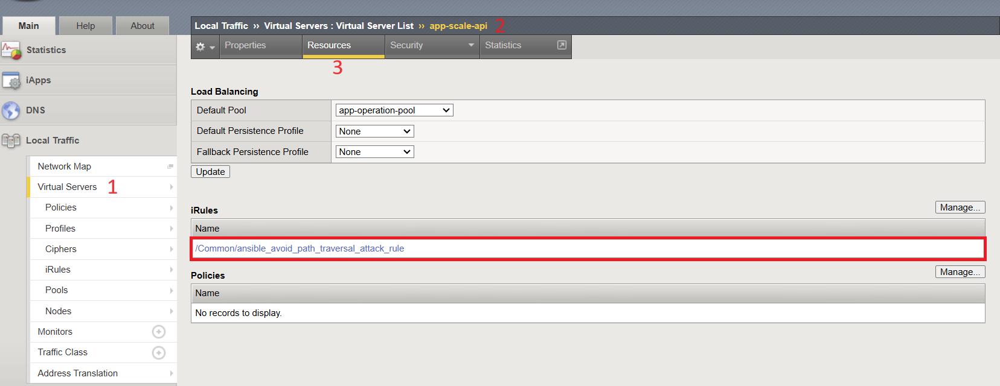

Next, we will rerun the request to test the servers:

```bash
for ip in $(seq 41 60); do echo "Requesting http://10.1.10.$ip"; curl -X GET "http://10.1.10.$ip/action?filename=../sensitive_file_$ip"; done
```

As seen from the output, the requests for all servers are not answered.

Finally, we will take a look at the traffic of servers via TMOS. Navigate to the **System** => **Logs** => **Local Traffic** to see the events and the applied iRule.


### Detach iRule

Finally, we can detach the added iRule. Run the following command to do that:

```bash
ansible-playbook ./playbooks/detach-rule.yml
```

Go back to TMOS and navigate to **Local Traffic** => **Virtual Servers** proceed to **Virtual Server List**. Enter the server and proceed to **Resources**. You will see no resources attached.


Run the GET request:

```bash
curl -X GET "http://10.1.10.41/action?filename=../sensitive_file"
```

After that, run the POST request:

```bash
curl -X POST -d "filename=../sensitive_file" "http://10.1.10.41/action"
```

As you can see from the outputs, both are in `Performing Action`.

## Update Application to Scale via GitOPS

In this part of the guide we will assume that our application is going to experience increased load on specific dates. As a solution, we can scale the application to correspond to the predictable demand when needed. We can also create waiting room for those requests that exceed the limit so that they could wait there and automatically connect to the servers as soon as it has available resource.

### Run CI/CD Environment

Run Git and Jenkins environment to apply Ansible scaling script to the TMOS instance.

To do that, navigate to the following directory:

```bash
cd ~/bigip_automation_examples/bigip/bigip_next/security/operations/scale-api-security/scale-cicd
```

If you have not initialized the environment in the previous steps of this lab and this is the first step you are taking, run the following command to do that (or skip if you have already done it earlier):

```bash
./init.sh
```

After that, build Docker for Jenkins:

```bash
docker compose build
```

And finally, run CI/CD environment including Git and Jenkins connected to each other:

```bash
docker compose up -d
```

### Connect Jenkins to BIG-IP

Since we do not keep credentials in scripts, we will need to add those to Jenkins.

In the Blueprint deployed earlier navigate to the **Ubuntu Jump Host (client/server)** and proceed to **Firefox**.

**If you are not using the UDF Blueprint, open your browser for the 9090 port on your Jump Host.**

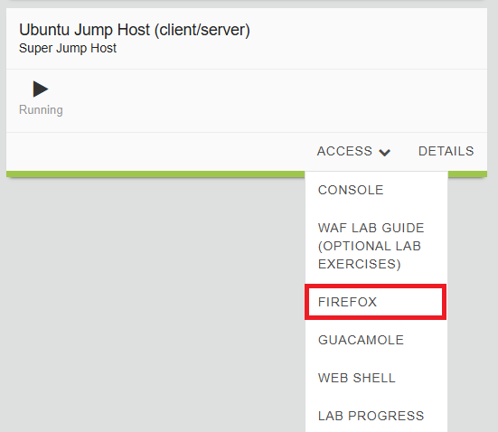

In the opened Firefox tab go to http://10.1.10.4:9090. This will open Jenkins on Jumphost at 9090 port.

In the opened page enter **admin** for both username and password.


Navigate to **Manage Jenkins** > **Credentials**. Click the **global** button.


Click the **Add Credentials** button.


Fill in the opened form:

- **admin** for username,
- **admin** for password,
- **bigip-access** for ID.


Now Jenkins is setup for running deployment.

### Scale Application

#### 1. Check Current Server Configuration

First, let's make sure we have only two nodes. From your deployed Blueprint navigate to TMOS. Go to **Local Traffic** => **Nodes**. You will see two nodes.


We can take a look at the operation pool and its members as well. Move on to **Pools** and enter the **app-operation pool**. You will see only one member.

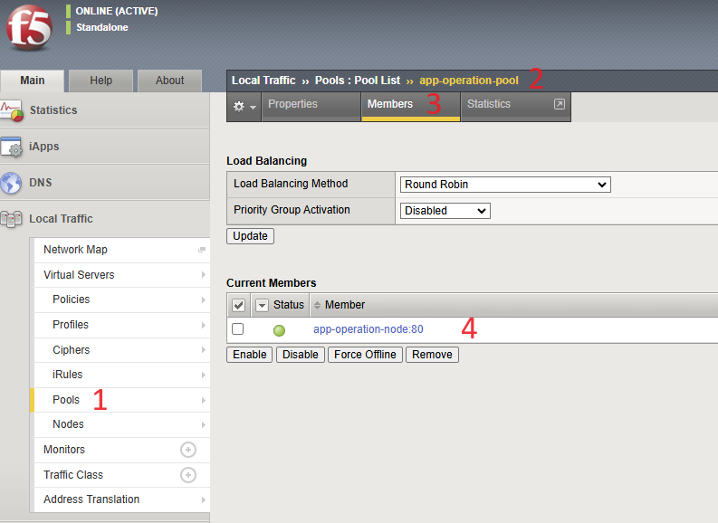

#### 2. Overview iRule

Before running the `Zoom Out Pipeline` to apply iRule that will route traffic as well as put excessive requests to the waiting room, we can take a look at the iRule. It is available [here](https://github.com/yoctoserge/bigip_automation_examples/blob/feature/scale-api-security/bigip/bigip_next/security/operations/scale-api-security/scale-cicd/server-git/repo/app/automation/templates/scale-irule.tlc.j2).

#### 3. Run Zoom Out Pipeline

Go back to the Firefox with open Jenkins and start the **Scale Out Pipeline**.


Click **Build Now** and enter the build to see its progress.


Proceed to **Console Output**.

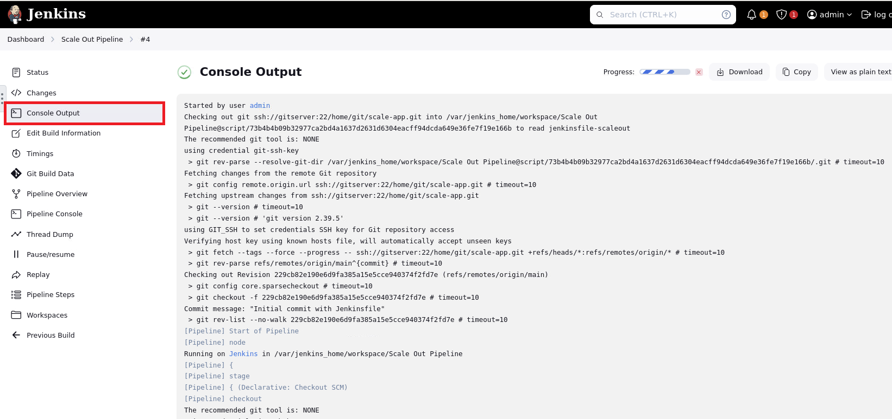

You can see build progress. As soon as it is successfully completed, scroll it. You will see added nodes, pools, and updated virtual servers so that they could have waiting room. iRule is added to route traffic as well as put excessive requests to the waiting room.

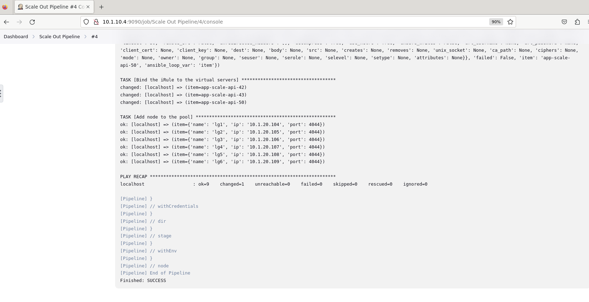

#### 4. Check Applied iRule

Back in TMOS go to **Nodes** to see all the added nodes.


Then move on to **Pools** and enter the **app-operation pool**. Open the **Members** tab to see the added members.


Finally, we can take a look at the added iRule. Go to **iRules** and enter the added **irule_waiting_room**.

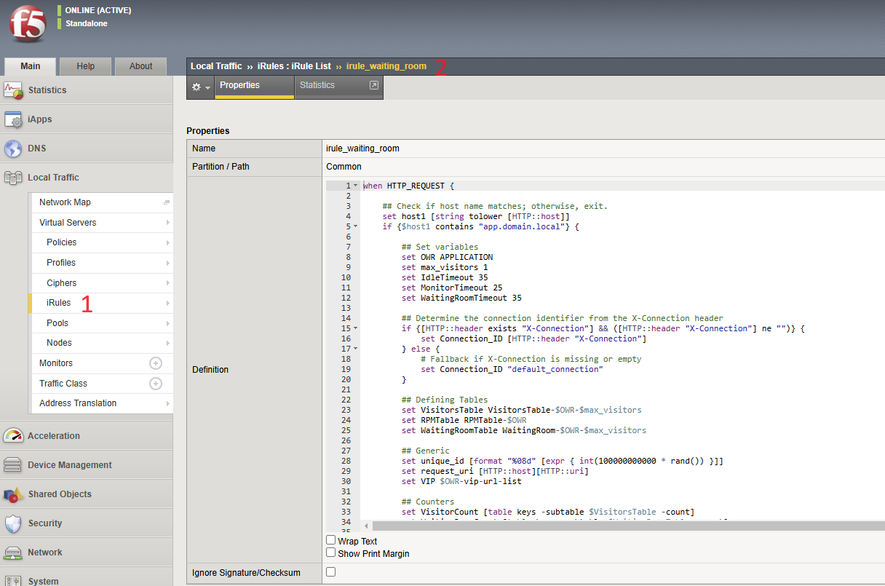

Let's take a closer look at the iRule:

- **Line 9** specifies `set max_visitors 1` which is maximum number of visitors that can be at the server. This number can be updated as needed.

- **Line 5** specifies host name - `"app.domain.local"`. It can be changed as needed or specified as variable.

- `html` page which will be shown to a user who got into the waiting room starts from **line 65** and can be updated as needed:

```bash
                   HTTP::respond 503 content {
                        <html>
                        <head>
                        <meta http-equiv="refresh" content="60">
                        <title>Online Waiting Room</title>
                        </head>
                        <body>
                        <center>
                        <h1>Online Waiting Room</h1>
                        <h2>We're Sorry</h2>
                        <p>We currently have an exceptionally large number of visitors on the site, and you are in the queue.</p>
                        <p>Please hold tight, it should only be a few minutes. Make sure you stay on this page as you will be automatically redirected.</p>
                        </center>
                        </body>
                        </html>
                    }
```

- **Line 39** shows `getcount` which is the current statistics of server load:

```bash
        if {[HTTP::uri] equals "/getcount"} {
            HTTP::respond 200 content "<html><body>Total: \[$TotalVisitors\] Max: \[$max_visitors\] Waiting: \[$WaitingRoomCount\] RPMCount: \[$RPMCount\]</body></html>\r\n"
            TCP::close
            return
        }
```

- **Line 15** shows `header` name responsible for connection ID. If header is not available, ID will be `"default_connection"`.

```bash
if {[HTTP::header exists "X-Connection"] && ([HTTP::header "X-Connection"] ne "")} {
            set Connection_ID [HTTP::header "X-Connection"]
        } else {
            # Fallback if X-Connection is missing or empty
            set Connection_ID "default_connection"
        }
```

### Test Waiting Room

Let's assume we have a few users. First, send the following request imitating one user:

```bash
curl --resolve app.domain.local:80:10.1.10.42 -X GET "http://app.domain.local/long-operation" -H "X-Connection: $(date +%s%3N)"
```

The server will respond:

```bash
Long Operation Completed
```

Next, open another Ubuntu window and run the following command to see if the waiting room is now free:

```bash
curl --resolve app.domain.local:80:10.1.10.42 http://app.domain.local/getcount
```

You will see the following output, where total request number is now 0, maximum possible is 1, and waiting number is 0:

```bash
<html><body>Total: [0] Max: [1] Waiting: [0] RPMCount: [0]</body></html>
```

Now we will imitate two users at a time. Run one more request to the server:

```bash
curl --resolve app.domain.local:80:10.1.10.42 -X GET "http://app.domain.local/long-operation" -H "X-Connection: $(date +%s%3N)"
```

And run the same one in another Ubuntu window imitating the second user:

```bash
curl --resolve app.domain.local:80:10.1.10.42 -X GET "http://app.domain.local/long-operation" -H "X-Connection: $(date +%s%3N)"
```

As the second user, you will see the following output showing that you need to wait:


Let's see if waiting room status has changed:

```bash
curl --resolve app.domain.local:80:10.1.10.42 http://app.domain.local/getcount
```

You will see the following output showing 2 connections, with maximum 1 possible, and 1 waiting.

```bash
<html><body>Total: [2] Max: [1] Waiting: [1] RPMCount: [2]</body></html>
```

### Zoom In Application

#### 1. Run Zoom In Pipeline

As soon as the expected high load is over, we can zoom in the application. Back in Jenkins run the **Zoom In Pipeline**.


Click **Build Now** and enter the build.

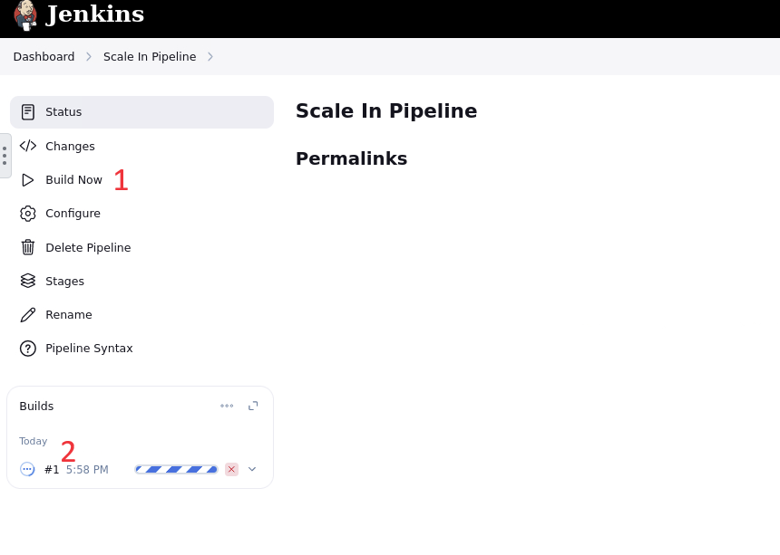

In the **Console Output** tab see the pipeline progress. It will remove nodes and pools and go back to the original configuration.


#### 2. Check Updated Server Configuration

First, let's make sure we have only two nodes. From your deployed Blueprint navigate to TMOS. Go to **Local Traffic** => **Nodes**. You will see two nodes.


We can check the operation pool and its members as well. Move on to **Pools** and enter the **app-operation pool**. You will see only one member.


