Application workload migration from VMware to Nutanix using BIG-IP
#########################################################

This guide consists of detailed steps for migrating application workloads from Vmware to Nutanix platform

Pre-requesites
-------------------------------

BIG-IP HA pair deployed in Vmware platform

Refer to 
`BIG-IP HA Deployment on VMware
<../application-delivery-security/workload/BIG-IP-Deployment-on-VMware.rst>`_
for Deployment Steps

Migration from VMware to Nutanix
-------------------------------

The migration is breakdown into 5 detailed stages for better understanding,

1) Deploying BIG-IP HA pair in Nutanix
2) Migrate Standby BIG_IP VE to Nutanix
3) Failover the Active BIG-IP
4) Migration of application workloads
5) Migratate VMware BIG-IP to Nutanix

Stage 1: Deploying BIG-IP in HA pair in Nutanix
--------------------------------------------------

1. BIG-IP is already deployed as HA pair in VMware.

.. image:: ./Assets/device_details_active.jpg

.. image:: ./Assets/device_details_stby.jpg

2. Node Pool and Virtual Server is configured as shown below, 

.. image:: ./Assets/juice_shop_vs.jpg

3. Its associated web application is accessible using Virtual Server IP.

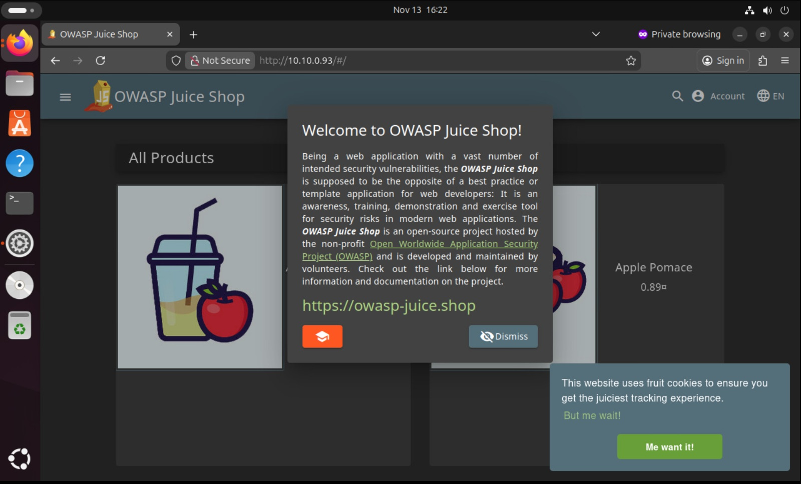

4. Similarly we need to deploy couple of BIG-IPs in Nutanix with no configs. 

Refer to
`BIG-IP Deployment on Nutanix
<../application-delivery-security/workload/BIG-IP-Deployment-Nutanix.rst>`_
for Deployment Steps

.. image:: ./Assets/big_ip_vms_nutanix.jpg

5. From the above screenshot , you can able to see couple of BIG-IPs are deployed successfully in Nutanix platform.

Stage 2: Migrating Standby BIG-IP VE to Nutanix
--------------------------------------------------

1. Place VMware BIGIP-2 (Standby) into **Forced Offline** mode and save a backup of its configuration.

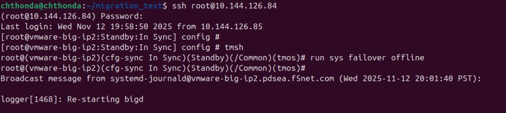

2. Copy the license file located at ``/config/bigip.license``.

3. Store the configuration and license files in a secure location for later use.

4. Revoke the license on VMware BIGIP-2.

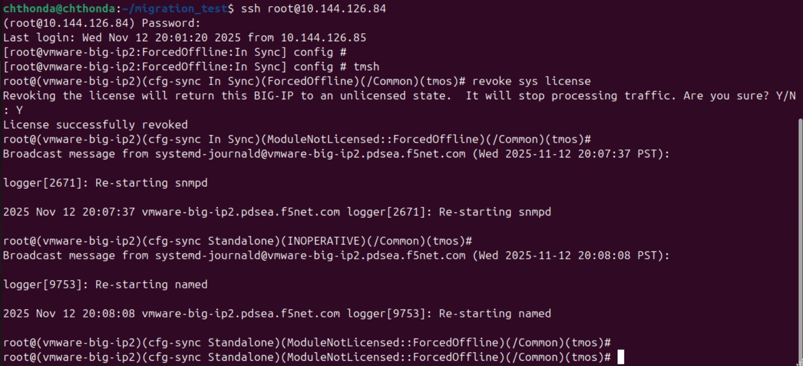

5. Disconnect all network interfaces on VMware BIGIP-2.

.. image:: ./Assets/connection_disconnected.jpg

6. Power on Nutanix BIGIP-2 and assign it the same management IP address previously
   used by VMware BIGIP-2.

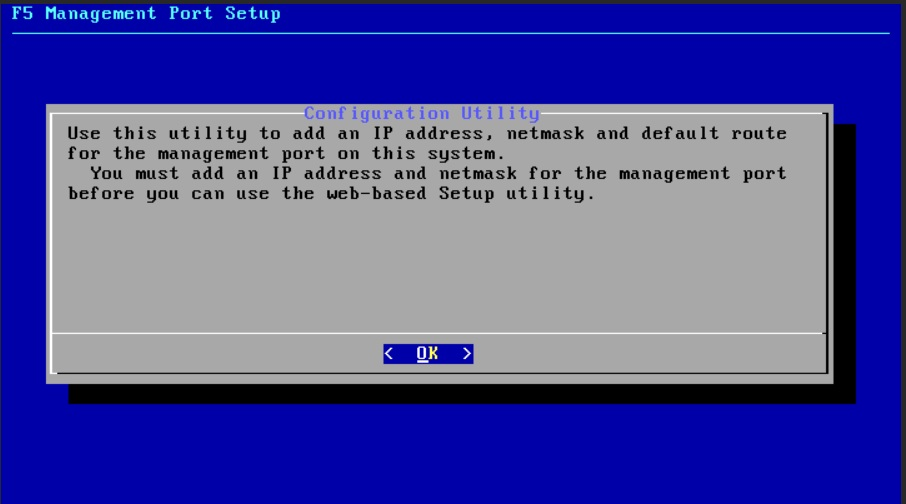

7. Apply the saved license to Nutanix BIGIP-2.

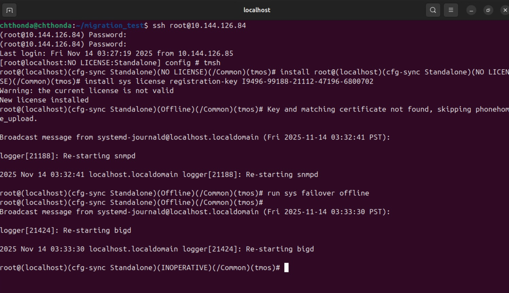

8. Set Nutanix BIGIP-2 to **Forced Offline**.

9. Upload the saved UCS file to Nutanix BIGIP-2 and load it using the

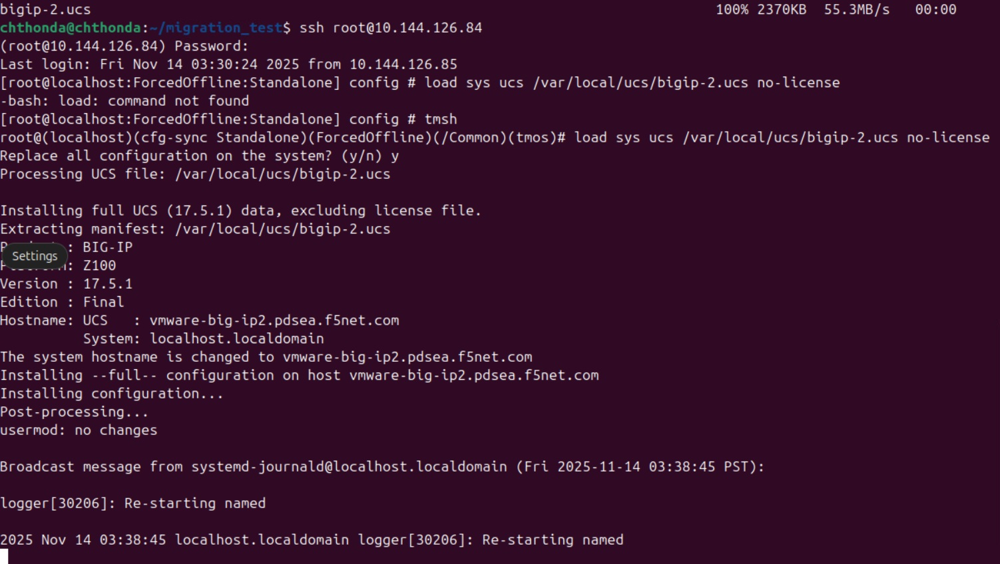

10. Monitor the logs and wait until the message
    ``Configuration load completed, device ready for online`` appears.

11. Bring Nutanix BIGIP-2 **Online**.

    Note::

       Ensure the NIC count and interface-to-VLAN mappings exactly match those of
       VMware BIGIP-2.

12. Verify that Nutanix BIGIP-2 is **In Sync**. If configuration changes are pending,
    initiate a config sync using::

        run cm config-sync from-group <device-group-name>

13. The Standby BIG-IP VE has now been successfully migrated to Nutanix.

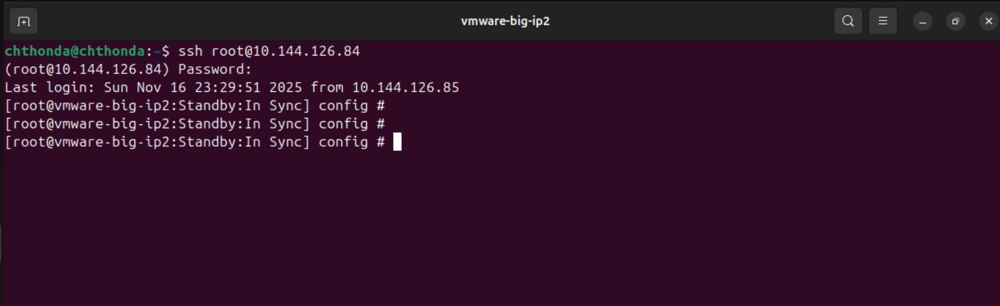

.. note::
   Because the BIG-IP VEs are running on different hypervisors during this phase,
   connection or persistence mirroring will not function. Messages such as
   ``DAG hash mismatch; discarding mirrored state`` may appear and are expected.

**Current BIG-IP Status:**

- VMware BIGIP-1: Active
- Nutanix BIGIP-2: Standby

Stage 3 – Fail Over the Active BIG-IP VE to Nutanix
--------------------------------------------------

1. Initiate a failover, transitioning VMware BIGIP-1 from Active to Standby using::

        run sys failover standby

2. Nutanix BIGIP-2 becomes the Active BIG-IP VE.

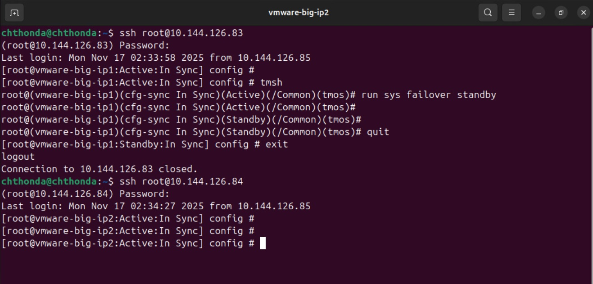

3. As observed after executing the failover standby command, the BIG-IP instance on VMware transitions from Active to Standby, while the BIG-IP instance running on Nutanix becomes Active. This behavior confirms that the traffic switchover was completed successfully

**Current BIG-IP Status:**

- VMware BIGIP-1: Standby
- Nutanix BIGIP-2: Active

Stage 4 – Migrate Application Workloads from VMware to Nutanix
--------------------------------------------------------------

1. The recommended and preferred method for migrating application workloads from
   VMware to Nutanix is to use **Nutanix Move**, as it provides an automated and
   consistent migration workflow.

2. For the purpose of this testing and validation exercise, application workloads
   were **manually deployed** on Nutanix instead of using Nutanix Move.

3. Manual deployment included provisioning new ubuntu virtual machines and restoring 
   application data to match the existing VMware environment.

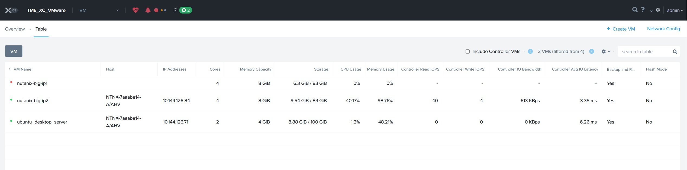

4. Application configurations were updated and validated to ensure proper
   integration with the Active BIG-IP VE running on Nutanix, including pool member
   configuration, health monitors, and traffic flow validation.

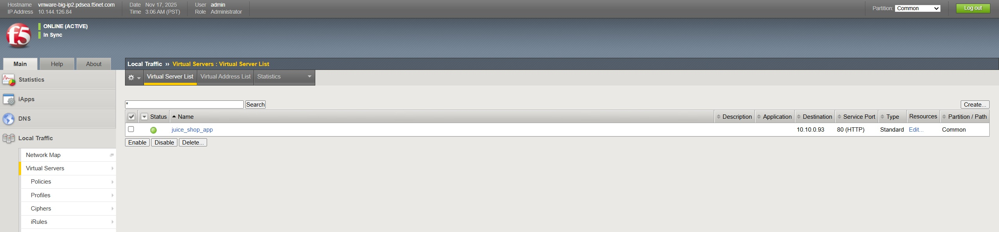

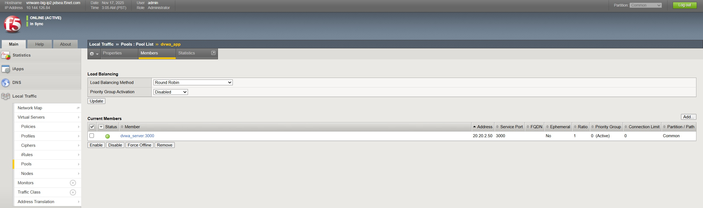

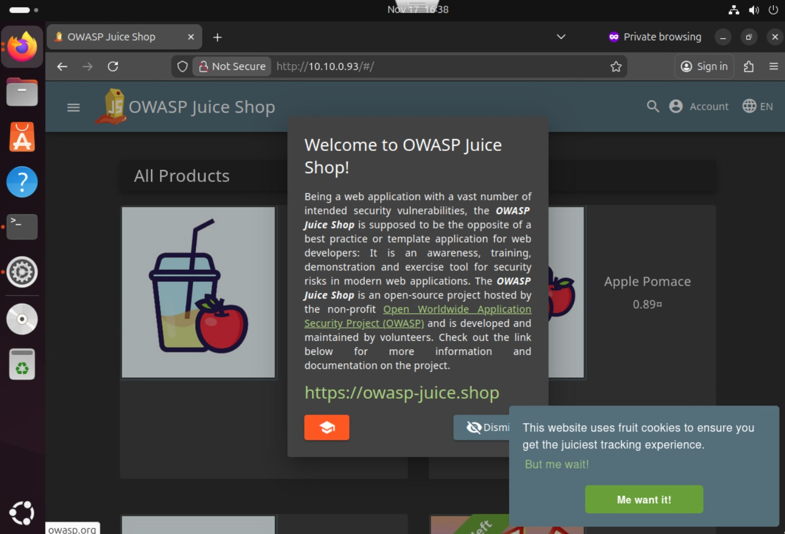

.. note::
   To minimize service interruption, it is recommended to migrate applications in
   smaller batches rather than all at once. Nutanix Move requires briefly shutting
   down the source VM to complete the final data synchronization before starting it
   on Nutanix.

5. From the screenshot below, the increase in traffic statistics confirms that application traffic is successfully flowing through BIG-IP.

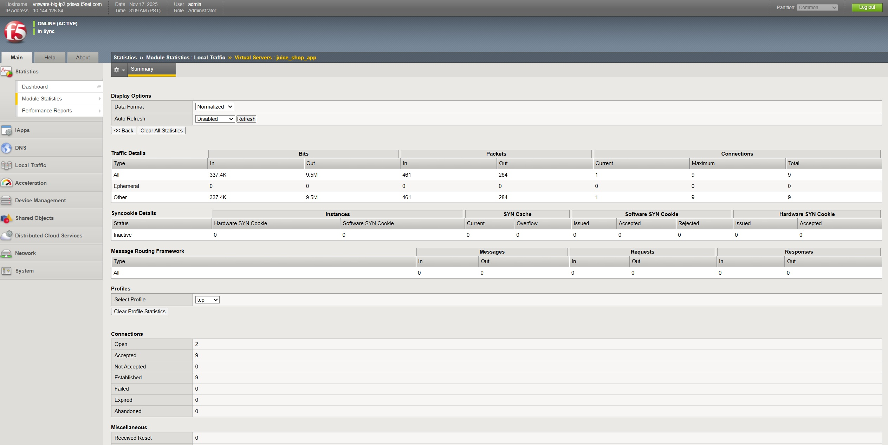

**Current BIG-IP Status:**

- VMware BIGIP-1: Standby
- Nutanix BIGIP-2: Active

Stage 5 – Migrate the Remaining Standby BIG-IP VE to Nutanix
------------------------------------------------------------

1. Place VMware BIGIP-1 (Standby) into **Forced Offline** mode and back up its
   configuration.

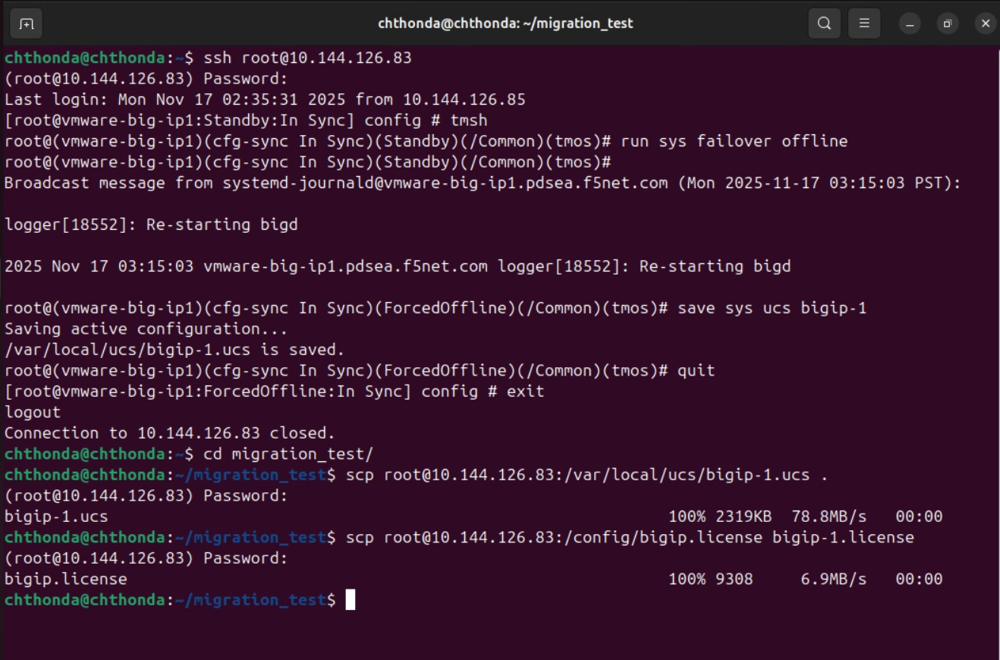

2. Save the license file from ``/config/bigip.license``.

3. Store both files securely for later restoration.

4. Revoke the license from VMware BIGIP-1.

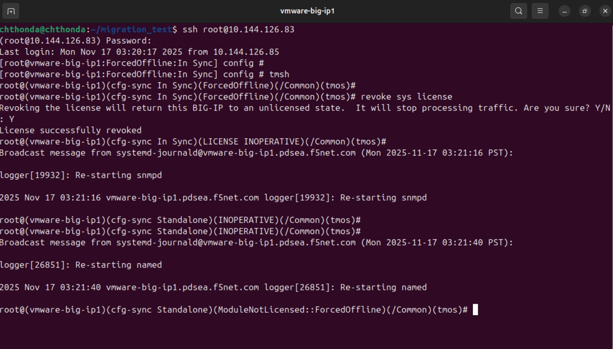

5. Disconnect all interfaces on VMware BIGIP-1.

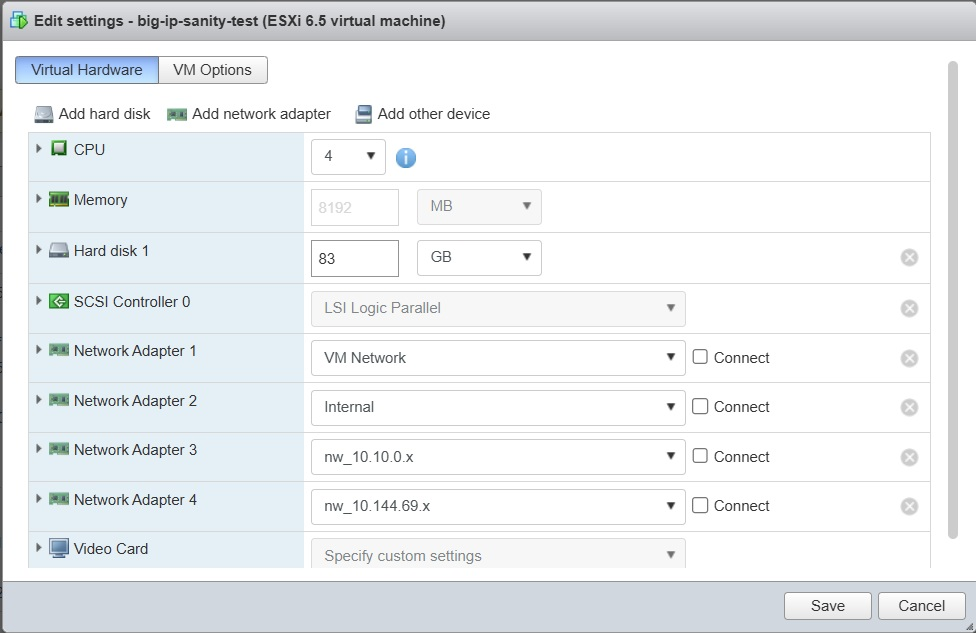

6. Power on Nutanix BIGIP-1 and configure it with as shown in below screenshots
   VMware BIGIP-1.

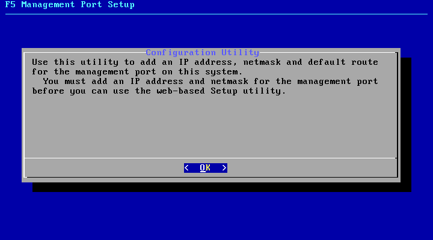

7. Select the option as ipv4

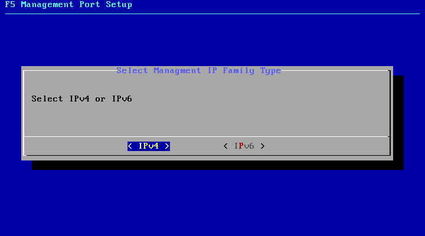

8. Select “No”  for auto configutration 

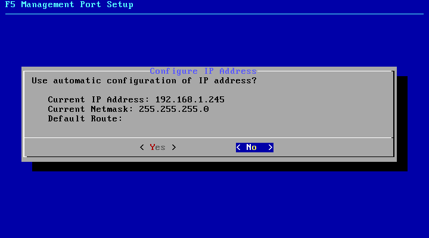

9. Assing same management ip , subnet mask and default route as of Vmware BIG-IP

.. image:: ./Assets/ip_assign_4.png

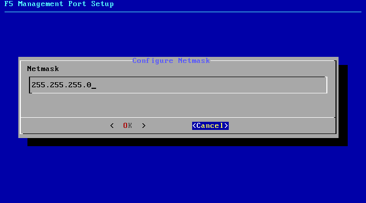

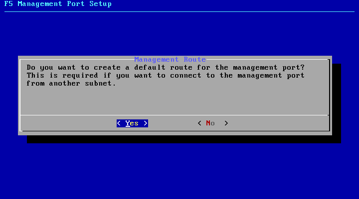

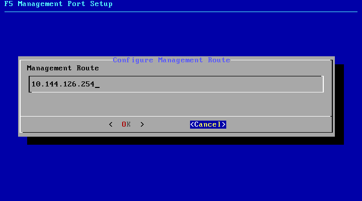

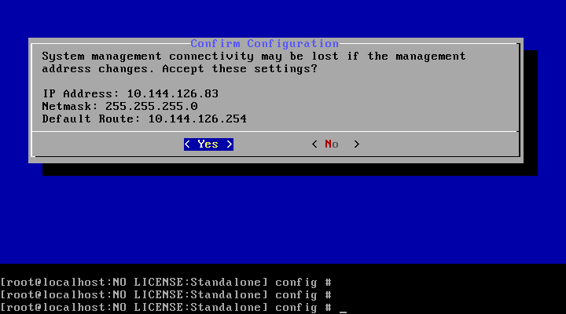

10. Apply the saved license to Nutanix BIGIP-1.

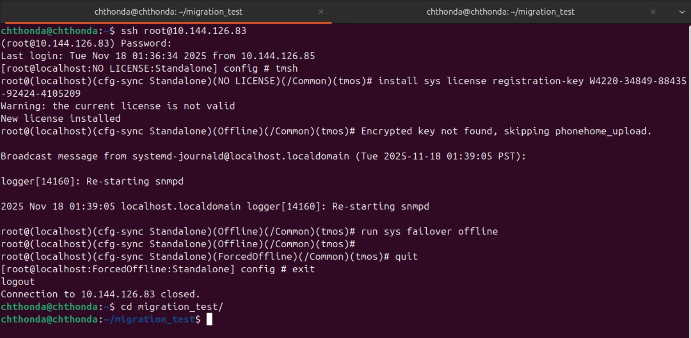

11. Set Nutanix BIGIP-1 to **Forced Offline**.

12. Upload and restore the saved UCS file using the **no-license** option.

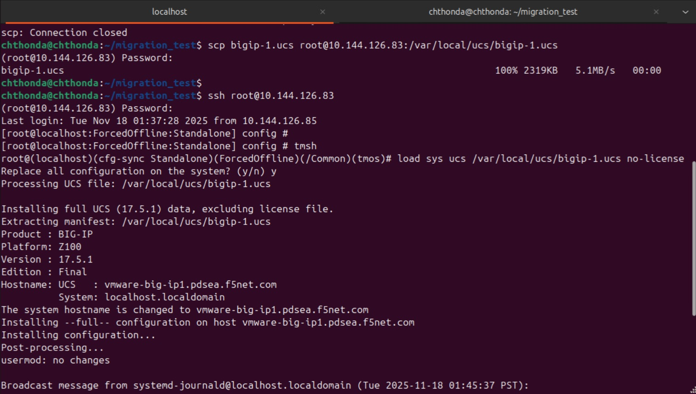

13. Monitor logs until the message
    ``Configuration load completed, device ready for online`` is displayed.

14. Bring Nutanix BIGIP-1 **Online**, ensuring NIC count and VLAN mappings match
    the original VMware configuration.

15. Confirm that the device is **In Sync** and perform a configuration sync if needed.

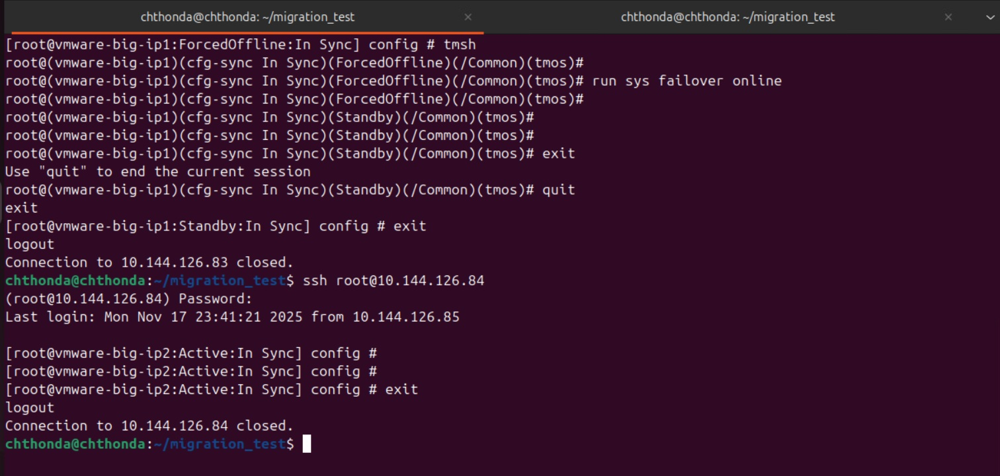

16. VMware BIGIP-1 has now been fully migrated to Nutanix.

14. Application is accesible through Nutanix Active BIG-IP and the increase in traffic statistics confirms that application traffic is successfully flowing through BIG-IP. This also indicates that migration is succesfull 

.. image:: ./Assets/traffic_stats_nutanix_big_ip_active.jpg

**Migration Status:**

- Nutanix BIGIP-1: Standby
- Nutanix BIGIP-2: Active

Conclusion
----------
This document demonstrates the detailed process for migrating F5 BIG-IP
Virtual Edition instances and application workloads from VMware to Nutanix AHV.
By following this phased approach within a planned maintenance window, organizations
can achieve a smooth transition with minimal impact to application services, ensuring
continuity both during and after the migration.

