BIG-IP Migration from VMware to Nutanix
#########################################################

This guide consists of detailed steps for migrating BIG-IP from Vmware to Openshift platform

Pre-requesites
-------------------------------

BIG-IP HA pair deployed in Vmware platform

Refer to 
`BIG-IP HA Deployment on VMware
<../application-delivery-security/workload/BIG-IP-Deployment-on-VMware.rst>`_
for Deployment Steps

Migration from VMware to Openshift
-------------------------------

The migration is breakdown into 5 detailed stages for better understanding,

1) Deploying BIG-IP HA pair in Openshift
2) Migrate Standby BIG-IP VE to Openshift
3) Failover the Active BIG-IP
4) Migration of application workloads
5) Migratate VMware BIG-IP to Openshift

Stage 1: Deploying BIG-IP in HA pair in Openshift
--------------------------------------------------

1. BIG-IP is already deployed as HA pair in VMware.

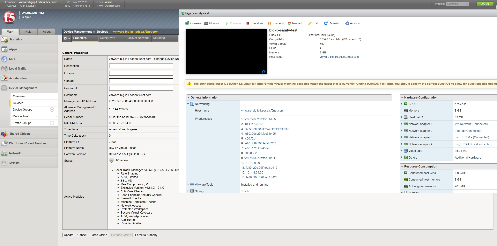

.. image:: ./Assets/device_details_stby.jpg

2. Node Pool and Virtual Server is configured as shown below, 

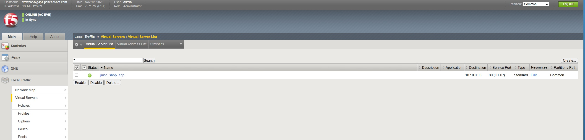

3. Its associated web application is accessible using Virtual Server IP.

.. image:: ./Assets/application-access-before-testing.jpg

4. Similarly we need to deploy couple of BIG-IPs in Openshift with no configs. 

Refer to
`BIG-IP Deployment on Openshift
<../application-delivery-security/workload/BIG-IP-Deployment-Openshift.rst>`_
for Deployment Steps

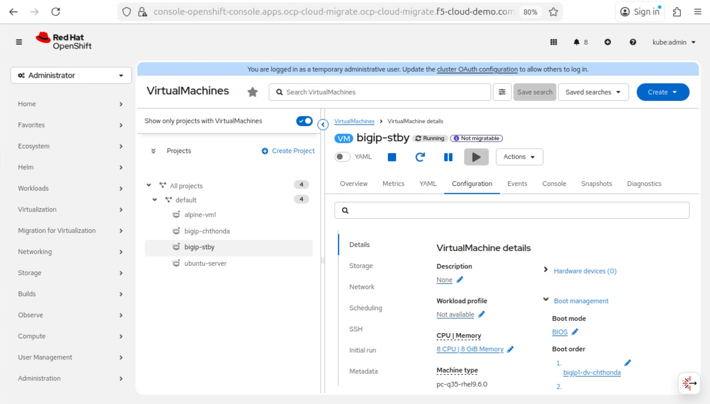

5. From the above screenshot , you can able to see couple of BIG-IPs are deployed successfully in Openshift platform.

Stage 2: Migrating Standby BIG-IP VE to Openshift
--------------------------------------------------

1. Place VMware BIGIP-2 (Standby) into **Forced Offline** mode and save a backup of its configuration.

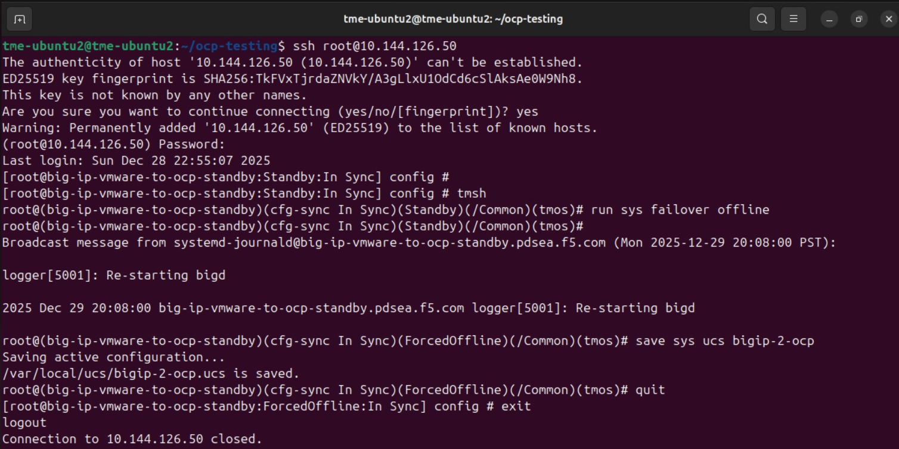

2. Copy the license file located at ``/config/bigip.license``.

3. Store the configuration and license files in a secure location for later use.

4. Revoke the license on VMware BIGIP-2.

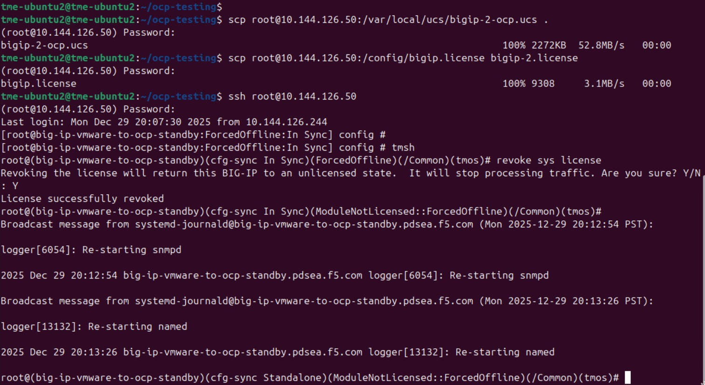

5. Disconnect all network interfaces on VMware BIGIP-2.

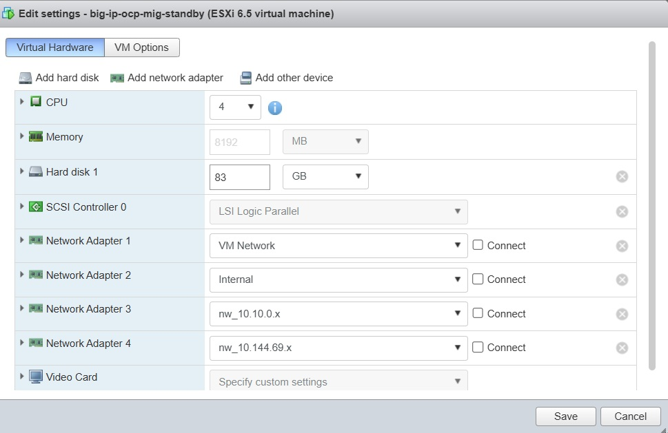

6. Power on Openshift BIGIP-2 and assign it the same management IP address previously
   used by VMware BIGIP-2.

.. image:: ./Assets/config-page-1.jpg

7. Select the option as ipv4

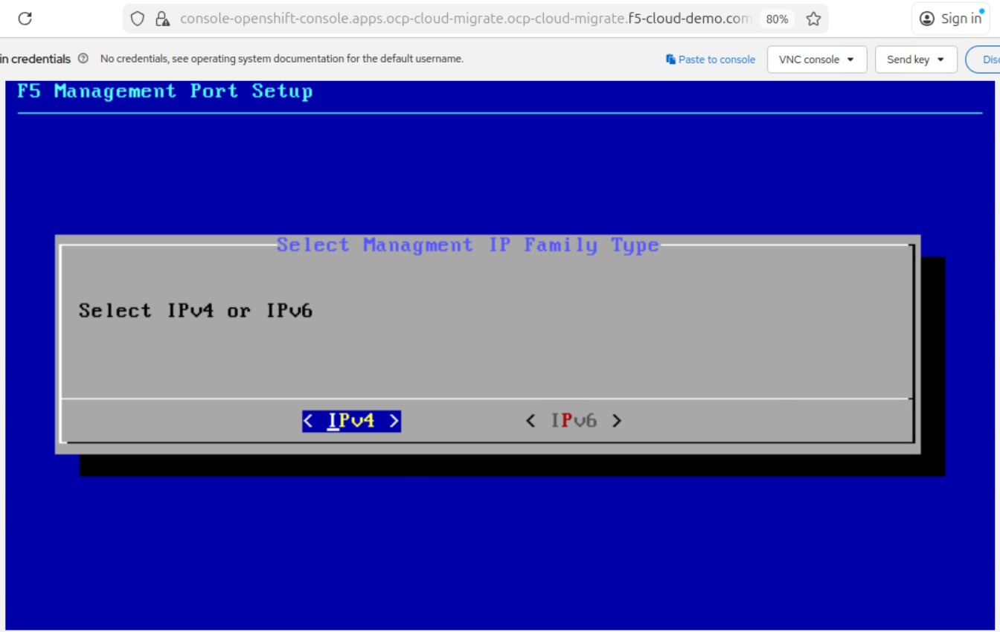

8. Select “No”  for auto configutration 

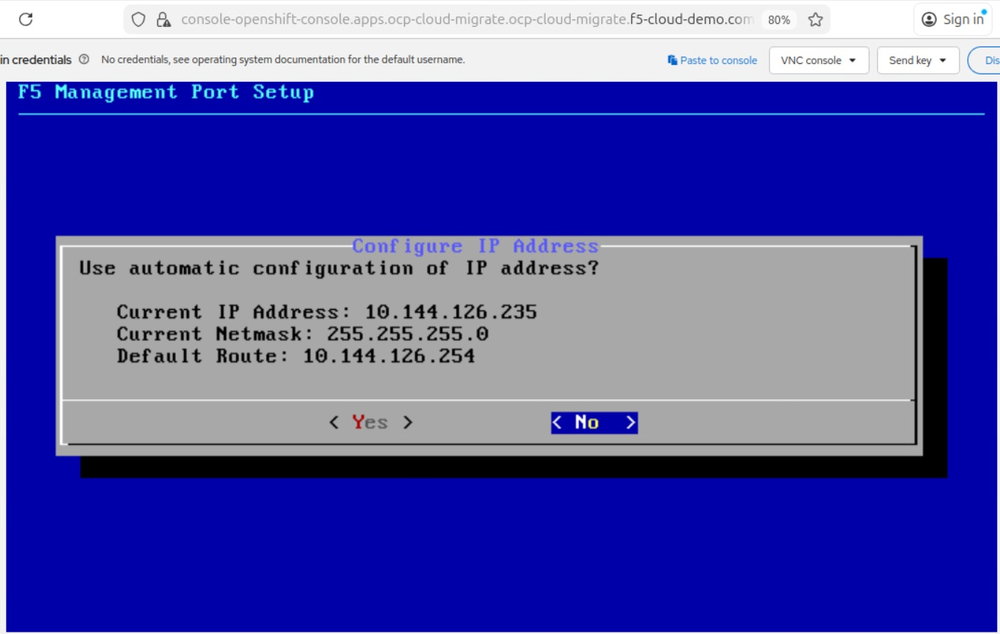

9. Assing same management ip , subnet mask and default route as of Vmware BIG-IP

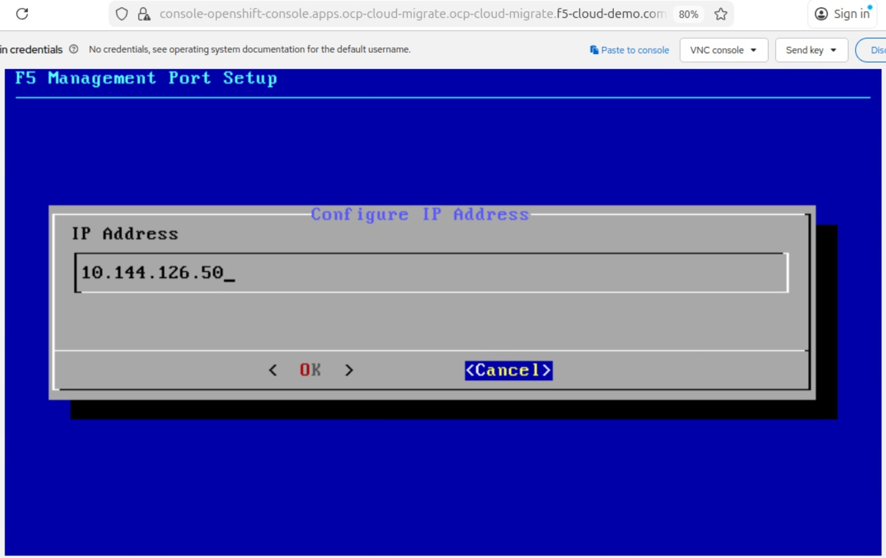

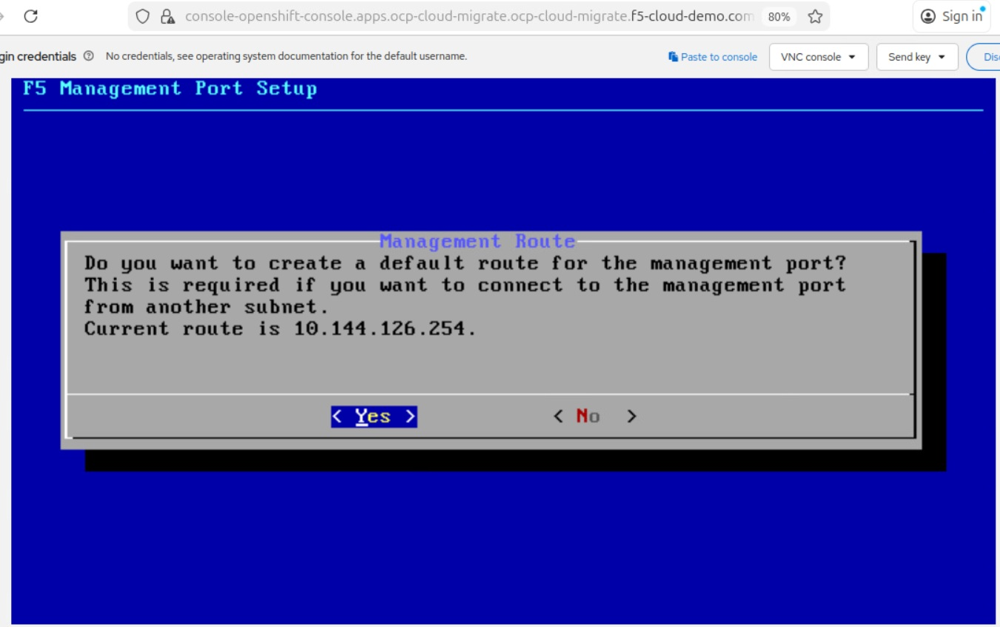

.. image:: ./Assets/config-page-7.jpg

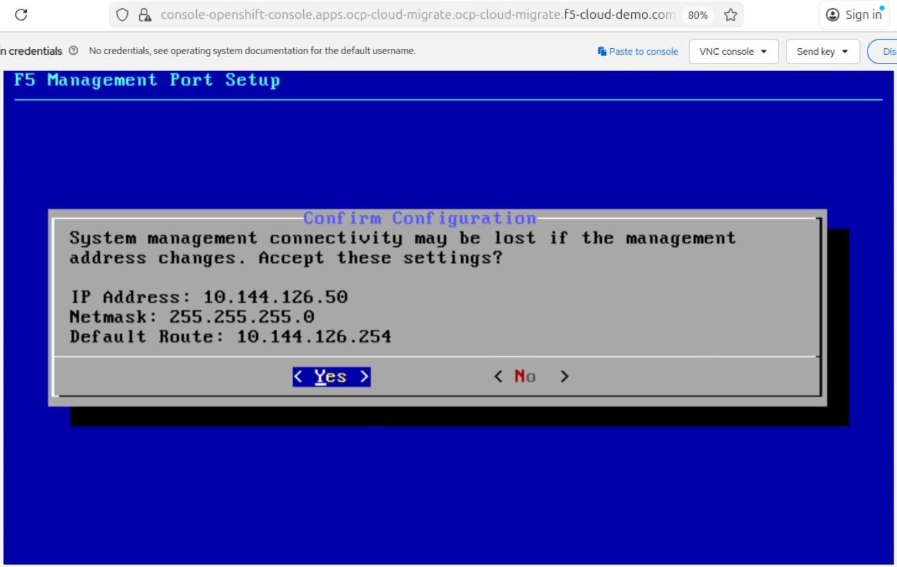

10. Apply the saved license to Openshift BIGIP-2.

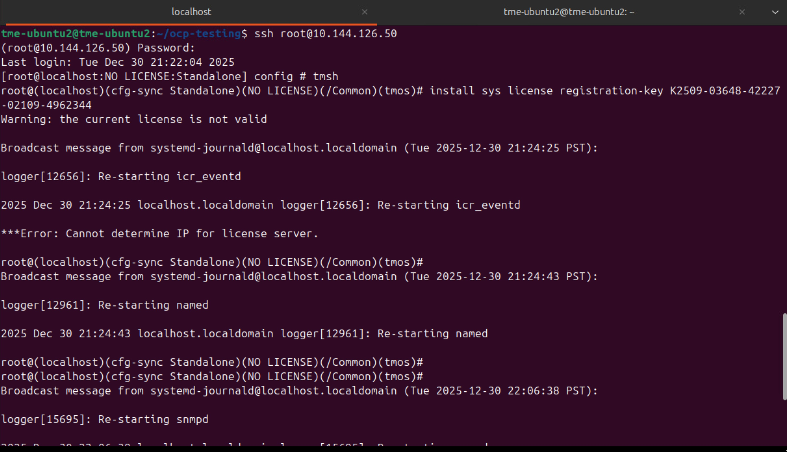

11. Set Openshift BIGIP-2 to **Forced Offline**.

12. Upload the saved UCS file to Openshift BIGIP-2 and load it using the **no-license** option.

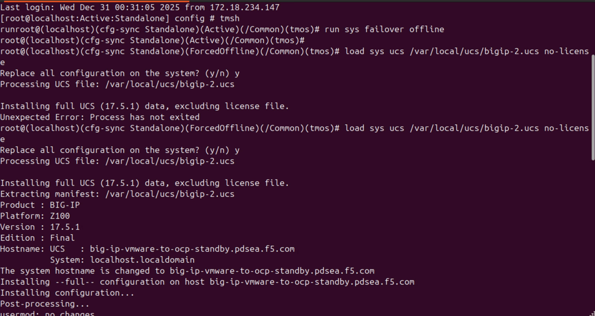

13. Monitor the logs and wait until the message
    ``Configuration load completed, device ready for online`` appears.

14. Bring Openshift BIGIP-2 **Online**.

    Note::

       Ensure the NIC count and interface-to-VLAN mappings exactly match those of
       VMware BIGIP-2.

15. Verify that Openshift BIGIP-2 is **In Sync**. If configuration changes are pending,
    initiate a config sync using::

        run cm config-sync from-group <device-group-name>

16. The Standby BIG-IP VE has now been successfully migrated to Openshift.

.. image:: ./Assets/stby-big-ip-in-ocp-GUI.jpg

.. note::
   Because the BIG-IP VEs are running on different hypervisors during this phase,
   connection or persistence mirroring will not function. Messages such as
   ``DAG hash mismatch; discarding mirrored state`` may appear and are expected.

**Current BIG-IP Status:**

- VMware BIGIP-1: Active
- Openshift BIGIP-2: Standby

Stage 3 – Fail Over the Active BIG-IP VE to Openshift
--------------------------------------------------

Note: In production environment, usually there will be a multiple origins per applications available on both the infrastructure before switchover.

1. Initiate a failover, transitioning VMware BIGIP-1 from Active to Standby using::

        run sys failover standby

2. Openshift BIGIP-2 becomes the Active BIG-IP VE.

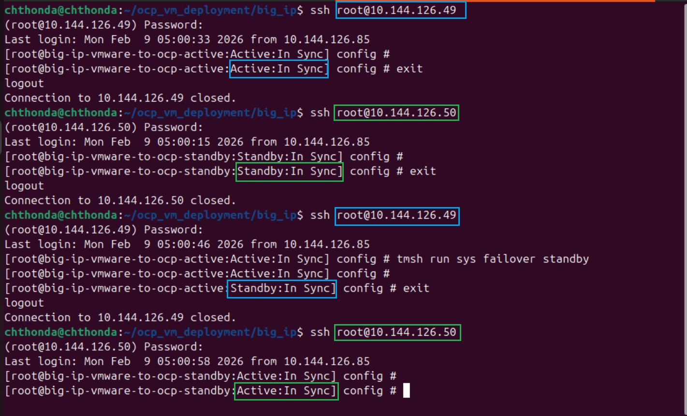

3. As observed after executing the failover standby command, the BIG-IP instance on VMware transitions from Active to Standby, while the BIG-IP instance running on Openshift becomes Active. This behavior confirms that the traffic switchover was completed successfully

**Current BIG-IP Status:**

- VMware BIGIP-1: Standby
- Openshift BIGIP-2: Active

Stage 4 – Migrate Application Workloads from VMware to Openshift
--------------------------------------------------------------

1. For the purpose of this testing and validation exercise, application workloads
   were **manually deployed** on Openshift instead of using Openshift Move.

2. Manual deployment included provisioning new ubuntu virtual machines and restoring 
   application data to match the existing VMware environment.

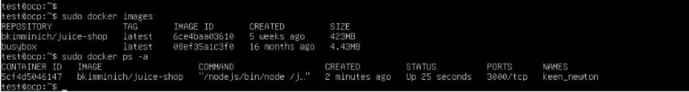

3. Application configurations were updated and validated to ensure proper
   integration with the Active BIG-IP VE running on Openshift, including pool member
   configuration, health monitors, and traffic flow validation.

4. From the screenshot below, the increase in traffic statistics confirms that application traffic is successfully flowing through BIG-IP in OCP.

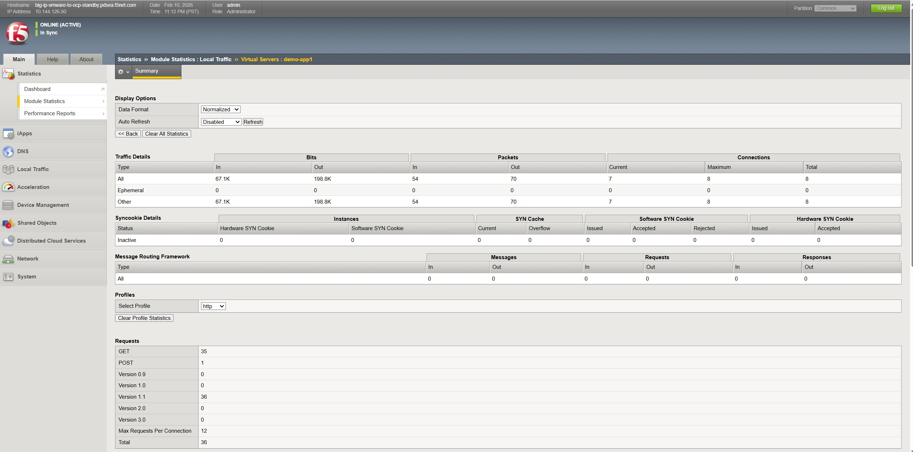

**Current BIG-IP Status:**

- VMware BIGIP-1: Standby
- Openshift BIGIP-2: Active

Stage 5 – Migrate the Remaining Standby BIG-IP VE to Openshift
------------------------------------------------------------

1. Place VMware BIGIP-1 (Standby) into **Forced Offline** mode and back up its
   configuration.

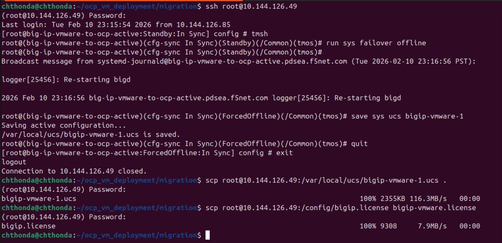

2. Save the license file from ``/config/bigip.license``.

3. Store both files securely for later restoration.

4. Revoke the license from VMware BIGIP-1.

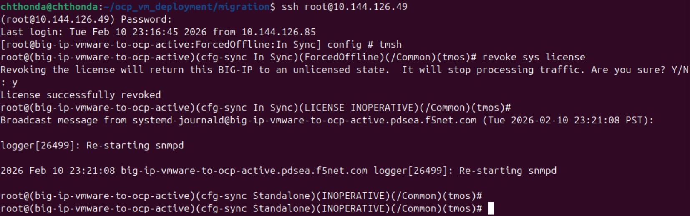

5. Disconnect all interfaces on VMware BIGIP-1 and click on Save button.

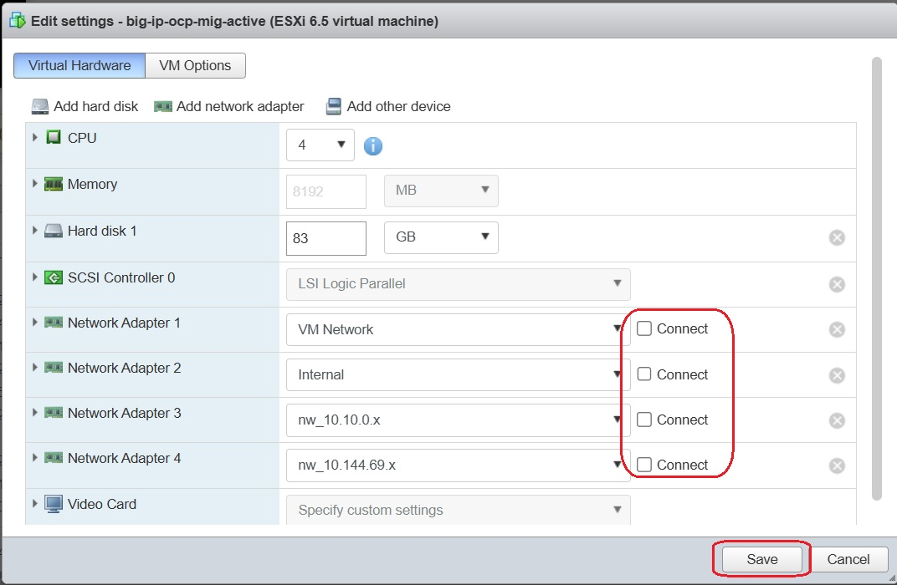

6. Power on Openshift BIGIP-1 in OCP and configure it with the same Management IP address of BIG-IP in VMware,

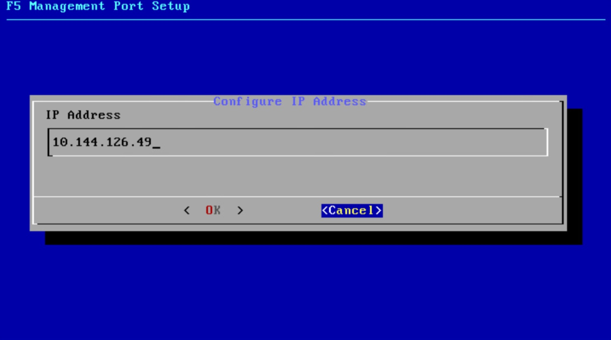

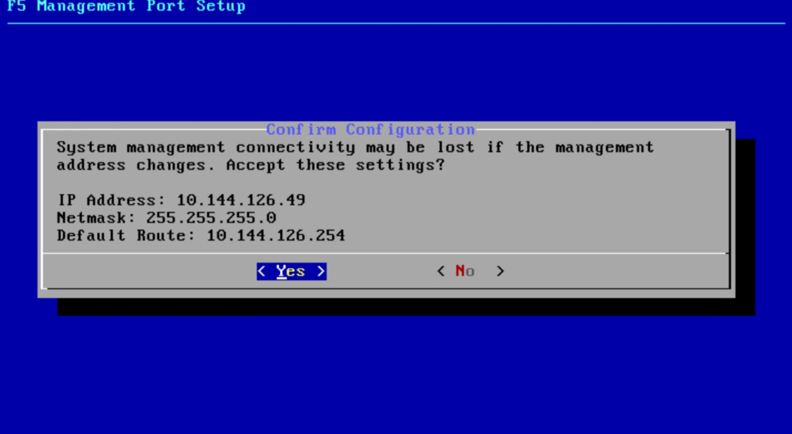

License the BIG-IP with the same saved license from VMware BIGIP 1. This is similar to repetetion of step mentioned in stage 2.

7. Set Openshift BIGIP-1 to **Forced Offline**.

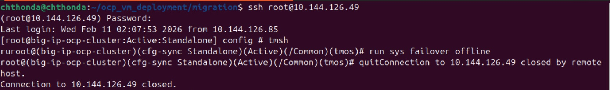

8. Upload and restore the saved UCS file using the **no-license** option.

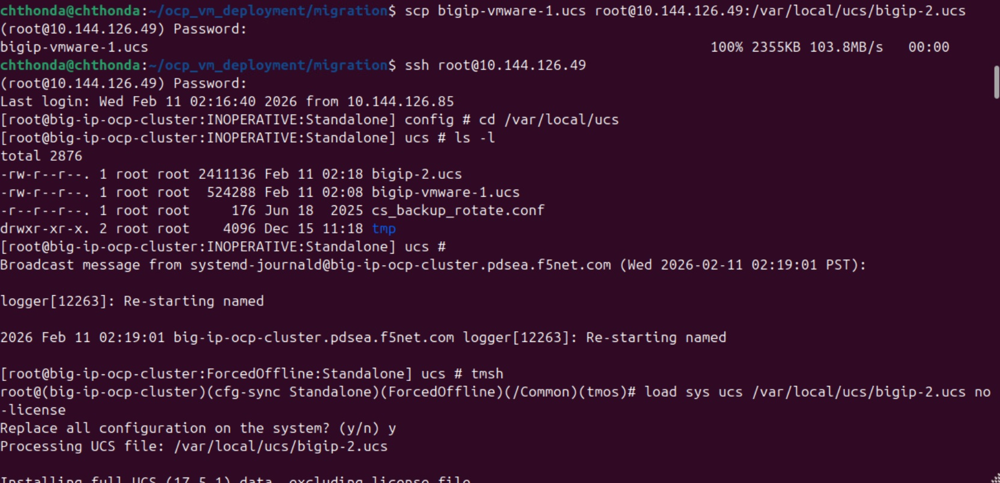

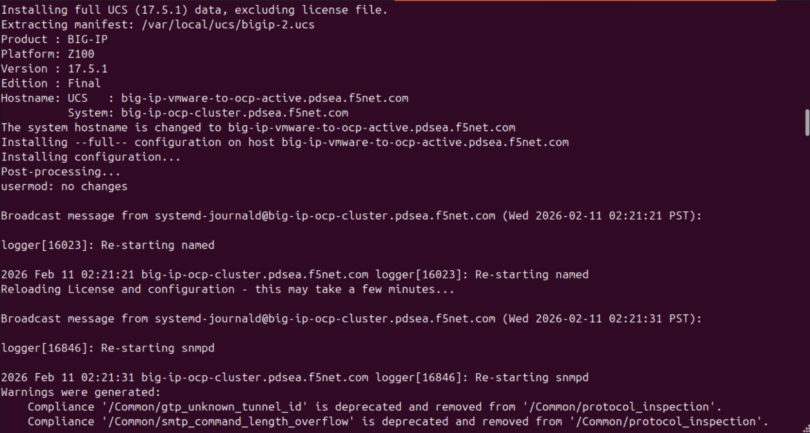

9. Monitor logs until the message
    ``Configuration load completed, device ready for online`` is displayed.

10. Bring Openshift BIGIP-1 **Online**, ensuring NIC count and VLAN mappings match
    the original VMware configuration.

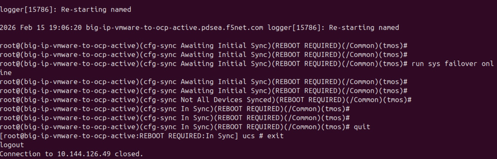

11. Confirm that the device is **In Sync** and perform a configuration sync if needed.

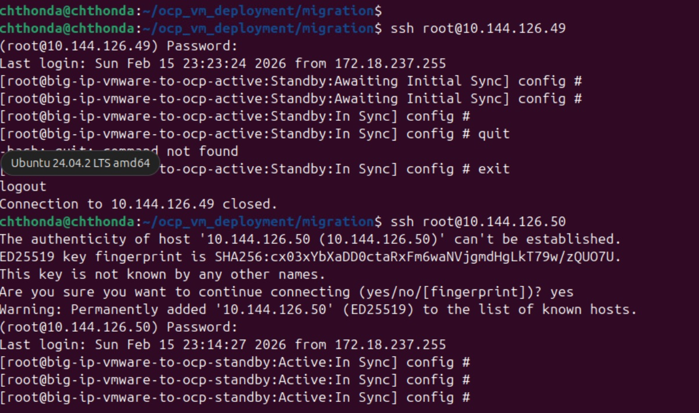

12. VMware BIGIP-1 has now been fully migrated to Openshift.

13. Application is accesible through Openshift Active BIG-IP and the increase in traffic statistics confirms that application traffic is successfully flowing through BIG-IP. This also indicates that migration is succesfull 

**Migration Status:**

- Openshift BIGIP-1: Standby
- Openshift BIGIP-2: Active

Conclusion
----------
This document demonstrates the detailed process for migrating F5 BIG-IP
Virtual Edition instances and application workloads from VMware to Openshift .
By following this phased approach within a planned maintenance window, organizations
can achieve a smooth transition with minimal impact to application services, ensuring
continuity both during and after the migration.

