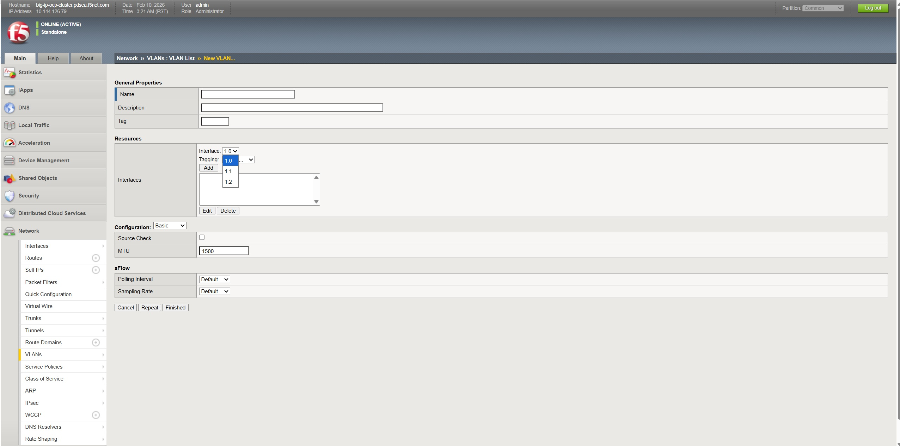
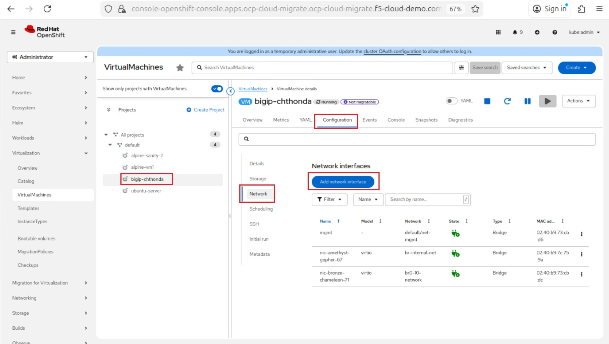
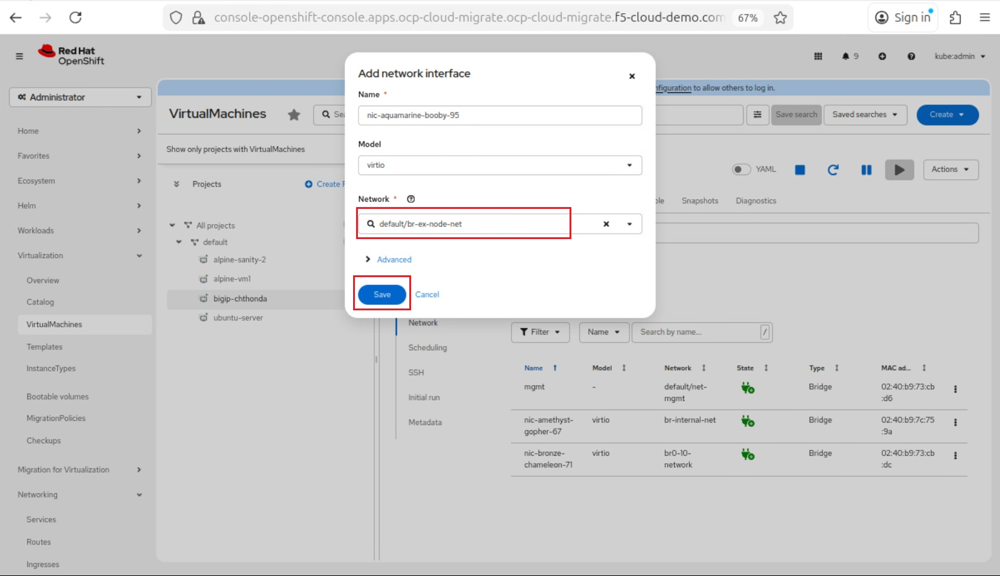
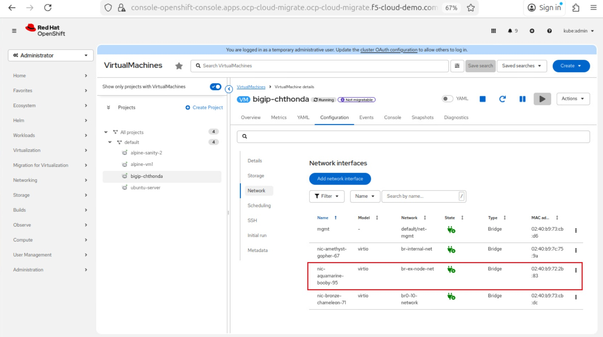
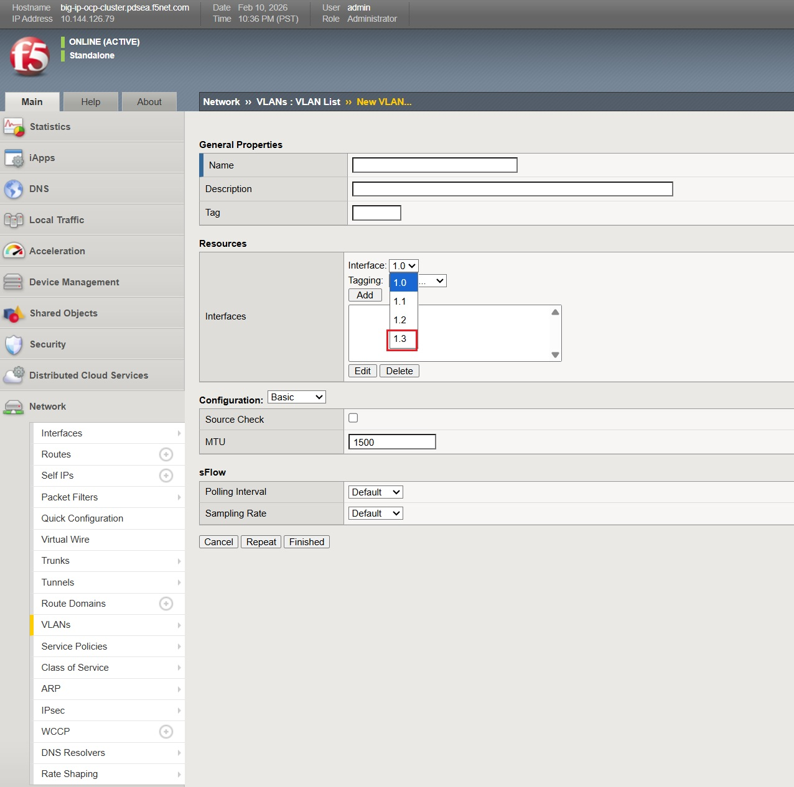

Attach an Interface Network to BIG-IP Instance in RedHat OpenShift Platform
#########################################################
This documents contains step by step procedure to attach an Interface Network to BIG-IP instance to communicate to external or internal network to RedHat OpenShift Platform (OCP). 

Introduction
-------------------------------
Attaching an interface depends on how it is intended to be used. Interface can be External or Internal to the Cluster Network.

Pre-requesites
-------------------------------
To configure network interfaces, NNCP and NAD configurations should be available in OCP Web Console. Those configuration can be achieved by following the document mentioned `here <https://github.com/f5devcentral/bigip_automation_examples/blob/main/bigip/workflow-guides/Migration/OCP/Configuring_NNCP_NAD_configs_in_Red_Hat_OpenShift/configuring_NNCP_NAD_configs_in_ocp.rst>`__.

Steps to attach an Interface
-------------------------------
Below are the series of steps to follow to attach an network of BIG-IP VE,

At first, we can able to see from the Interface dropdown in BIG-IP instance running in OCP

Now, let's try to attach an interface to this instance. Select the associated BIG-IP Instance in OCP and Navigate to Configuration > Network. Click on **Add network interface** button.

A window shows to add network interface. From the Network section dropdown, select the NAD Network that has to be attached to this instance and Click on Save button.

Once the network interface is attached, its status shows pending as shown below, to apply the changes, reboot the instance.

.. image:: ./Assets/big_ip_reboot_after_int_attach.jpg

Once the instance is rebooted and comes online, you can able to see network interface status shows attached.

This confirms interface is attached successfully and ready to be configured in BIG-IP.

Login to BIG-IP to make associated changes related to it.

As shown above, Interface 1.3 which is avaiable after performing above steps. Now, its associated VLAN and Self IP configurations can be performed.

Conclusion:
----------
By following above steps, interface network can be attached to BIG-IP Instance in OCP.

