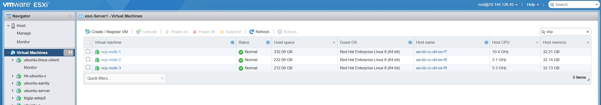
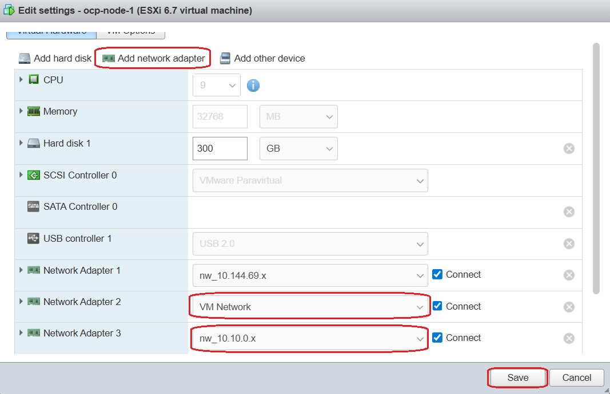
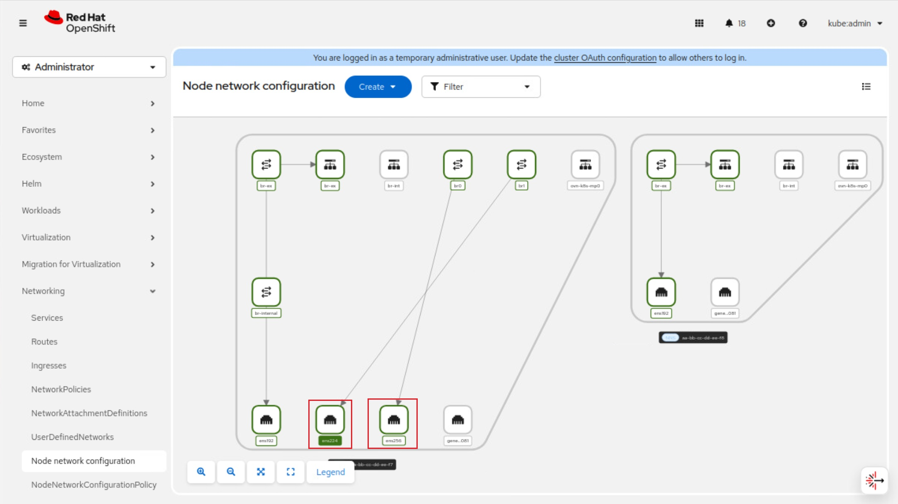

Connecting OpenShift to External Network
#########################################################

OpenShift can be configured to access external network in additoin to the internal pod network. This is to assign the Lab Network VLANs to be assigned to the VMs created in RedHat OpenShift.

There are series of steps that has to be followed along with configuration of RedHat OpenShift (OCP) associated to it need to be carried out.

Pre-requesites
-------------------------------
1) OCP 3 Node Cluster should be available. Installation of OCP 3 Node cluster is mentioned in the doc here.
2) NMState Operator must be installed in OCP cluster.
3) Network configurations such as Port Group and Virtual Switch should be configured in VMware ESXi Machine.

Now, with the above conditions satisfied, we proceed with the introducing Network to the 3 Node cluster first and then to the VMs in that cluster.

Section 1: Connect OpenShift node to a Network with different Physical NICs 
-------------------------------
At first, Let's login to the VMware ESXi Machine where 3 Node cluster is installed.

Select the Node to which Network should be attached to. In this case, I choose **ocp-node-1**. Click on Edit button to add the Network to this Node.

Click on **Add network adapter** button and select the interface from the dropdown. Once you add the interface, click on Save. It is better to add Interface individually and then carry the NNCP and NAD configurations associated to it.

**Step 1.1: Ensure Attached interface is showing in OCP console**

Login to OCP console, and navigate to Networking > Node network configuraitons to confirm the Network attachment status.

This confirms interface is attached successfully and can move to configuring network interfaces on OpenShift nodes.

**Step 1.2: External network with an OVS bridge on a dedicated NIC**

In this step, we will create an Node Network Configuration Policies (NNCP) that creates a new OVS bridge **br1** called on the node, using an unused NIC ens224.

.. code-block:: python

    apiVersion: nmstate.io/v1
    kind: NodeNetworkConfigurationPolicy
    metadata:
    name: br1-net-mgmt
    spec:
    nodeSelector:
        kubernetes.io/hostname: aa-bb-cc-dd-ee-f7  <<<<Adjust Role
    desiredState:
        interfaces:
        - name: br1
        description: |-
            A dedicated OVS bridge with ens224 as a port
            allowing traffic from 10.144.126.0/24 Network
        type: ovs-bridge
        state: up
        bridge:
            options:
            stp: false      <<<< Disable Spanning Tree
            port:
            - name: ens224  <<<< Name of the Network interface
        ovn:
        bridge-mappings:
        - localnet: net-mgmt
            bridge: br1
            state: present

Note: Make stp as false, this will not send the BPDU packets to the Switch connected to it.

Now appl the NNCP, by executing oc apply cmd, and results shown as created

    oc apply -f br1-net-mgmt-ovs-bridge.yaml
    
    nodenetworkconfigurationpolicy.nmstate.io/br1-net-mgmt created

**Step 1.2: NetworkAttachemnteDefinition Configuration**

In this step, we create a Network Attachment Definiton (NAD) for an OVS bridge created above, we use localnet that we created above.

.. code-block:: python

    apiVersion: k8s.cni.cncf.io/v1
    kind: NetworkAttachmentDefinition
    metadata:
    name: net-mgmt
    namespace: default
    spec:
    config: '{
                "name":"net-mgmt",
                "type":"ovn-k8s-cni-overlay",
                "cniVersion":"0.4.0",
                "topology":"localnet",
                "netAttachDefName":"default/net-mgmt"
            }'

Apply the NAD configurations using below command, and results shown as created

    oc apply -f br1-10-144-ex-network-nad.yaml
    
    networkattachmentdefinition.k8s.cni.cncf.io/net-mgmt created

**step 1.3: Virtual Machine NIC configuration**

To use the new external network with a virtual machine, modify the Network Interfaces section of the virtual machine and select the new default/net-mgmt as the Network type.

Section 2: Connect OpenShift node by reusing Cluster Node Network
-------------------------------
In this scenario, we connect virtual machine to the external network by resuing the **br-ex** bridge that is the defualt on all nodes running in an OVN-Kubernetes cluster. We provide necessary NNCP configurations to get it done.

.. image:: ./Assets/interface_in_ocp_br_ex.jpg

**Step 2.1: NNCP configurations**

.. code-block:: python

    apiVersion: nmstate.io/v1
    kind: NodeNetworkConfigurationPolicy
    metadata:
    name: br-ex-network-test
    spec:
    nodeSelector:
        kubernetes.io/hostname: aa-bb-cc-dd-ee-f7
    desiredState:
        ovn:
        bridge-mappings:
        - localnet: br-ex-node-net
            bridge: br-ex
            state: present

Now apply the NNCP, by executing oc apply cmd, and results shown as created

    oc apply -f br-ex-ha-bridge-node.yaml
    
    nodenetworkconfigurationpolicy.nmstate.io/br-ex-network-test created

**Step 2.2: NetworkAttachemnteDefinition Configuration**

We create associated NAD configuraitons for above NNCP.

.. code-block:: python

    apiVersion: k8s.cni.cncf.io/v1
    kind: NetworkAttachmentDefinition
    metadata:
    name: br-ex-node-net
    namespace: default
    spec:
    config: '{
                "name":"br-ex-node-net",
                "type":"ovn-k8s-cni-overlay",
                "cniVersion":"0.4.0",
                "topology":"localnet",
                "netAttachDefName":"default/br-ex-node-net"
            }'

Apply NAD configurations using below command, and results shown as created

    oc apply -f br-ex-ha-node-nad.yaml
    
    networkattachmentdefinition.k8s.cni.cncf.io/br-ex-node-net created

**Section 3: Configuring Internet Network**

We require Internal network to communicate between two VMs in the OCP, and this network will be within the OCP but cannot be accessed from the outside. We do not need to configure NNCP in this case, but only require NAD configurations.

**Step 3.1: NAD Configurations**

.. code-block:: python

    apiVersion: "k8s.cni.cncf.io/v1"
    kind: NetworkAttachmentDefinition
    metadata:
    name: br-internal-net
    namespace: default
    spec:
    config: '{
        "cniVersion": "0.3.1",
        "type": "bridge",
        "bridge": "br-internal",
        "ipam": {
    "type": "whereabouts",
    "range": "20.20.2.0/24",
    "gateway": "20.20.2.254"
    }
    }'

20.20.20.0/24 is the Internal network being created.

Apply NAD configurations using below command, and results shown as created

    oc apply -f br-int-whrebout-20.yaml
    
    networkattachmentdefinition.k8s.cni.cncf.io/br-internal-net created

Conclusion:
----------
With this, Virtual Machines deployed in OCP can be associated with these Networks based on the requirement.

Referrence Links:
----------
`Red Hat OpenShift Virtualization: Configuring virtual machines to use external network <https://www.redhat.com/en/blog/access-external-networks-with-openshift-virtualization#:~:text=Option%20%233%20below.-,Option%20%231%3A,-Using%20an%20external>`__

`Red Hat OpenShift Secondary Network Configuration <https://docs.redhat.com/en/documentation/openshift_container_platform/4.19/html-single/multiple_networks/index#nw-multus-whereabouts-fast-ipam_configuring-additional-network>`__

