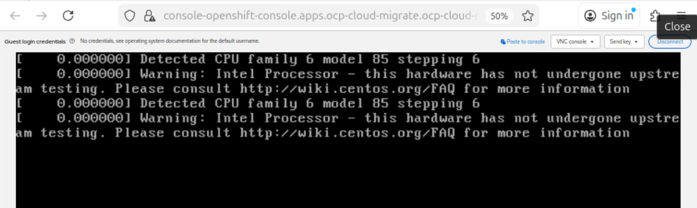
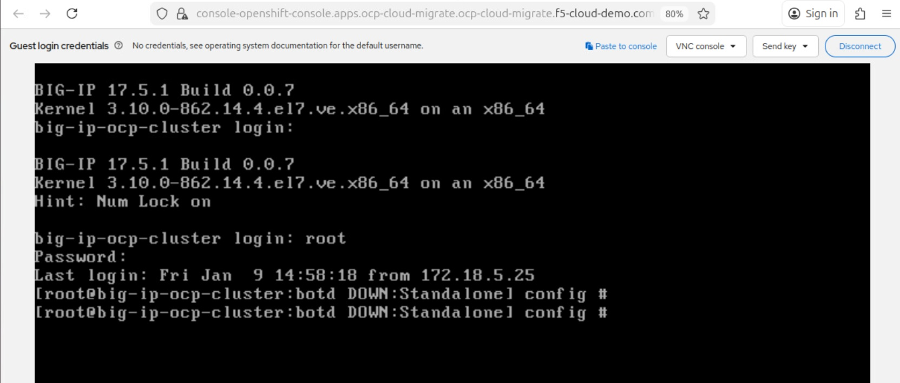

Deploy F5 BIG-IP VE in RedHat OpenShift Platform
#########################################################
This documents contains step by step procedure to deploy F5 BIG-IP in RedHat OpenShift Platform (OCP).

Pre-requesites
-------------------------------
Availablitiy of BIG-IP Image in OCP Cluster. For more details on Image Upload, refer to this `link <https://github.com/f5devcentral/bigip_automation_examples/blob/main/bigip/workflow-guides/Migration/OCP/Upload_BIG-IP_Image_to_RedHat_OpenShift/Upload_BIG-IP_Image_to_OCP_console.rst>`__.

BIG-IP Deployment Defintion
-------------------------------
The following deployment defintion creates a BIG-IP pod:

.. code-block:: python

    apiVersion: kubevirt.io/v1
    kind: VirtualMachine
    metadata:
    name: bigip-stby
    namespace: default
    labels:
        f5type: bigip-ve
    annotations:
        k8s.v1.cni.cncf.io/networks: "default/net-mgmt"
    spec:
    runStrategy: Always
    template:
        metadata:
        labels:
            f5type: bigip-ve
            bigip-unit: unit-1
        spec:
        domain:
            cpu:
            sockets: 1
            cores: 4
            threads: 2
            resources:
            requests:
                memory: 8Gi
            limits:
                memory: 16Gi
            devices:
            networkInterfaceMultiqueue: true
            disks:
            - name: bigip1-datavolume-chthonda
                disk:
                bus: virtio
            interfaces:
            - name: mgmt
                bridge: {}
        volumes:
        - name: bigip1-datavolume-chthonda
            dataVolume:
            name: "big-ip-17.5"
        networks:
        - name: mgmt
            multus:
            networkName: default/net-mgmt
        nodeSelector:
            kubernetes.io/hostname: aa-bb-cc-dd-ee-f7

Save the file and create the BIG-IP Pod:

    $ oc apply -f big-ip-pv.yaml

    persistentvolume/big-ip-image-17.5-pv1 created

BIG-IP Pod is successfully created. This can be verified from Web Console as well.

Initally, console shows the logs as below,

After sometime, we can able to login to the console as below,

Update the password once you login. Install the license and good to go for next step of configurations.

Conclusion
-------------------------------
With the follow of above steps, BIG-IP can be successfully deployed in OCP Cluster and good to be configured for Pool and Virtual Server configurations.

Additional Links
-------------------------------
`Using tmsh to modify BIG-IP Password <https://my.f5.com/manage/s/article/K13121>`__