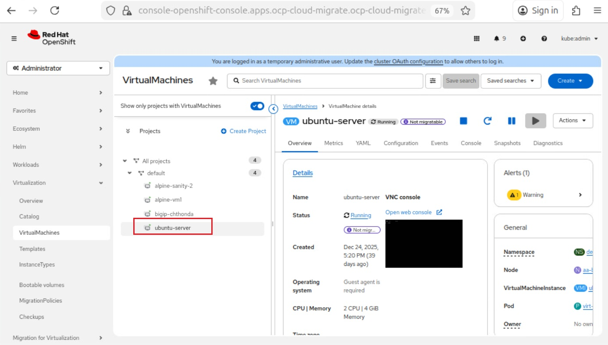
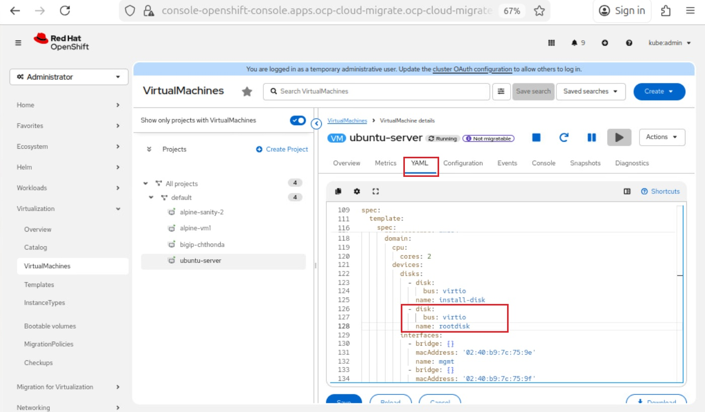
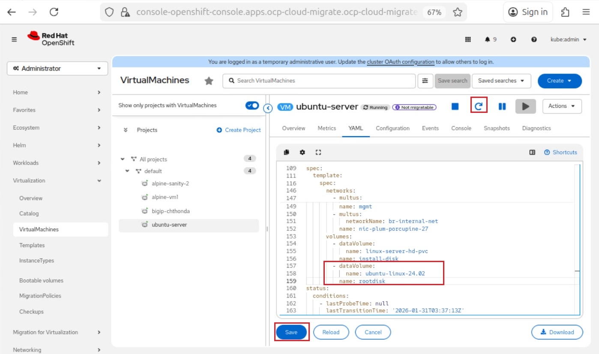

Deploy Ubuntu Server Machine in RedHat OpenShift Platform
#########################################################
This documents contains step by step procedure to deploy Ubuntu Server in RedHat OpenShift Platform (OCP). This is needed to deploy web based demo applications within it, which acts as a web server.

Pre-requesites
-------------------------------
Availablitiy of Ubunut Server Image in OCP Cluster. For more details on Image Upload, refer to this `link <https://ubuntu.com/download>`__.

Steps to deploy Ubuntu Server:
-------------------------------
Below are the detailed steps to bring up Ubuntu Server machine in OCP

1) Create a Ubuntu Server

2) Installation steps

3) Installing a demo application

**Step 1: Creating a Ubuntu Server**

This in this step, we discuss about creating a Ubuntu Server. As a pre-requisite, we have a Ubuntu Server defintion file ready,

**Step 1.1: Ubuntu Server definition file**

.. code-block:: python

    apiVersion: kubevirt.io/v1
    kind: VirtualMachine
    metadata:
    name: ubuntu-server
    namespace: default                                <<<< Name of the Namespace to which Ubuntu machine should be deployed
    spec:
    nodeSelector:
        kubernetes.io/hostname: aa-bb-cc-dd-ee-f7     <<<< Hostname of the device
    running: true
    template:
        metadata:
        labels:
            kubevirt.io/domain: ubuntu              
        spec:
        domain:
            cpu:
            cores: 2
            devices:
            disks:
            - name: rootdisk
                disk:
                bus: virtio
            - name: install-disk
                disk:
                bus: virtio
            interfaces:
            - name: mgmt
                bridge: {}
            resources:
            requests:
                memory: 4Gi
        networks:
        - name: mgmt
            multus:
            networkName: default/net-mgmt               <<<< Name of the NAD Network to which this VM/Pod should be launched in
        volumes:
        - name: rootdisk                                
            dataVolume:     
            name: ubuntu-linux-24.02                    <<<< Image of the Ubuntu ISO file
        - name: install-disk
            dataVolume:                                 
            name: linux-server-hd-pvc                   <<<< PVC used as a Harddisk to the server

Save the file and create the Ubuntu Machine Pod:

    $ oc apply -f linux-server-edition.yaml

    persistentvolume/ubuntu-server created

As you can able to see from the above screenshot, "ubuntu-server" shows status running. Click on "Open Web Console" to perform the installation steps.

**Step 2: Ubuntu Installation steps**

This step consists of detailed process of Ubuntu Installation steps. Upon accessing the Web Console, After a few moments, you should see messages like below,

.. image:: ./Assets/bootup_language.jpg

.. image:: ./Assets/ubuntu_installation_network_configuration.jpg

Below step we are configuring storage. Configuring install to have a entier disk for running Ubuntu

.. image:: ./Assets/ubuntu_installation_guided_config.jpg

Installer will calculate the partitions to create and persent as shown below,

.. image:: ./Assets/ubuntu_installation_storage_configuration.jpg

Confirm the changes,

.. image:: ./Assets/ubuntu_installation_storage_configuration_2.jpg

Set up a profile. Ubuntu server needs to hvae at least one known user for the system, and a hostname. 

.. image:: ./Assets/ubuntu_profile_details.jpg

After entering the required information, the screen will now show the progress of the installer. Once installation completes, do not press the **Reboot Now** button at the botton. OCP re initiate the installation process once again, to avoid this follow the process mentioned below,

.. image:: ./Assets/ubuntu_new_install_complete.jpg

**Step 1.2: Update Yaml configs before reboot**

Update the Yaml file in the OCP console, to effectivelty boot from Ubuntu Harddisk PVC but not Ubuntu ISO file. To get it achieved, follow the steps mentioned below,

Remove the highlighted configs related to rootdisk, which points to the Ubuntu ISO volume. Simillary, remove the Volume configs associated to rootdisk as well,

After removing both the rootdisk and volume configs, Click on Save button below to save the configs. Click on Reboot button on the top to reboot the pod.

Pod gets booted up with Ubuntu and ready to be accessed,

.. image:: ./Assets/ubuntu_new_after_bootup.jpg

.. image:: ./Assets/ubuntu_login.jpg

**Step 3: Installing a demo application**

A demo application is installed for testing purpose. In this case, Juice-shop demo app is installed in Ubuntu Machine,

.. image:: ./Assets/juice_shop_app_deploy.jpg

Juice-shop demo app is pulled successfully using docker run cmd and make to run on port 80 as shown above.

Conclusion
-------------------------------
With the follow of above steps, Ubuntu Server can be successfully deployed in OCP Cluster along with Juice-shop demo app and good to be used for testing.

Additional Links
-------------------------------
`Install Ubuntu Server <https://ubuntu.com/tutorials/install-ubuntu-server#1-overvie>`__

