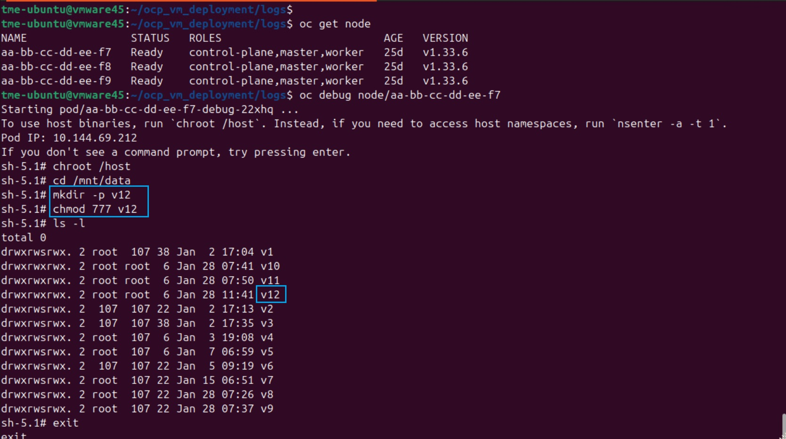

Uploading Image to RedHat OpenShift Platform
#########################################################

In this article, we discuss about how to upload any image to RedHat OpenShift Platform (OCP) cluster, which is required to bring up a VM using it.

Pre-requesites
-------------------------------

1. OCP Cluster Installation

2. Storage Class Availability

3. Have access to the software downloads on `my.f5.com<https://my.f5.com/manage/s/>`__

OCP Installation cluster is mentioned `here<Yet to Update>`__ which also includes Storage Class creation in OCP Cluster.

**Step 1: Download the BIG-IP Image**

1. Log in to your F5 account on `my.f5.com<https://my.f5.com/manage/s/>`__ and navigate to the software downloads page.
2. Select the product, version, image type and location that you want to download.
3. Select "Copy Download Link". The copied link will include authentication token that will be valid for a limited time.
4. Open your terminal and navigate to the directory where you want to save the qcow2 file.

**Step 2: Upload Image to OCP cluster**

Below are the detailed steps to Upload Image to OCP Cluster. For better understanding, it is broken down into series of steps.

**Step 2.1: Create a mount directory in respective Node**

In a 3 Node cluster, select the Node in which Image has to deployed and booted. Login to the Node and create a directory of a valid name.

As you can able to see, directory named **v12** is created.

**Step 2.2: Create a Persistent Volume**

Persistent Volume should be created with necessary.

.. image:: ./Assets/persistent_volume.jpg

With the volume shows available, Now can go ahead and upload the Image.

**Step 2.3: Upload Image to OCP cluster**

From the OCP Console, 

.. image:: ./Assets/add_volume.jpg

Additional Links:
--------------------
https://my.f5.com/manage/s/article/K000138258

