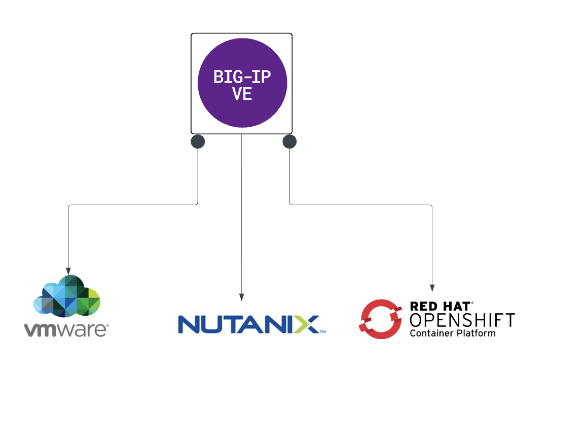
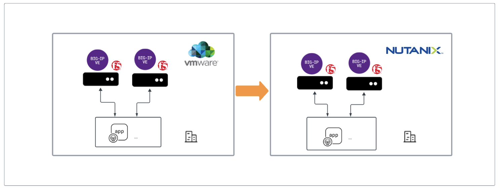
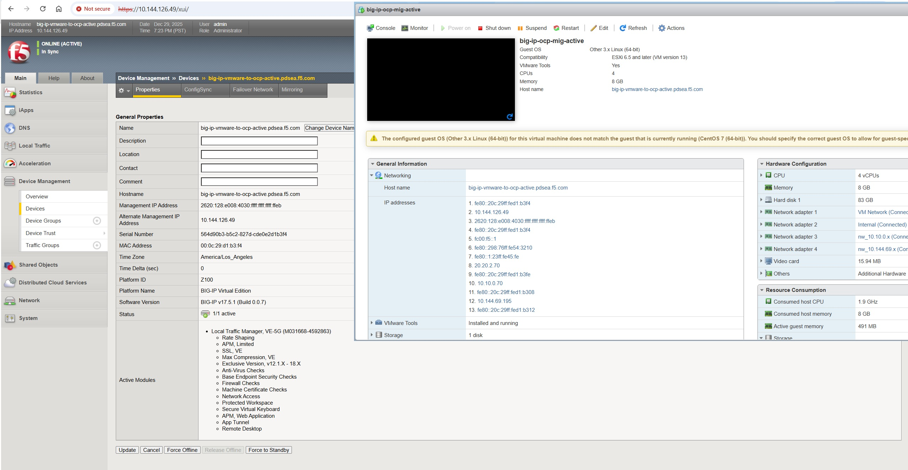
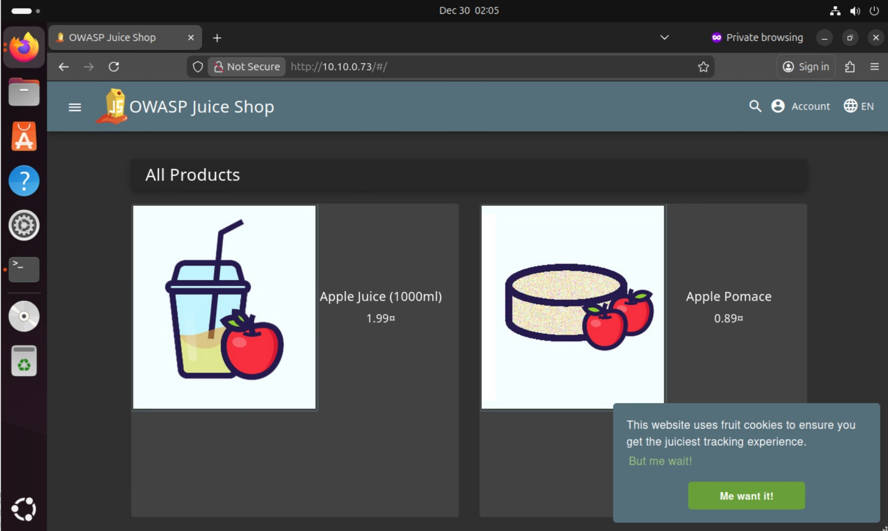
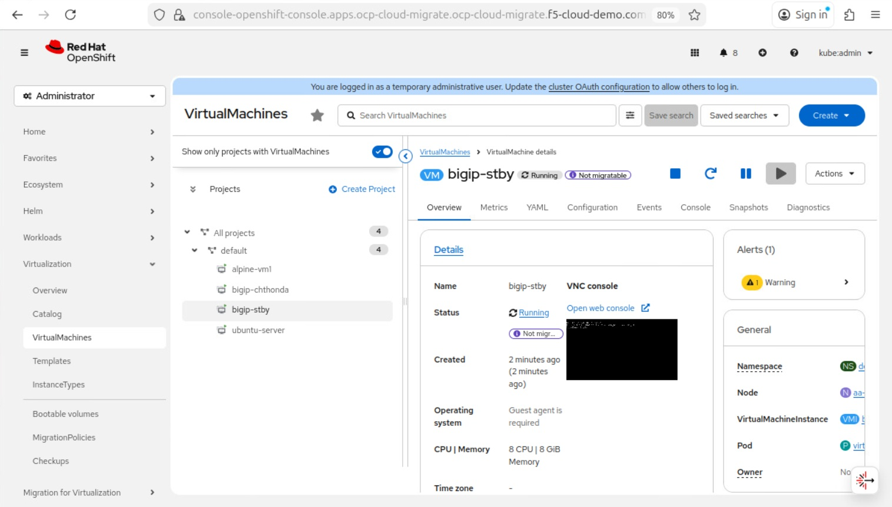

# Application Migration across Heterogeneous Environments using F5 BIG-IP VE

## Scope

As organizations deploy applications across multiple infrastructure platforms to meet scalability, cost, and flexibility requirements, the need to migrate applications and traffic between environments becomes unavoidable. Such migrations introduce challenges related to availability, security, and network consistency.

This document focuses on the use of F5 BIG-IP to support application traffic migration across heterogeneous platforms, ensuring consistent traffic management and policy enforcement with minimal impact to application services.

## Introduction

This article highlights how F5 BIG-IP enables seamless application traffic migration across mixed infrastructure environments commonly found in enterprise deployments. As organizations move applications between platforms such as VMware, Nutanix, and public clouds, maintaining consistent traffic management, availability, and security becomes critical.

Common migration scenarios include moving applications from VMware to alternative platforms based on business needs, extending on-premises applications to Nutanix and public cloud environments, and deploying applications across multiple platforms for resiliency and continuity. BIG-IP plays a central role in these transitions by ensuring consistent application delivery and policy enforcement throughout the migration process.

## Architecture Overview

The architecture demonstrates how F5 BIG-IP VE provides consistent application delivery across heterogeneous infrastructure platforms.

In the source environment, application workloads run on VMware and are front-ended by BIG-IP VE instances responsible for traffic management, availability, and security enforcement. As part of the migration, equivalent BIG-IP VE instances are deployed on Nutanix, allowing both environments to operate in parallel during the transition.

BIG-IP serves as a centralized traffic control layer, ensuring that application delivery and security policies remain consistent while workloads migrate from VMware to Nutanix. This approach enables controlled traffic redirection and seamless failover with minimal impact to application availability.

The architecture also highlights BIG-IP’s ability to extend the same traffic management and policy framework across multiple platforms, including VMware, Nutanix, and container platforms such as Red Hat OpenShift, supporting hybrid and multi-platform deployment models.

## Scenario 1: Migration from VMware to Nutanix

This scenario demonstrates the migration of application traffic and workloads from a VMware-based environment to Nutanix AHV using F5 BIG-IP Virtual Edition. BIG-IP enables a phased migration approach by maintaining consistent traffic management, availability, and security policies while applications and infrastructure components transition between platforms.

## Migration Stages Overview

### Stage 1 – BIG-IP VE HA pair deployment on Nutanix
At this stage BIG-IP Virtual Edition instances are already present on Vmware and a we will deploy a couple of BIG-IPs on Nutanix platform as well.

### Stage 2 – Migrate Standby BIG-IP VE from VMware to Nutanix
The Standby BIG-IP VE is migrated first from the VMware source environment to the Nutanix target platform. Configuration and licensing are preserved, allowing the migrated instance to rejoin the high-availability configuration without affecting active application traffic.

### Stage 3 – Failover Active BIG-IP VE to Nutanix
Application traffic is failed over from the Active BIG-IP VE running on VMware to the BIG-IP VE running on Nutanix. At this stage, Nutanix becomes the active traffic-handling platform while VMware remains in standby.

### Stage 4 – Migrate Application Workloads from VMware to Nutanix
Application workloads are transitioned from the VMware platform to the Nutanix platform. While automated tools such as Nutanix Move are recommended for production migrations, manual deployment may be used for testing and validation purposes. BIG-IP continues to provide consistent traffic steering and availability during this phase.

### Stage 5 – Migrate Remaining BIG-IP VE from VMware to Nutanix
The remaining BIG-IP VE is migrated from VMware to Nutanix and added back into the high-availability configuration. Upon completion, both BIG-IP instances operate entirely from the Nutanix platform.

For a detailed, step-by-step migration procedure, refer to the following document:

- [`BIG-IP-Migration-Vmware-To-Nutanix.rst`](Migrating_BIG_IP_from_VMware_to_Nutanix.rst)

## Scenario 2: Migration from VMware to Red Hat OpenShift

This scenario demonstrates the migraiton of applicaiton traffic and workloads from a VMware to RedHat Openshift Container Platform using F5 BIG-IP Virtual Edition. With BIG-IP, we follow series of steps to migration from VMware along with application workloads to OCP.

## Migration Stages Overview

### Stage 1 – BIG-IP VE HA pair deployment on Nutanix
At this stage BIG-IP Virtual Edition instances are already present on Vmware and a we will deploy a couple of BIG-IPs on Nutanix platform as well.

### Stage 2 – Migrate Standby BIG-IP VE from VMware to OCP

The Standby BIG-IP VE is migratd from VMware to OCP. Configuration and licensing are preserved, allowing the migrated instance to rejoin the high-availability configuration without affecting active application traffic.

### Conclusion

This workflow demonstrates how F5 BIG-IP Virtual Edition enables a controlled and low-risk migration of application traffic from VMware to Nutanix. By leveraging BIG-IP high availability and consistent traffic management capabilities, organizations can transition applications across heterogeneous infrastructure platforms while preserving availability, security, and operational consistency.

The phased migration approach allows infrastructure and application components to be migrated independently, reducing service disruption and providing clear validation points at each stage. This ensures that application traffic continues to be handled reliably throughout the migration and after the transition to the target platform.

### References

https://community.f5.com/kb/technicalarticles/f5-big-ip-ve-and-application-workloads-migration-from-vmware-to-nutanix/340465

https://techdocs.f5.com/kb/en-us/products/big-ip_ltm/manuals/product/bigip-ve-setup-vmware-esxi-11-5-0/2.html

https://clouddocs.f5.com/cloud/public/v1/nutanix/nutanix_setup.html

