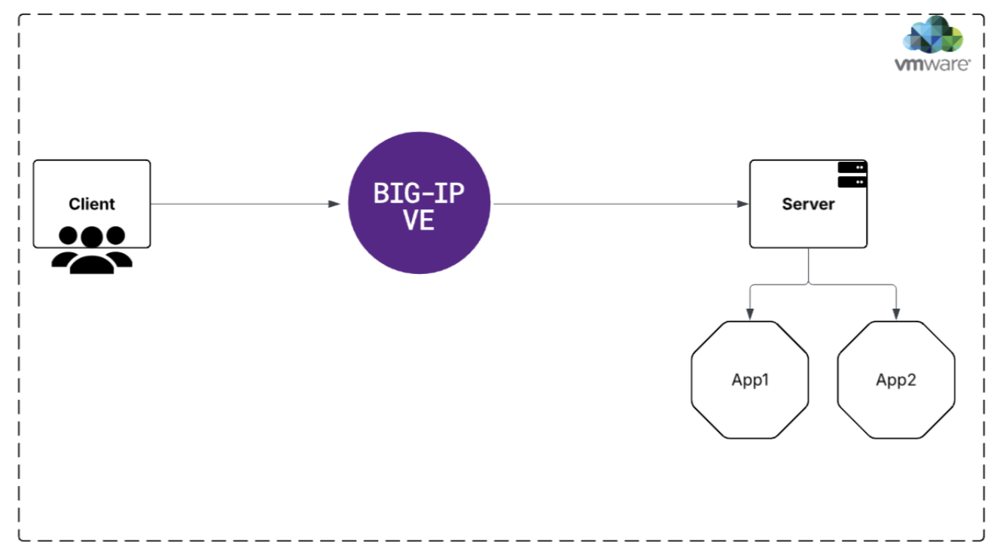

**BIG-IP Deployment Steps in VMware:**
~~~~~~~~~~~~~~~~~~~~~~~~~~~~~~~~~~~~~~

Here is the topology diagram for this scenario.

- Create a virtual machine (VM) on VMware ESXi hosted on a Dell
  PowerEdge R640 bare-metal server and ensure the VM is booted using the
  BIG-IP OVA image downloaded from the MyF5 Downloads portal.

- Additionally, create two more virtual machines using Ubuntu ISO
  images—one to function as the client and the other as the server.

  - Deployment Steps<link>

**Prerequisites:**
~~~~~~~~~~~~~~~~~~

- VMware ESXi host UP and Running.

  - Access to the ESXi host via vSphere Client (web or desktop).

  - A virtual machine (VM) is created in VMware ESXi deployed in Dell
    PowerEdge-R640 bare metal.

- F5 BIG-IP virtual appliance image (usually in .ova or .ovf format).

  - The VM is booted using the OVA image of BIG-IP downloaded from myf5
    Downloads.

  - `Steps to download the latest BIG-IP Image <https://github.com/sshajiya/bigip_automation_examples/blob/main/bigip/workflow-guides/application-delivery-security/workload/Download-BIG-IP-Image.rst>`__

- Licensing info for BIG-IP if applicable.

**Deployment Steps:**

1. **Log in to VMware ESXi:**

- Open your web browser and navigate to the VMware ESXi host IP address.

- Enter your administrative credentials to access the ESXi management
  interface.

2. **Start the VM Creation Process:**

- In the left-hand navigation pane, select **Virtual Machines**.

- | Click on the **Create / Register VM** button at the top.

  .. image:: ./assets/image2_2.png

3. **Select Deployment Type**

- In the wizard, choose **Deploy a virtual machine from an OVF or OVA
  file**.

- | Click **Next** to proceed.

  .. image:: ./assets/image2_3.png

4. **Specify VM Name and Upload OVA**

- Enter a descriptive and unique name for your BIG-IP virtual machine.

- Upload the BIG-IP OVA file by dragging and dropping it into the
  designated area or by browsing your local files. 

  - Steps to download BIG-IP OVA file:

    - Visit the `F5 Downloads <https://my.f5.com/manage/s/downloads>`__
      page and then log in with your credentials.

    - After logging in, look for **BIG-IP Virtual Editions (VE)**.

    - You can find this under **Products > BIG-IP Virtual Editions** or
      search directly for "BIG-IP Virtual Edition OVA".

    - Choose the BIG-IP version you want to deploy (e.g., 17.x, 16.x).

    - Locate the OVA package (it may be bundled with other files like
      license or documentation).

    - Click **Download** to get the OVA file to your local machine.

- | Once the OVA file is selected, click **Next**.

  |.. image:: ./assets/image2_4.png

5. **Choose Datastore**

- Select the datastore where you want to store the VM configuration
  files and virtual disks.

- Ensure the selected datastore has sufficient storage space and
  appropriate performance characteristics.

- Click **Next**.

6. **Accept License Agreement**

- Review the end-user license agreement (EULA) presented by the BIG-IP
  OVA package.

- Click **I Agree** to accept the terms.

- Click **Next** to continue.

7. **Configure Network Mappings and Deployment Options**

- Map the BIG-IP virtual machine’s network interfaces to the appropriate
  virtual switches or port groups available on your ESXi host.

- Choose the deployment format as **Thin provisioned** for
  storage-efficient disks.

- | Confirm your selections and click **Next**.

  .. image:: ./assets/image2_5.png

8. **Review and Confirm**

- Carefully review all deployment settings, including VM name,
  datastore, network mappings, and provisioning options.

- | If everything looks correct, click **Finish** to start the
    deployment.
  .. image:: ./assets/image2_6.png

9. **Power On and Initial Configuration**

- Once deployment completes, locate the VM in the **Virtual Machines**
  list.

- Right-click the VM and select **Power > Power On**.

- Open the VM console to monitor the boot process.

10. **Obtain the BIG-IP Management IP Address ,connect and perform
    licensing.**

- | Use the VM console in VMware ESXi or check your DHCP server to find
    the management IP assigned to the BIG-IP virtual machine.

  .. image:: ./assets/image2_7.png

- Alternatively, if you configured a static IP during deployment, use
  that address.

- From your local machine, open a terminal or SSH client and then
  connect using the default root credential like <**ssh
  root@<BIG-IP-management-IP**>>

- When prompted, enter the default password (commonly **default**).

- Immediately after login, change the default root password to a strong,
  secure password to protect your system.

- Use the BIG-IP command line interface to update the admin user
  credentials.

- This is critical for secure access to the BIG-IP management web
  interface.

- **Activate the BIG-IP license**
  Choose either:

  - Manual Activation: Upload a license file provided by F5

  - Automatic Activation: Use an F5 license key with internet access.

- Select and provision the required software modules based on your
  license:

  - LTM (Local Traffic Manager)

  - ASM (Application Security Manager)

  - Advanced WAF, etc.

- Click Submit and allow the system to provision the selected modules.

- | Once license is uploaded successfully go back to the BIG-IP GUI >
    System > License and cross verify the required modules are
    provisioned or not.

  .. image:: ./assets/image2_8.png

- Finally, set the hostname, DNS server, and NTP settings if required.

=========================================
F5 BIG-IP High Availability (HA) Setup
=========================================

This guide explains how to configure **High Availability (HA)** on **F5 BIG-IP** using
**tmsh CLI**, following a **manual, command-driven approach**.

The configuration results in a **Sync-Failover (Active–Standby)** HA pair.

-------------------------------------------------
Topology Overview
-------------------------------------------------
.. list-table::
   :header-rows: 1
   :widths: 20 40 40

   * - Component
     - BIG-IP 1
     - BIG-IP 2
   * - Hostname
     - resp1-bigip1.local.net
     - resp2-bigip1.local.net
   * - ConfigSync IP
     - 10.3.3.5
     - 10.3.3.6
   * - Management IP
     - 10.218.139.1
     - 10.218.134.250

-------------------------------------------------
Prerequisites
-------------------------------------------------

- Pair of BIG-IPs with same version
- Same provisioned modules
- Management connectivity between devices

-------------------------------------------------
Step 1: Configure NTP (Both Devices)
-------------------------------------------------

Time synchronization is mandatory for HA stability.

.. code-block:: bash

   tmsh modify sys ntp servers add { 172.23.241.134 }

-------------------------------------------------
Step 2: Configure Hostname
-------------------------------------------------

Each BIG-IP must have a **unique hostname**.

**BIG-IP 1**

.. code-block:: bash

   tmsh modify sys global-settings hostname resp1-bigip1.local.net

**BIG-IP 2**

.. code-block:: bash

   tmsh modify sys global-settings hostname resp2-bigip1.local.net

-------------------------------------------------
Step 3: Rename BIG-IP Device Object
-------------------------------------------------

Rename the default device name to match the hostname.

**BIG-IP 1**

.. code-block:: bash

   tmsh mv cm device bigip1 resp1-bigip1.local.net

**BIG-IP 2**

.. code-block:: bash

   tmsh mv cm device bigip1 resp2-bigip1.local.net

-------------------------------------------------
Step 4: Configure ConfigSync, Failover & Mirror IPs
-------------------------------------------------

These IPs are used for:
- Configuration synchronization
- Failover heartbeat
- Connection mirroring

**BIG-IP 1**

.. code-block:: bash

   tmsh modify cm device resp1-bigip1.local.net \
   configsync-ip 10.3.3.5 \
   unicast-address {
     { effective-ip 10.3.3.5 effective-port cap ip 10.3.3.5 }
     { effective-ip 10.218.139.1 effective-port cap ip 10.218.139.1 }
   } \
   mirror-ip 10.3.3.5

**BIG-IP 2**

.. code-block:: bash

   tmsh modify cm device resp2-bigip1.local.net \
   configsync-ip 10.3.3.6 \
   unicast-address {
     { effective-ip 10.3.3.6 effective-port cap ip 10.3.3.6 }
     { effective-ip 10.218.134.250 effective-port cap ip 10.218.134.250 }
   } \
   mirror-ip 10.3.3.6

-------------------------------------------------
Step 5: Set Admin Password (Both Devices)
-------------------------------------------------

Ensure the **admin credentials match** on both devices.

.. code-block:: bash

   tmsh modify auth user admin password f5root02

-------------------------------------------------
Step 6: Reset Existing Trust (BIG-IP 1)
-------------------------------------------------

Remove any existing trust configuration.

.. code-block:: bash

   tmsh delete cm trust-domain Root

-------------------------------------------------
Step 7: Establish Device Trust (BIG-IP 1)
-------------------------------------------------

Add BIG-IP 2 as a trusted device.

.. code-block:: bash

   tmsh modify cm trust-domain Root {
     add-device {
       device-ip 10.218.134.250
       device-name resp2-bigip1.local.net
       username admin
       password f5root02
       ca-device true
     }
   }

-------------------------------------------------
Step 8: Recreate Sync-Failover Device Group
-------------------------------------------------

Delete any existing HA group and create a fresh one.

**BIG-IP 1**

.. code-block:: bash

   tmsh modify cm device-group ha devices delete { all }
   tmsh delete cm device-group ha

.. code-block:: bash

   tmsh create cm device-group ha {
     devices add {
       resp1-bigip1.local.net { }
       resp2-bigip1.local.net { }
     }
     type sync-failover
     auto-sync enabled
   }

-------------------------------------------------
Step 9: Perform Initial Configuration Sync
-------------------------------------------------

Push configuration to the HA group.

.. code-block:: bash

   tmsh run cm config-sync to-group ha

-------------------------------------------------
Step 10: Force Standby on BIG-IP 2
-------------------------------------------------

Ensure proper **Active–Standby** role assignment.

**BIG-IP 2**

.. code-block:: bash

   tmsh run sys failover standby

-------------------------------------------------
Optional Fix: HA Sync / Load Balancing Issues
-------------------------------------------------

If HA sync or traffic handling is unstable, disable
TCP offloading features (known issue in some environments).

.. code-block:: bash

   tmsh modify /sys db tm.tcplargereceiveoffload value disable
   tmsh modify /sys db tm.tcpsegmentationoffload value disable

-------------------------------------------------
Verification Commands
-------------------------------------------------

Check device status:

.. code-block:: bash

   tmsh show cm device
   tmsh show cm failover-status
   tmsh show cm device-group

-------------------------------------------------
Result
-------------------------------------------------

- Devices operate in **Sync-Failover (HA) mode**
- Configuration is automatically synchronized
- Traffic fails over seamlessly using floating objects

-------------------------------------------------
Notes & Best Practices
-------------------------------------------------

- Always use **floating IPs** for Virtual Servers
- Keep NTP enabled and synchronized
- Avoid manual config changes on Standby
- Monitor failover events regularly
