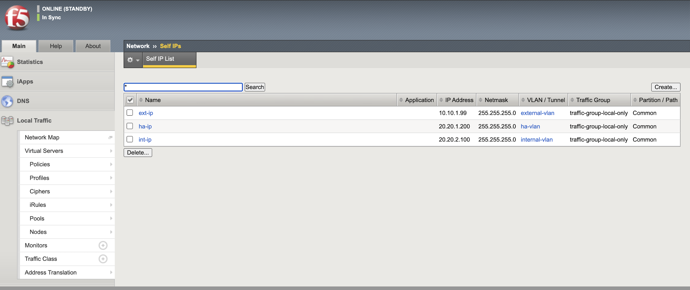
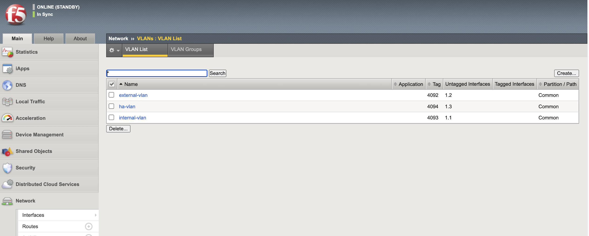

**BIG-IP Virtual Server Configuration:**

Below is a step-by-step process to create a Virtual Server and validate
the effectiveness of the Web Application Firewall (WAF) by simulating
malicious attacks on application endpoints.

- Before creating the virtual server (VS), let’s configure required
  network settings, VLANs, self IPs, and other required BIG-IP features
  via CLI or web interface. 

- Install and configure various vulnerable web applications such as
  Juice Shop, DVWA (Damn Vulnerable Web Application), XVWA (Xtreme
  Vulnerable Web Application), Mutillidae, and others on an Ubuntu
  server. 

  `Application Installation via Docker on Ubuntu  Step-by-Step Guide <https://github.com/sshajiya/bigip_automation_examples/blob/main/bigip/workflow-guides/application-delivery-security/workload/Download-BIG-IP-Image.rst>`__ 

   Ensure each application is running on different custom HTTP ports
   (e.g., 8080, 8081, etc.) to avoid conflicts. 

- Now, on the BIG-IP system, create a virtual server configured with the
  appropriate node details pointing to the Ubuntu machine hosting the
  vulnerable apps. 

   *Node and Pool Details:
   *\ |image2|\ *
   *\ |image3|\ *
   *\ |image4|\ *
   *\ |image5|\ *
   *

   | |image6|
   | |image7|
   | |image8|

- | Associate the virtual server with a pool that includes these nodes
    and their respective custom HTTP ports. Confirm that the virtual
    server is up and operational on the BIG-IP platform. Also, Apply the
    WAF policy to the created virtual servers.
  | |image9|\ |image10|
  | |image11| 

- | Access the vulnerable applications through the BIG-IP virtual
    server’s IP and verify connectivity and functionality by navigating
    to the respective HTTP ports. 
  |  
  |   |image12|
  | |image13|

.. |A screenshot of a computer AI-generated content may be incorrect.| image:: media/image1.png
   :width: 6.26806in
   :height: 2.93333in
.. |image1| image:: media/image2.png
   :width: 6.26806in
   :height: 2.71181in
.. |image2| image:: media/image3.png
   :width: 6.26806in
   :height: 3.44306in
.. |image3| image:: media/image4.png
   :width: 6.26806in
   :height: 3.49514in
.. |image4| image:: media/image5.png
   :width: 6.26806in
   :height: 3.47014in
.. |image5| image:: media/image6.png
   :width: 6.26806in
   :height: 3.44653in
.. |image6| image:: media/image7.png
   :width: 6.26806in
   :height: 3.27014in
.. |image7| image:: media/image8.png
   :width: 6.26806in
   :height: 3.46181in
.. |image8| image:: media/image9.png
   :width: 6.26806in
   :height: 3.48125in
.. |image9| image:: media/image10.png
   :width: 6.26806in
   :height: 3.69653in
.. |image10| image:: media/image11.png
   :width: 6.26806in
   :height: 2.10417in
.. |image11| image:: media/image12.png
   :width: 6.26806in
   :height: 3.49236in
.. |image12| image:: media/image13.png
   :width: 6.26806in
   :height: 3.79375in
.. |image13| image:: media/image14.png
   :width: 6.26806in
   :height: 3.51736in
