BIG-IP HA Pair Configurations
#########################################################
This guide gives detailed information about configuring BIG-IP to HA pair.

Pre-requesites
-------------------------------
1. Couple of Standalone BIG-IPs should be available.

2. Couple of IP Address to connect both the BIG-IP.

Steps to bring up BIG-IP in HA mode
-------------------------------
Before proceeding, we can see both the BIG-IPs are in Standalone mode, Assuming one BIG-IP as BIG-IP A and other as BIG-IP B.

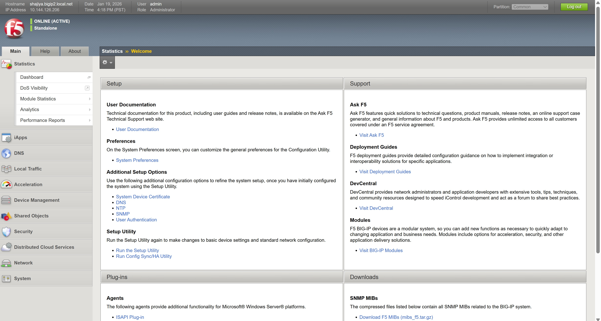

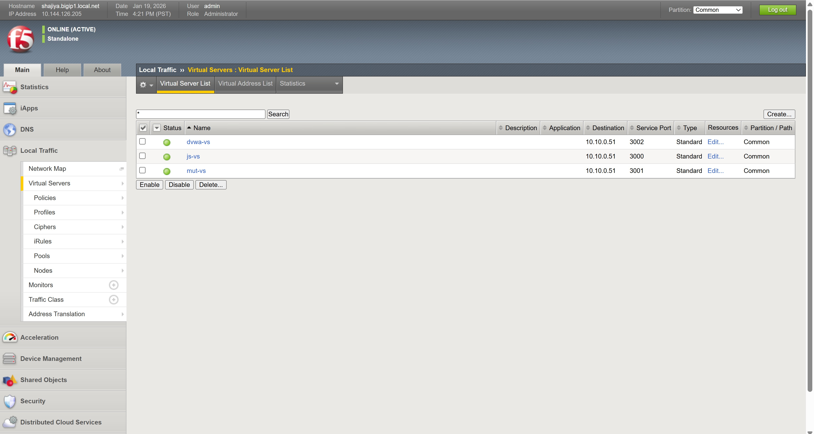

Let's have a look at Internal, External and HA IP addresses.

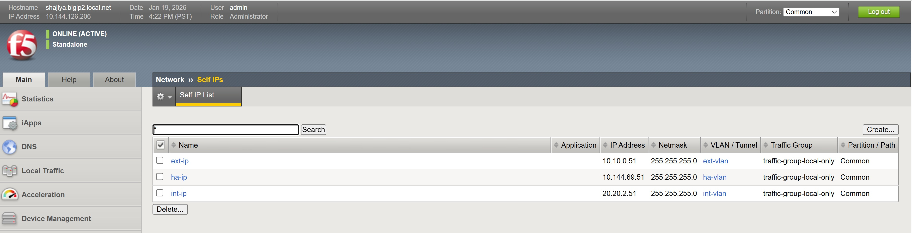

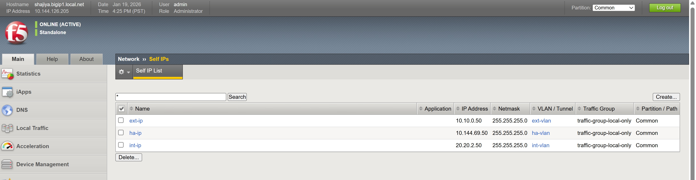

HA configuration follows series of steps which includes ConfigSync, Failover Network and Mirrorring. These need to be performed for both the BIG-IPs that are planned to form HA pair.

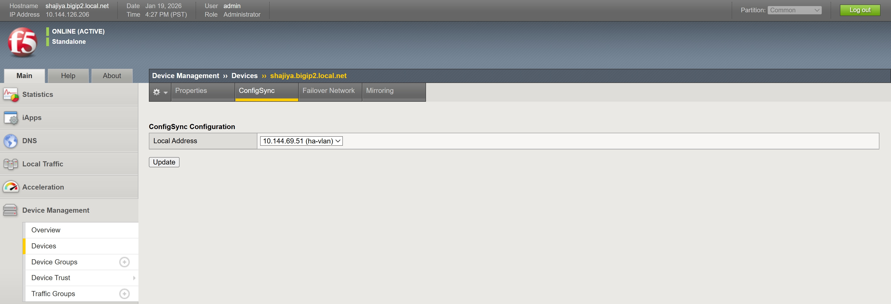

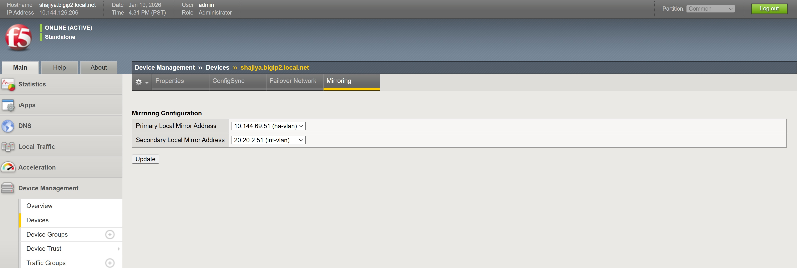

Similary, ConfigSync, Failover Network and Mirroring for other asociated BIG-IP as well,

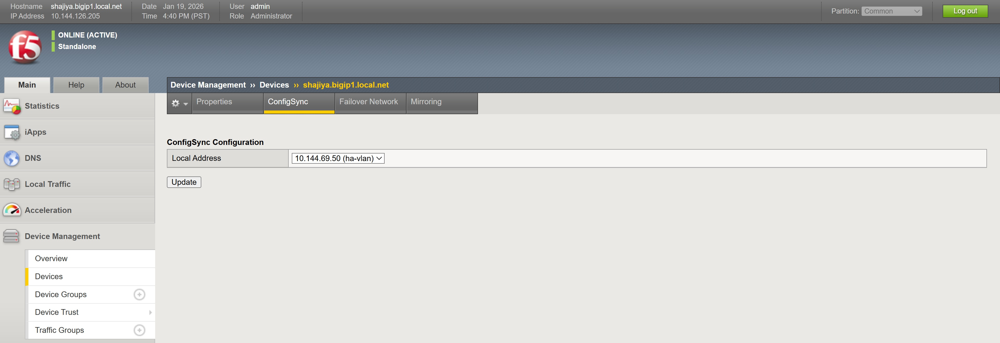

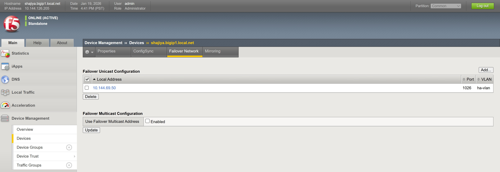

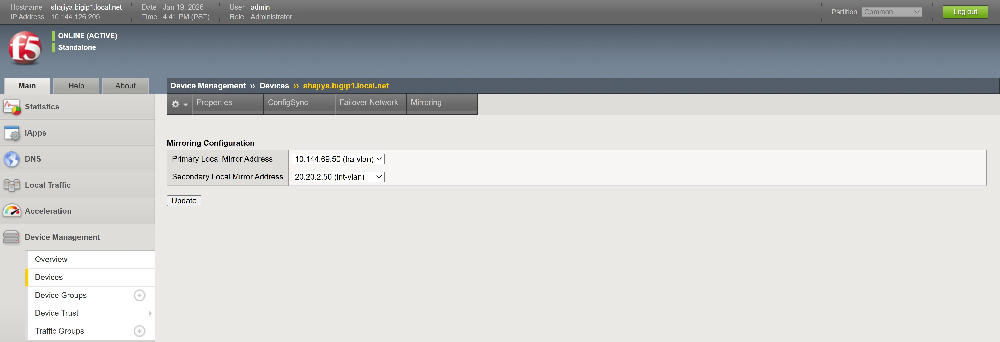

Now, go to Device trust to add other BIG-IP as trusted device, this is achieved by Navigating to Device Management > Device Trust > Device Trust Members. Click on Add button.

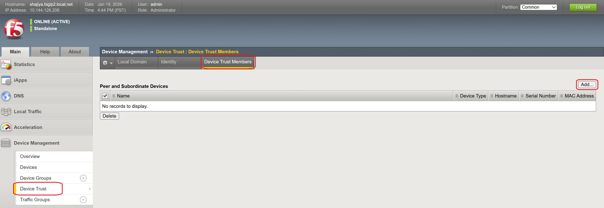

From BIG-IP A, enter the details of BIG-IP B IP address and enter the credentials,

.. image:: ./assets/BIG-IP_HA/device_trust_group_add_device.jpg

Once it is successfully, We can able to see Device is added successfully. Along with that, we can see both the standalone devices shows **Online (ACTIVE) In Sync**.

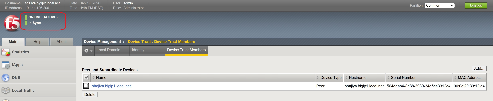

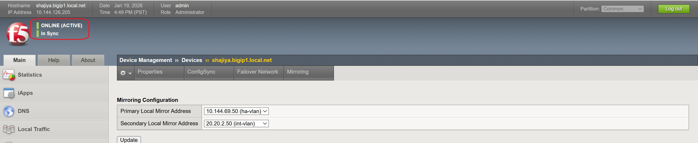

Now, device group should be configured. To do that, Navigate to Device Management > Device Groups. Click on Create.

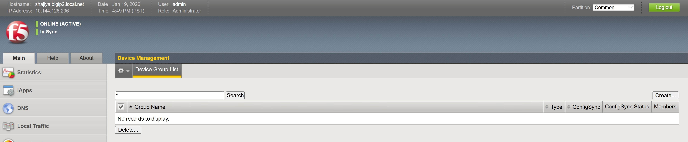

Provide a valid name and add the devices (BIG-IP A and B) to this group. Provide the necessary configs such as "Automatic with Incremental Sync" for Sync Type and Group Type as "Sync-Failover". Click on Finished.

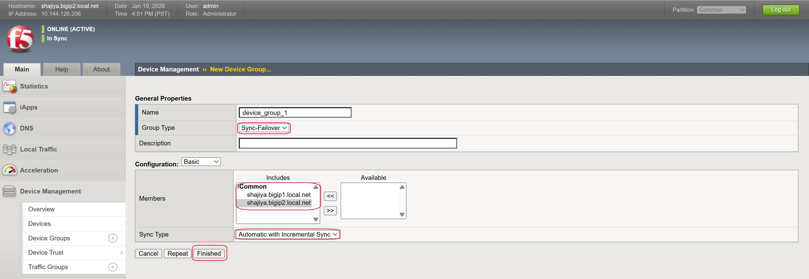

Once done, you can able to see BIG-IP shows **Awaiting Initial Sync**. click on that and select the configs to be pushed from one to another BIG-IP.

In this case, I would like to push from BIG-IP B to BIG-IP A and Click on Sync button under device group section.

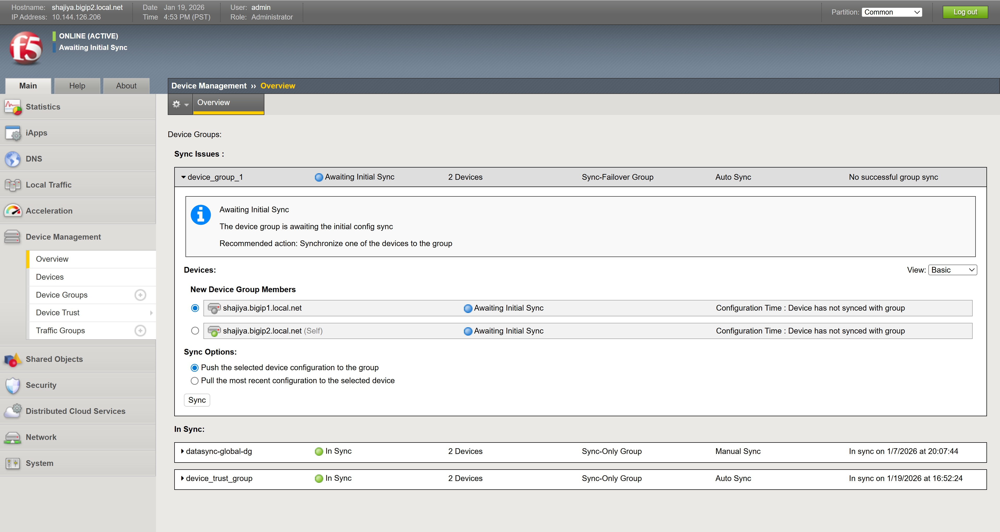

Once it is done. You can able to see both the BIG-IPs shows **Online (ACTIVE) In Sync** and **Online (STANDBY) In Sync**.

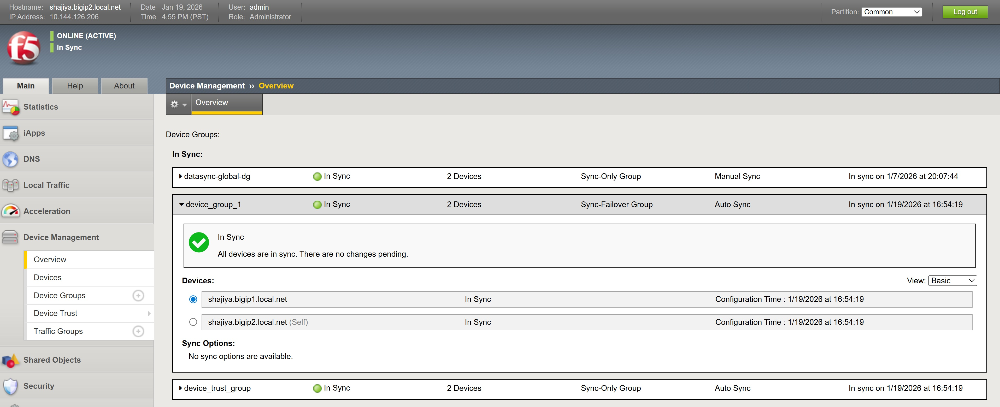

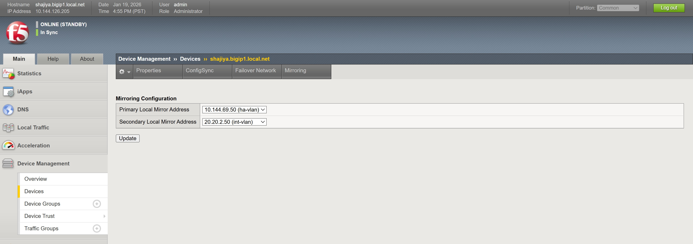

This confirms both the BIG-IPs are in HA pair.

Conclusion
-------------------------------
As mentioned in this document, the series of steps to bring up BIG-IPs to HA pair can be achieved.

