**Installation of Nutanix Community Edition 2.1 on Bare Metal** 

**Introduction:** 

Nutanix Community Edition (CE) 2.1 is a community supported version of
Nutanix’s hyperconverged software. It allows to deploy and testing new
workloads using Nutanix’s Acropolis Hypervisor (AHV). AHV offers an
intuitive and easy way to manage virtual environments with optimized
performance and reliability.  

**Recommended Hardware:** 

Below are the following hardware requirements for running CE in our
environment, 

- CPU: Intel Sandy Bridge (VT-x or AVX), or AMX Zen or later, 4 cores
  minimum 

- Memory: 32 GB minimum, 64 GB or greater recommended 

- NIC: Intel or Realtek, 1 GbE or 2.5 GbE 

- HBA: AHCI SATA or LSI Controller with IT mode (best) or IR mode
  (Passthrough or Raid-O) 

- Storage device: Data disk with 500 GB minimum, 18 TB maximum (can be
  SSD or HDD) 

- Storage device: CVM (hot-tier flash) with 200 GB minimum (must be
  SSD) 

- Hypervisor Boot Disk: 32GB minimum (for external drives, use USB 3.0) 

- Imaging Software: Open-source imaging software such as Rufus. 

Reference page for `Recommended Hardware for Community
Edition <https://portal.nutanix.com/page/documents/details?targetId=Nutanix-Community-Edition-Getting-Started-v2_1:top-sysreqs-ce-r.html>`__
section. 

**My setup:** 

For my setup, I installed single node cluster on Dell PowerEdge R430
with Intel NIC with following specs,  

- CPU: 2 x Intel® Xeon® CPU E5-2620 v4 

- Memory: 64 GB 

- NIC: Intel NIC 10 GbE 4P X710 Adapter 

- HBA: AHCI SATA 

- Storage device: Data disk of SSD with 800 GB 

- Storage device: CVM of SSD with 800 GB 

- Hypervisor Boot disk: 32 GB USB 3.0 device 

- Imaging Software: Nutanix ISO booted using Rufus to USB 3.0 drive 

  .. image:: ./assets/image3_1.png

Above screenshot shows the Dell PowerEdge R430 HW that I brought up to
install Nutanix CE. After connecting necessary USB drives such as
Installer and Hypervisor boot and other HW, I have installed AHV
Hypervisor followed by Controller Virtual Machine (CVM) for managing the
storing and providing the management plane. Once everything is up and
running, we login to CVM or cluster’s external IP address to create
virtual machines. 

 

Detailed process of Nutanix CE installation is below. 

 

**Procedure to Install Nutanix CE 2.1:** 

Below are the series of steps to be followed to install CE on any Bare
Metal server, 

Make sure that you have a valid `Nutanix
Community <https://next.nutanix.com/>`__ account, if not sign up to
Nutanix `registration page <https://my.nutanix.com/page/signup>`__. 

1. Prepare installation media 

2. Install Nutanix Community Edition 

3. Create and configure a single-node cluster 

4. Access the Web Console 

 

**Step 1: Preparing installation media** 

After registering to Nutanix account, go to the `Community Edition
discussion forum <https://next.nutanix.com/discussion-forum-14>`__ and
click the **Download Community Edition** topic. 

**Note:** Nutanix recommends using drive with USB 3.0 or later to avoid
networking and installation timeouts, but you can use virtual media to
perform installation. Nutanix recommends a smaller capacity than all the
other drivers (Data & CVM) on the node. 

Under **Installer ISO**, click the download link. Image the installation
device with the installer ISO file. 

Download the latest edition of Rufus `here <https://rufus.ie/en/>`__ and
open the application. Select the downloaded ISO image and rest of the
configs were set to default, click on start button to image. Once the
process is done, eject the USB drive and insert it to selected Bare
Metal HW. 

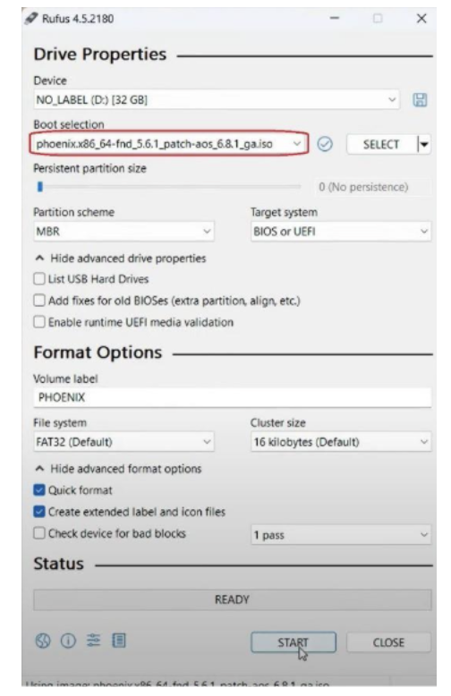

Before proceeding installing Nutanix CE, gather the following
information that is required during installation process, 

- Host IP address (for CE hypervisor host) 

- Controller VM (CVM) IP address 

- Subnet mask 

- Gateway 

- DNS, NTP, and proxy server IP addresses (if applicable) 

..

    

**Step 2: Installing Nutanix CE 2.1** 

Before you begin, ensure that your hardware meets the requirements
mentioned above. 

Insert both the USB drives to the Bare Metal server you have, one with
Installer image and other for AHV boot disk. 

As informed, Nutanix CE is installed on Dell PowerEdge R430 Bare Metal.
Login to Dell iDRAC and click on **Power/Thermal** > **Power
Configuration.** Select **Reset System (warm boot)** and click on
**Apply** button to boot the bare metal. 

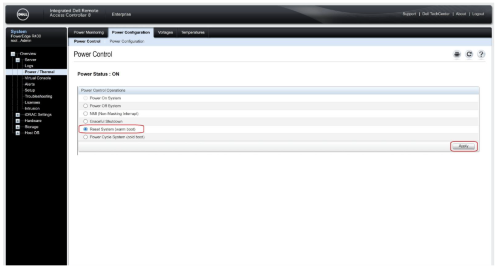

Device starts to bootup and navigate to boot settings to initiate the
boot from the USB drive imaged with CE. 

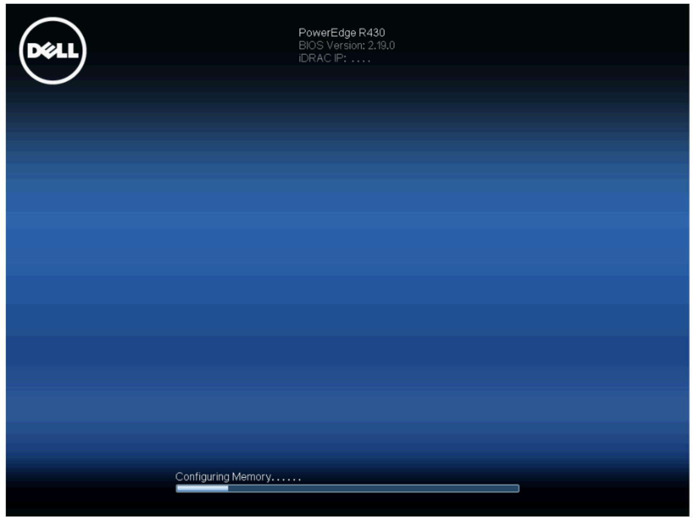

Click on F11 bootup process to modify the boot sequence. 

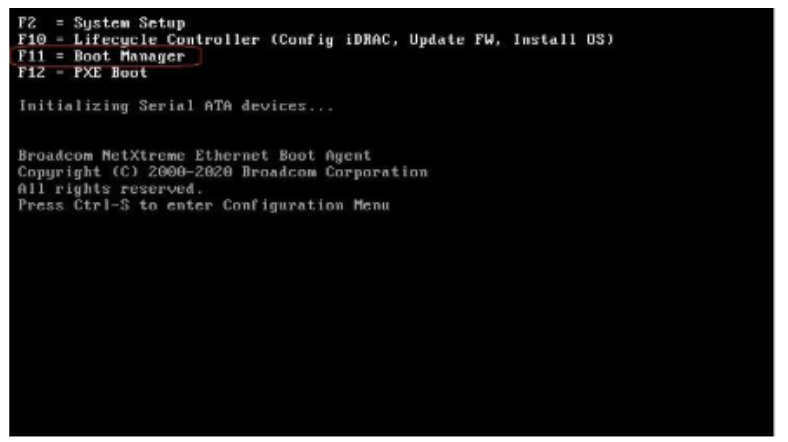

From the boot sequence, set the boot device to the imaged installation
device. 

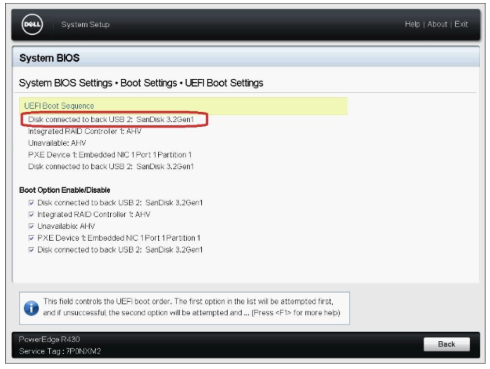

Save the configuration changes and initiate the bootup. 

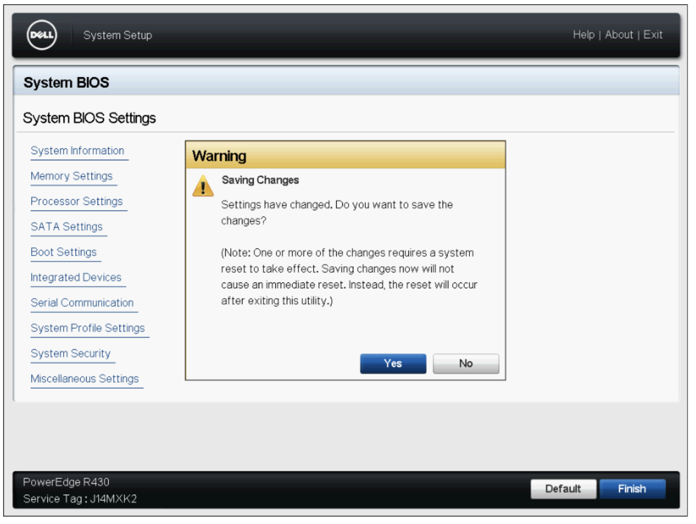

Boot process starts by booting USB drive. 

It will take a couple of minutes to get to installer screen. 

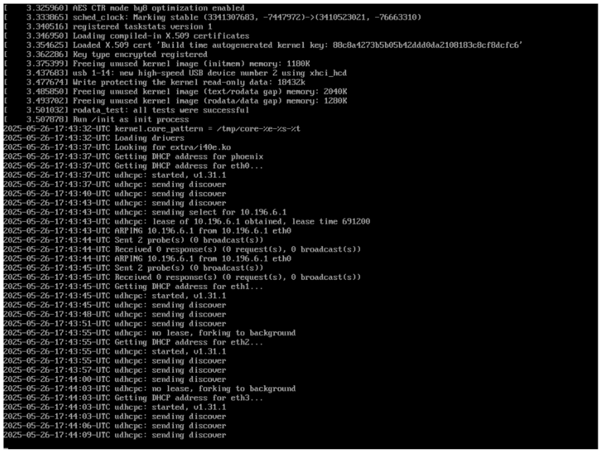

When the boot sequence finishes, the CE installer dialog appears. 

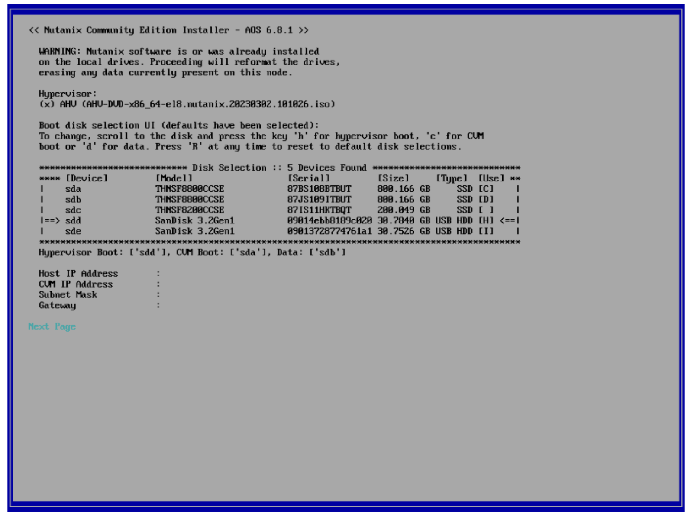

As you can be able to see, Hypervisor selection is AHV, and Hard disks
were selected as one of the SSD for CVM boot disk and others as Data
disk which is by default. Use Tab to navigate to the Disk Selection
field. One of the USB is selected as Installer and other as Hypervisor
boot disk.  

Use the up arrow and down arrow keys to navigate between the disk
selection, use **c** to confirm the CVM boot disk, **H** to confirm the
hypervisor boot disk selection, Similarly **D** and **I** for Data Disk,
Installer. 

Provide the networking information such as Host IP address, CVM IP
Address, Subnet Mask and Gateway that you gathered.  

I have provided details as **10.146.20.100, 10.146.20.101,
255.255.255.0, 10.146.20.254** respectively. 

Press Tab to select Next Page and press Enter. 

Read the end-user license agreement (EULA). Use the up arrow and down
arrow keys to scroll. Press Tab to navigate to the **I accept the end
user license agreement** checkbox. 

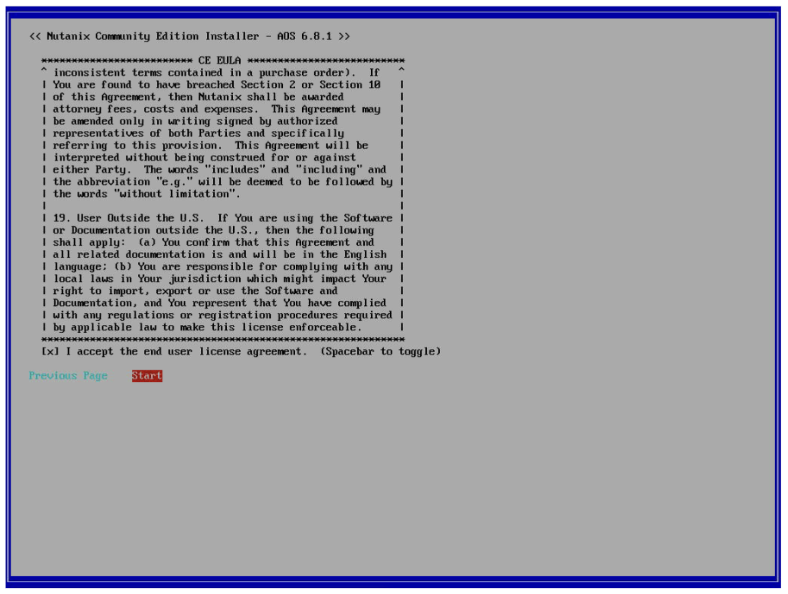

Press the spacebar to select the checkbox. Use the arrow keys to
navigate to Start and press Enter to start the installation process.  

Now Nutanix is a Hyperconverged Platform, it is not only installation
AHV Hypervisor but also management plane and storage controller as well.
Installation process as follows, 

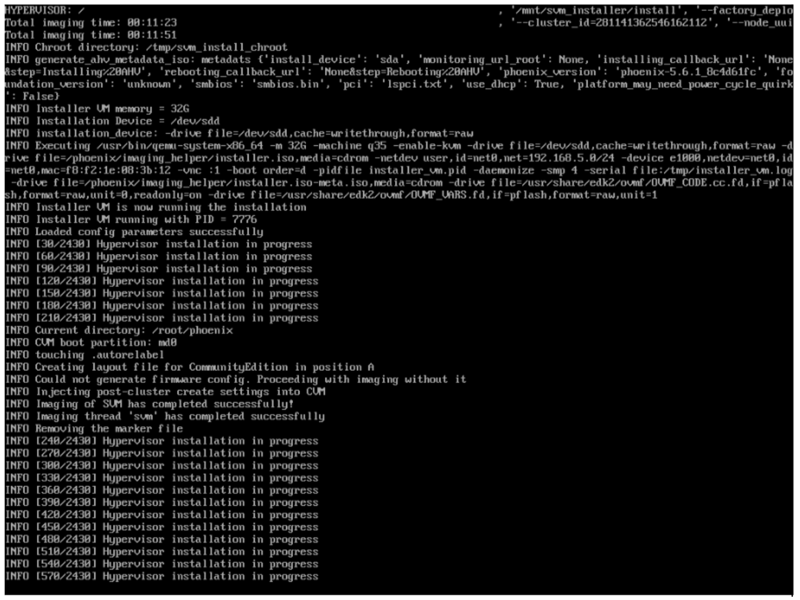

 
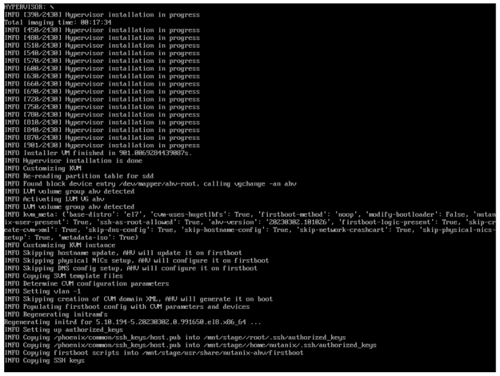

A prompt appears to remove CE installation media, Remove the CE
installation media depending on your Bare Metal HW (to make sure device
does not boot again with installer image). Enter the **y** key and press
Enter. 

 .. image:: ./assets/image3_14.png

Since my Bare Metal setup consists of 2 USB drives, once the bootup
process started, I need to change the boot sequence from boot manager,
so that device boots with AHV hypervisor installed. 

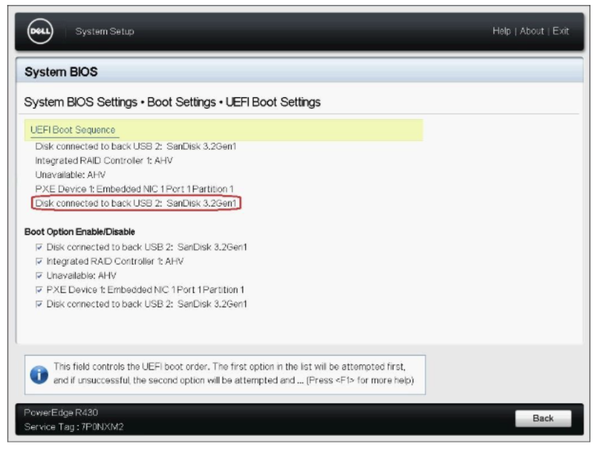

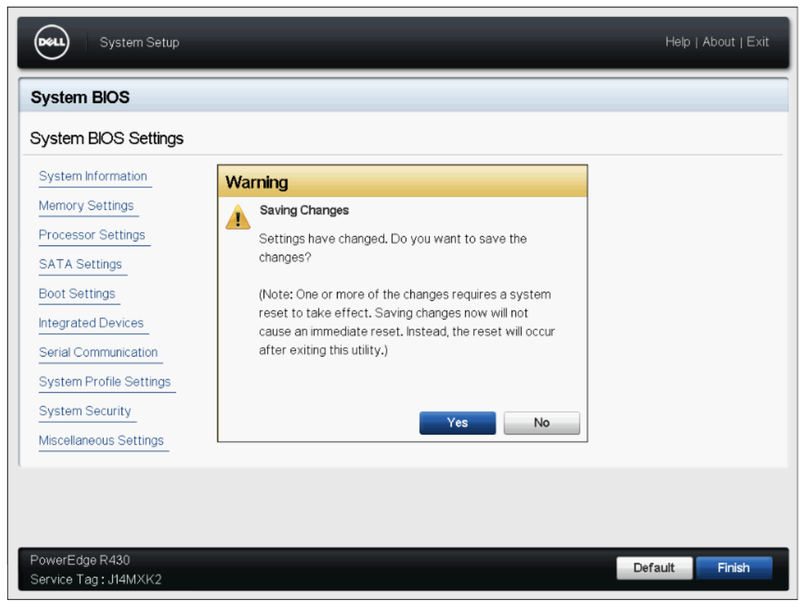

Now the device will be booted into AHV. 

 
**Step 3: Creating and configuring a cluster** 

Once you are at the AHV, you can see the login prompt, you can login
with default Nutanix credentials: root/Nutanix/4u 

It takes sometimes to come up for creating of cluster. 

 

Now, ssh to CVM with the CVM IP address with credentials nutanix and
password as nutanix/4u 

Once **cluster status** command shows cluster is unconfigured, now
you can go ahead and create a cluster. 

 

Since we are creating a single-node cluster, execute the command
**cluster –s <cvm_ip> –-redundancy_factor=1 create** 

 

 

It takes a few minutes to create the cluster and shows success message
that cluster is successfully created. 

 

Now, let us configure cluster parameters such as cluster name, external
IP address, NTP server etc. 

External IP address is with which we access the Nutanix Web console, 

Cli configure an external IP address for the cluster is **ncli cluster
set-external-ip-address external-ip-address=<cluster_ip_address>** 

I have provided cluster IP as **10.146.20.102** 

Now, setup is good and ready to be accessed. 

 

**Step 4: Accessing the web console** 

In a web browser, navigate to IP> with port number 9440 to access the
Nutanix console. 

 

Sign in with default admin account username and password. 

- Username: **admin** 

- Password: **nutanix/4u** 

When prompted, change the default password. 

Sign in with the admin account username and the new password. 

Finally, we need to connect our next community account to the cluster by
providing the Nutanix Community credentials. If you can’t sign in using
your Nutanix community credentials, your account might not be registered
to use CE. Complete the `CE
registration <https://www.nutanix.com/products/community-edition/register>`__
page to register your account. 

 

Once the login is successfully, you will see the Nutanix dashboard
details as shown below, 

 

This confirms Nutanix CE 2.1 is successfully installed in Bare Metal.
Virtual Instances can now be created. 

 

**Conclusion:** 

Nutanix CE helps to manage virtual environments with optimized
performance and reliability. With the Nutanix CE installed successfully
on Dell PowerEdge R430 by following above steps mentioned. Similar
process helps in installing Nutanix CE on any Bare Metal. 

 

**Additional Links:** 

*https://portal.nutanix.com/page/documents/details?targetId=Nutanix-Community-Edition-Getting-Started:top-sysreqs-ce-r.html* 
