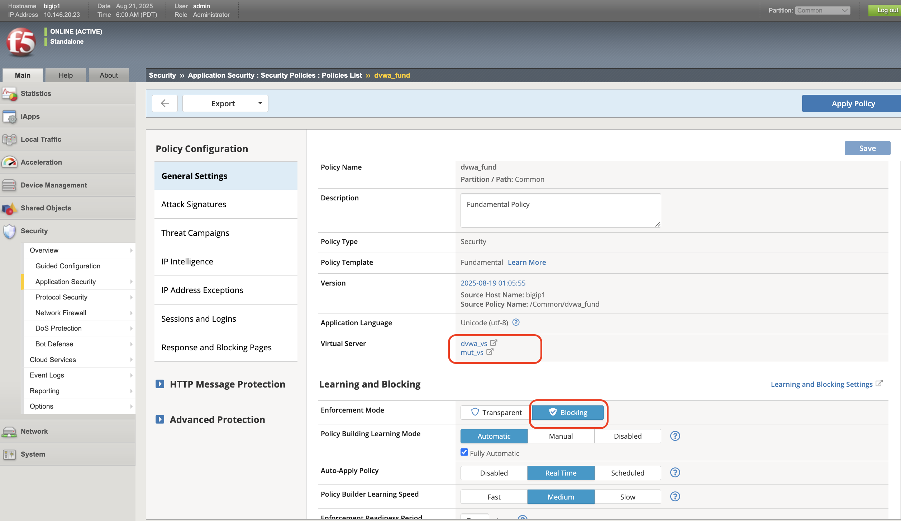
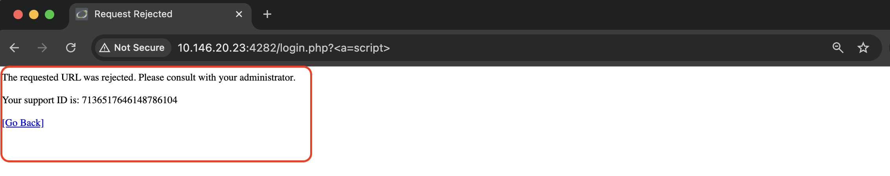
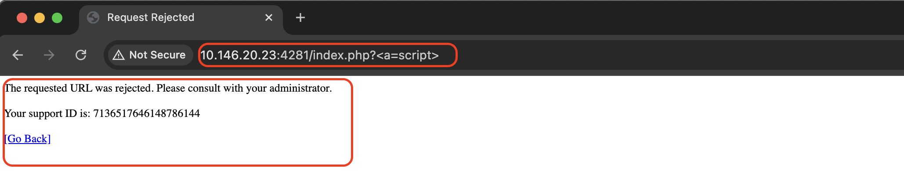
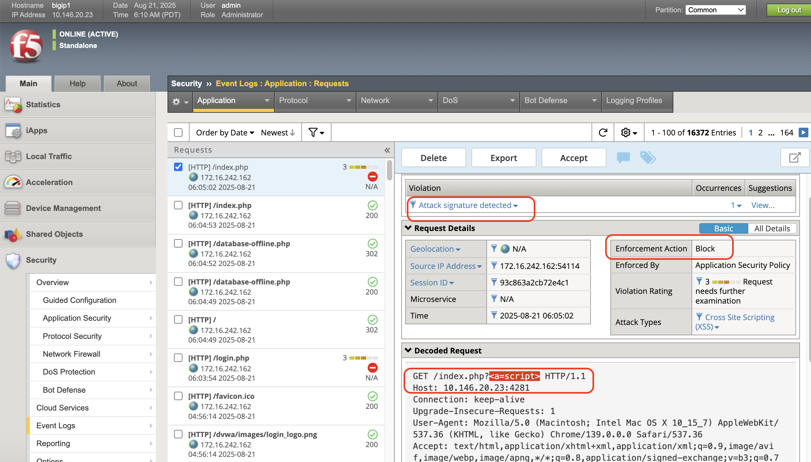
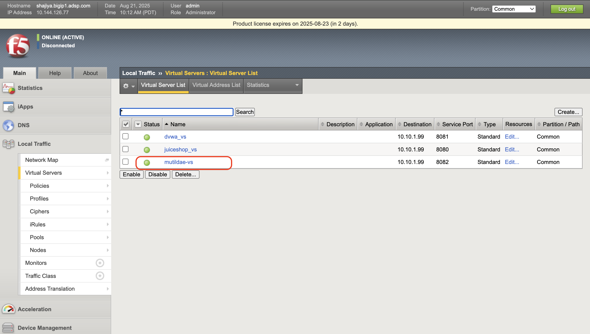
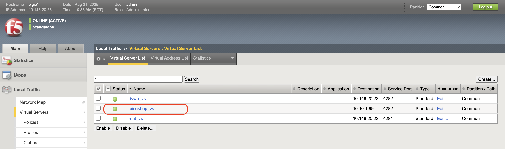
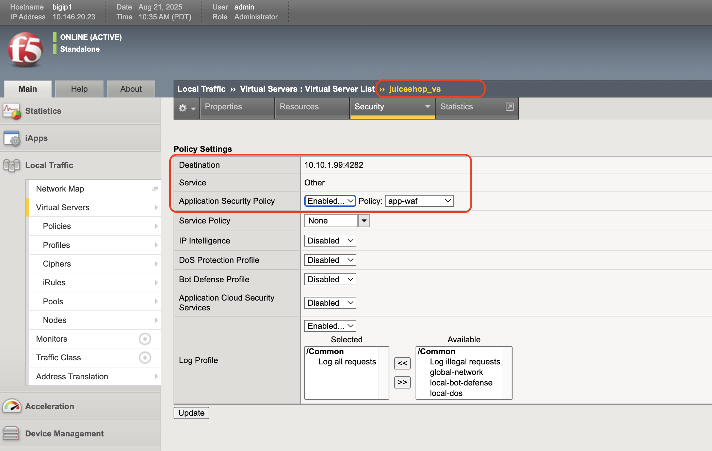

Scalable App Delivery & Security across hybrid environments using F5 BIG-IP 
#########################################################
Introduction
-----------
As enterprises deploy multiple instances of the same applications across diverse infrastructure platforms such as VMware, OpenShift, Nutanix, and public cloud environments and across geographically distributed locations to support redundancy and facilitate seamless migration, they face increasing challenges in ensuring consistent performance, centralized security, and operational visibility. The complexity of managing distributed application traffic, enforcing uniform security policies, and maintaining high availability across hybrid environments introduces significant operational overhead and risk, hindering agility and scalability. 

F5 BIG-IP Application Delivery and Security address this challenge by providing a unified, policy-driven approach to manage secure workloads across hybrid multi cloud environments by scaling up application services on existing infrastructure or with new business models. 

Overview
---------
Deploying identical workloads with F5 BIG-IP Application Delivery and Security enables organizations to achieve high availability, scalability, and consistent user experience across distributed environments. This approach allows seamless traffic steering and easy workload shifting, ensuring zero-downtime deployments, efficient load balancing, and rapid failover during outages. From a business perspective, it enhances operational agility, supports growing traffic demands, reduces risk during updates, and ultimately delivers a reliable, secure, and high-performance application experience that meets customer expectations and drives growth. 

In this use case, we focus on a representative enterprise scenario that includes the following environments: 

- VMware – On-Premises 
- Nutanix – On-Premises 
- Google Cloud Platform (GCP) 
- Red Hat OpenShift (OCP) – On-Premises 

Architecture Overview
---------------------
The architecture for this use case demonstrates how F5 BIG-IP Application Delivery and Security is deployed to provide a centralized control plane with distributed enforcement points across cloud and on-premises platforms. 

**VMware:** 
Two virtual machines are provisioned using Ubuntu ISO images—one designated as the client and the other as the server. On the server VM, multiple intentionally vulnerable web applications such as Juice Shop, DVWA, and Mutillidae are deployed using Docker containers with custom port configurations. These applications are used for testing and security assessment purposes and can be accessed from the client VM over the configured ports. 

`Installing Client Server Machines in ESXi <https://github.com/sshajiya/bigip_automation_examples/blob/main/bigip/workflow-guides/application-delivery-security/workload/Ubuntu-deployment-ESXi.rst>`__ 

A virtual machine (VM) is provisioned on VMware ESXi, which is deployed on a Dell PowerEdge R640 bare-metal server. The VM is booted using the BIG-IP OVA image obtained from the official F5 Downloads portal. Once the BIG-IP instance is operational, application workloads hosted on another VM which are deployed within the same ESXi environment and are integrated through a virtual server configured on the BIG-IP. This setup ensures secure access by routing traffic through the virtual server, effectively preventing direct exposure of the applications to external networks.  

`Deploying BIG-IP on VMware <https://github.com/sshajiya/bigip_automation_examples/blob/main/bigip/workflow-guides/application-delivery-security/workload/BIG-IP-Deployment-on-VMware.rst>`__

**Nutanix on bare metal:**
Nutanix Community Edition is used as the hypervisor, deployed on a Dell PowerEdge R430 bare-metal server. 

`Steps to install Nutanix on bare metal <https://github.com/sshajiya/bigip_automation_examples/blob/main/bigip/workflow-guides/application-delivery-security/workload/Installation-Nutanix.rst>`__

A virtual machine (VM) is provisioned and booted using the QCOW2 image of the BIG-IP Virtual Edition (VE), downloaded from the official F5 Downloads portal. Once the VM is operational, application workloads are deployed and accessed through a virtual server configured on the BIG-IP VE. This ensures that the applications are securely exposed via the virtual server, preventing direct access and enabling centralized traffic management and security.  

`Steps to Deploy BIG-IP on Nutanix <https://github.com/sshajiya/bigip_automation_examples/blob/main/bigip/workflow-guides/application-delivery-security/workload/BIG-IP-Deployment-Nutanix.rst>`__

**GCP (Google Cloud Platform):** 
For this demonstration, Google Cloud Platform (GCP) is selected to deploy the BIG-IP Virtual Edition with Web Application Firewall (WAF) functionality. A virtual machine hosting application workload is provisioned and integrated with a virtual server configured on the BIG-IP instance. This setup ensures secure access by routing traffic through the virtual server, thereby preventing direct exposure of the applications to external networks. 

`Steps to deploy BIG-IP on GCP <https://github.com/sshajiya/bigip_automation_examples/blob/main/bigip/workflow-guides/application-delivery-security/workload/BIG-IP-Deployment-Steps-GCP.rst>`__

**OCP (OpenShift Container Platform):**
A 3-node OpenShift Container Platform (OCP) cluster is deployed on a VMware-based infrastructure, providing a robust foundation for containerized workloads. Within the OCP virtualization environment, a virtual machine (VM) is provisioned using a QCOW2 image, enabling flexible and efficient resource utilization. 

In parallel, application workloads are hosted on a separate Ubuntu-based VM, where they are deployed using Docker. These workloads are integrated with an F5 BIG-IP virtual server, which acts as a centralized and secure entry point for external traffic. 

Steps to Deploy BIG-IP on OCP <Coming soon> 

……….. 

**Scenario-1: Scalable Enterprise Workload Deployment Across Hybrid Environments**
------------------------------------------------------------------------------

Enterprise applications are deployed smoothly across multiple environments to address diverse customer needs. With F5’s advanced Application Delivery and Security features, organizations can ensure consistent performance, high availability, and robust protection across all deployment platforms. 

F5 provides a unified and secure application experience across cloud, on-premises, and virtualized environments. 

**Workload Distribution Across Environments**
~~~~~~~~~~~~~~~~~~~~~~~~~~~~~~~~~~~~~~~~

Workloads are distributed across the following environments: 

- **VMware**: App A & App B 
- **OpenShift**: App B  
- **Nutanix**: App B & App C 

  - → **VMware**: Add App C 

  - → **OpenShift**: Add App A & App C 

  - → **Nutanix**: Add App A 

Applications being used: 

- A → Juice Shop (Vulnerable web app for security testing) 
- B → DVWA (Damn Vulnerable Web Application) 
- C → Mutillidae 

This approach ensures flexible, scalable deployment of applications across VMware, OpenShift, and Nutanix environments which indeed maximizes the workload distribution and operational efficiency. 

**VMware**
~~~~~~~~~~
In the VMware on-premises environment, navigate to the virtual machine where the BIG-IP image with Web Application Firewall (WAF) has been successfully deployed. Within this instance, configure two virtual servers, each associated with one of the deployed applications: Juice Shop and DVWA. These virtual servers integrate seamlessly into the existing infrastructure, allowing the applications to actively serve user traffic. Application delivery and security are efficiently managed by BIG-IP, ensuring high availability, performance, and protection against web-based threats. 

`Steps to configure virtual server <https://github.com/sshajiya/bigip_automation_examples/blob/main/bigip/workflow-guides/application-delivery-security/workload/BIG-IP-VS-Config.rst>`__

Next, configure a Web Application Firewall (WAF) policy within the BIG-IP system and associate it with both virtual servers hosting the Juice Shop and DVWA applications. Once the policy is applied, simulate common web-based attacks such as SQL injection or cross-site scripting (XSS) to test the effectiveness of the WAF. Verify that the BIG-IP WAF successfully detects and mitigates the attacks, ensuring that the applications remain protected and the malicious traffic is blocked or logged appropriately. 

**WAF Validation Against SQL injection Attack:**

Now, perform a SQL injection test on the application to check if the WAF can detect and block the attack. Make sure the WAF stops the threat without affecting normal user activity.  

.. image:: ./assets/image4.png

The corresponding logs can be found under BIGIP > Security > Event Logs

**Nutanix**
~~~~~~~~~~

In the Nutanix on-premises environment, go to the virtual machine where the BIG-IP instance with Web Application Firewall (WAF) is successfully deployed. Inside this instance, set up two virtual servers one for each deployed application: DVWA and Mutillidae. These virtual servers integrate smoothly with the existing infrastructure, allowing the applications to serve user traffic effectively. BIG-IP handles both application delivery and security, ensuring strong protection against web threats, high availability, and reliable performance. 

`BIG-IP virtual server configuration steps in nutanix <https://github.com/sshajiya/bigip_automation_examples/blob/main/bigip/workflow-guides/application-delivery-security/workload/BIG-IP-Deployment-Nutanix.rst>`__

Next, configure a Web Application Firewall (WAF) policy within the BIG-IP system and apply it to both virtual servers hosting the Mutillidae and DVWA applications. After applying the policy, simulate common web-based attacks to verify that the BIG-IP WAF effectively detects and mitigates the threats.

You can find the corresponding logs under BIG-IP > Security > Event Logs.

**OCP**
~~~~~~~
A 3-node OpenShift Container Platform (OCP) cluster has been created on VMware. Within this OCP cluster virtualization, a VM running the BIG-IP image is deployed. Additionally, a VM hosting application workloads is deployed and linked to a virtual server configured with custom ports, ensuring the applications are not directly exposed.

`OCP Infra setup on VMware <https://github.com/sshajiya/bigip_automation_examples/blob/main/bigip/workflow-guides/application-delivery-security/workload/OCP-Setup-VMware.rst>`__

Step-by-Step Guide to BIG-IP Workload Deployment on OCP (Coming Soon)

………..

**Adding Aditional Workloads:**
~~~~~~~~~~~~~~~~~~~~~~~~~~~~~~~~

To demonstrate BIG-IP’s ability to support evolving enterprise demands, we will introduce new workloads across all environments. This will validate its seamless integration, consistent security enforcement, and support for continuous delivery across hybrid infrastructures.

**VMware:**
~~~~~~~

Let us add additional application application-3 (mutillidae) on the VMware on-premises environment.

Try to access the application through BIG-IP virtual server.

Apply the WAF policy to the newly created virtual server, then verify its effectiveness by testing with simulated malicious attacks.

The corresponding logs can be found under BIG-IP > Security > Event Logs

**Nutanix:**
~~~~~~~~~~~

Let’s deploy an additional application Application-3 (Mutillidae) within the VMware on-premises environment and associate the WAF policy to it.

Now, access the Juice Shop application through the BIG-IP virtual server.

Verify the Web Application Firewall’s (WAF) effectiveness against SQL Injection.

The corresponding logs can be found here.

**OCP:**
~~~~~~~~~

Add two additional applications Juice Shop and Mutillidae to the BIG-IP virtual server configuration. Apply the existing WAF policy to ensure consistent security enforcement. Once configured, access both applications through the BIG-IP virtual server to verify proper routing and policy enforcement.

Step by step deployment guide <coming soon>

**GCP:**
~~~~~~~~

Deploy multiple applications and associate them with BIG-IP virtual servers. Create a WAF policy and apply it to the configured virtual servers. Once setup is complete, access the applications and simulate malicious attacks to verify that the WAF effectively detects and mitigates the threats.

`Steps to configure VS in GCP <https://github.com/sshajiya/bigip_automation_examples/blob/main/bigip/workflow-guides/application-delivery-security/workload/BIG-IP-Deployment-Steps-GCP.rst>`__

**Conclusion:**
--------------

This demonstration clearly illustrates that BIG-IP’s Application Delivery and Security capabilities offer a robust, scalable, and consistent solution across both multi-cloud and on-premises environments. By deploying BIG-IP across diverse platforms, organizations can achieve uniform application security, while maintaining reliable connectivity, strong encryption, and comprehensive protection for both modern and legacy workloads.

This unified approach allows businesses to seamlessly scale infrastructure and address evolving user demands without sacrificing performance, availability, or security. With BIG-IP, enterprises can confidently deliver applications with resilience and speed, while maintaining centralized control and policy enforcement across heterogeneous environments.
Ultimately, BIG-IP empowers organizations to simplify operations, standardize security, and accelerate digital transformation across any environment.

**References:**
----------
`F5 Application Delivery and Security Platform <https://www.f5.com/products/f5-application-delivery-and-security-platform>`__

`BIG-IP Data Sheet <https://www.f5.com/pdf/data-sheet/big-ip-advanced-waf-datasheet.pdf>`__

